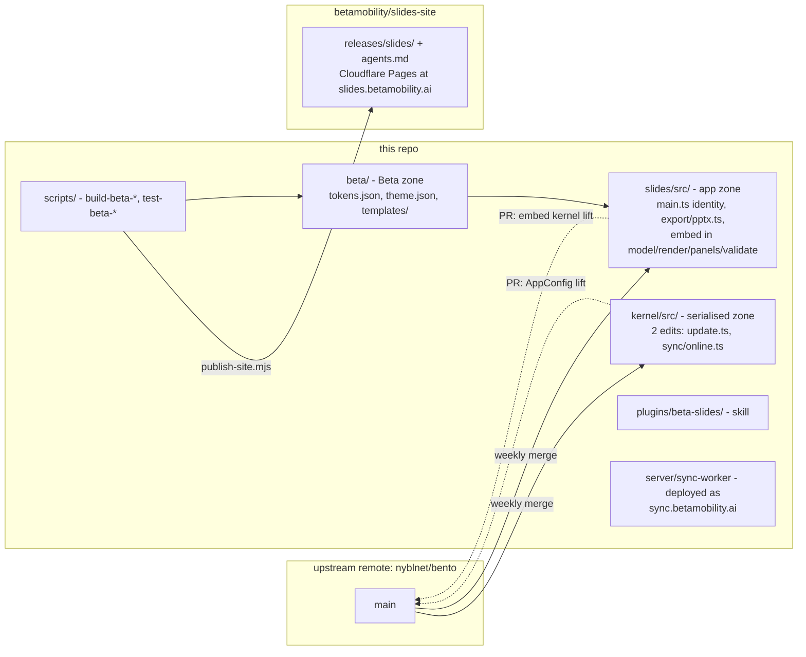
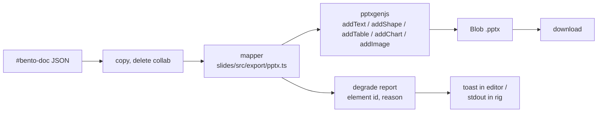

# Beta Slides on a Bento Fork - Plan

## Goal Capsule

- **Objective:** Fork [nyblnet/bento](https://github.com/nyblnet/bento) into this repo as a Beta-owned build of `bento/slides`, express the Beta design system in Bento's own document keys, add in-editor PPTX export and an `embed` element built to upstream's settled shape, and ship a `beta-slides` Claude Code plugin that extends the upstream skill.
- **Authority hierarchy:** this plan; then upstream's `docs/PLATFORM.md` invariants and `docs/PARALLEL-WORK.md` zones, which the fork inherits; then Beta's global conventions. Where this plan and a PLATFORM invariant disagree, the invariant wins and the plan is wrong.
- **Execution profile:** one branch per unit, merged into this repo's `main` by pull request. Upstream stays as a git remote and is merged on a documented cadence. Kernel-zone edits are limited to the two this plan names; any other kernel change stops the unit and becomes an upstream pull request first.
- **Stop conditions:** `scripts/shell-gate.mjs` fails on a built shell; a unit needs a `kernel/src/` change beyond the two KTD2 names after inspecting the file; a `#bento-doc` block would carry a literal `</script>`; a `docId` would be regenerated; or an export path would carry `doc.collab` keys.
- **Tail ownership:** Johan creates the two GitHub repos under the Beta Mobility org, generates and holds the release signing key offline, owns the `slides.betamobility.ai` and `sync.betamobility.ai` DNS, and cuts releases. Everything else is the implementer's.
- **Product Contract preservation:** unchanged. R14's "fallback poster" is realised as the `view` tier of upstream's `bento/embed` shape. Outstanding Questions were resolved in place by planning; the two that remain are marked.

---

## Product Contract

### Summary

Fork [nyblnet/bento](https://github.com/nyblnet/bento) (MIT) into a Beta-owned slides app. Express Beta's design system in Bento's native `theme`, `fonts`, `layouts` and `meta` keys rather than in a parallel Beta layer. Add two things the format lacks: an editable-PPTX exporter and an `embed` element kind. Extend the upstream `bento-slides` skill rather than writing a new one.

### Problem Frame

Beta has no presentation system. Decks are made ad hoc, so the design system is re-applied by hand each time and drifts, and Claude cannot create or revise a deck the way it revises a repo or a `publish` deliverable.

The usual answers each break a requirement. PowerPoint and Google Slides are not agent-editable in any durable sense and hold no design system. Slidev and reveal.js are agent-friendly but export PPTX as images, so a client cannot edit what they receive. Hosted AI deck tools fail offline and own the artifact.

Bento is the only substrate where the document is plain JSON an agent edits directly, the file works from `file://` with no backend, collaboration is end-to-end encrypted with the file itself as the capability, and shipped documents keep opening years later by explicit platform contract. What it lacks is an editable-PPTX path and any element that embeds a live third-party surface.

### Key Decisions

- **Fork Bento, and build inside its conventions.** Every Beta capability that has a native Bento home uses that home: the design system is `doc.theme` plus `doc.fonts`, reusable slide structures are `doc.layouts` entries with `role` on text elements, and per-deck strings are `doc.meta` resolved through `{{author}}` / `{{company}}` tokens. No parallel Beta template format, no Beta theme layer above Bento's. The fork exists for the two things with no native home.

- **Extend the upstream skill, do not replace it.** `bento-slides@bento` already carries the authoring contract, the material-to-feature mapping, the self-audit and the collaboration-credential warning. Beta adds design rules, data refresh and export on top. Starting a `beta-slides` skill from scratch would fork the guidance and let it rot against upstream.

- **Live elements are allowed and go blank offline.** Bento's `media` element already accepts an external URL and states plainly that it "needs the network at play time," so a network-dependent element is sanctioned by the format, not a violation of it. The `embed` kind follows that precedent: it renders when there is a network and shows a poster or placeholder when there is not. The rest of the deck never depends on the network.

- **Data is refreshed at edit time, not fetched at present time.** The agent updates figures when it edits a deck and writes the values into the document with an as-of date. A deck opened on stage cannot fail, and the numbers are traceable.

- **Every deck is PPTX-exportable by construction.** Bento's element set is already the declarative subset a PPTX generator needs, so there is no live-versus-editable deck split. Elements that cannot survive the trip degrade to a marked image.

- **Ship single-file Bento first; treat decoupling as a conditional phase two.** A working Beta system in Bento's own model answers three questions cheaply: whether Bento's editor is good enough to be Beta's design surface, how often decks actually need live content, and whether asset bloat bites. Most of the work carries forward regardless, because the alternative architecture is also a Bento fork with the same editor, theme, layouts and skill. Only storage and runtime differ. Phase two triggers: live content needed in more than roughly a quarter of decks, a deck crossing 50MB, or a client needing to re-edit a deck the exporter cannot produce cleanly.

- **Use Bento's collaboration, do not architect on it.** `doc.collab` works because the file is the capability, and that is precisely what decoupling removes. Phase one gets concurrent editing for free and must not grow a sharing workflow that assumes handing someone the file grants them the room. If phase two happens, collaboration becomes Beta's to build: per-slide JSON files plus git as the floor, soft slide locks as the cheap upgrade, Yjs with local persistence and a relay only when a real deadline is hurt. Bento's key model is never carried into a git repo, because that commits live session credentials to version control.

- **Beta charts live inside charts-lite.** The engine ignores unimplemented ECharts keys silently, and value labels on bar and line series do nothing. Beta's chart conventions are defined against what the engine actually honours, not against ECharts.

### Actors

- A1. **Beta author** — creates and edits decks, presents them, hands them to clients.
- A2. **Claude** — via the extended `bento-slides` skill: creates decks, edits them, refreshes data, exports them.
- A3. **Client recipient** — opens a deck, reads or presents it, sometimes needs to edit it in PowerPoint.
- A4. **Beta relay** — self-hosted worker relaying ciphertext between concurrent editors.

### Requirements

**Fork and platform conformance**

- R1. The fork keeps every `PLATFORM.md` invariant, and the release build runs the splice-contract conformance gate before signing.
- R2. The fork publishes its own signed release channel under a Beta-controlled domain, with its own offline ECDSA key, so Beta decks never self-update from upstream.
- R3. The fork tracks upstream on a documented cadence, and Beta additions are structured to minimise merge surface against `slides/src/model.ts`.
- R4. `doc.format` stays `bento/slides`. The fork determines and documents how upstream Bento renders a deck containing a Beta-only element kind, and picks the least destructive behaviour available.

**Design system, expressed in Bento's keys**

- R5. A generator turns `design-system/tokens.json` into `doc.theme` and `doc.fonts`, embedding required faces as woff2 in `doc.assets`. Font stacks are always written in full, never as a bare family name.
- R6. Beta slide structures ship as `doc.layouts` entries, with `role` set on every text element so a deck can be restyled without re-typing it.
- R7. Beta ships starter decks marked `template: true` so opening one mints a fresh document. The set is named during planning.
- R8. `doc.meta` carries Beta's standing values, and title slides and footers use `{{company}}`, `{{author}}` and `{{date}}` tokens rather than literal strings.
- R9. A deck records the design-system version it was generated from, and a command regenerates its theme and fonts against current tokens.
- R10. Beta chart conventions are defined only in terms of options the charts-lite engine honours.

**Export**

- R11. A deck exports to editable PPTX with real text boxes, shapes and tables, not images.
- R12. PDF export continues to work as Bento ships it.
- R13. An element that cannot be represented in PPTX degrades to a static image with a visible marker, and the exporter reports what degraded.

**Content capability**

- R14. The fork adds an `embed` element kind carrying a URL and a fallback poster, rendering the poster when the network is unavailable.
- R15. Geographic content renders as `svg` with self-contained CSS for hover and animation, produced by a build-time pipeline from Beta's geo tooling.
- R16. Code snippets use Bento's existing `code` element. Executing code inside a slide is out of scope.
- R17. Data-bound figures are refreshed at edit time, written into the document, and stamped with the date they were fetched.

**Agent surface**

- R18. Beta's skill extends `bento-slides@bento` and inherits its authoring contract, material-to-feature mapping, self-audit and collaboration-credential warning.
- R19. The extension adds the Beta design rules and refuses off-system colours, typefaces and spacing.
- R20. The extension adds data refresh and PPTX export as first-class steps.
- R21. The extension renders and inspects a deck before reporting it done, per the upstream skill's own rule.

### Key Flows

- F1. Create a deck from a brief
  - **Trigger:** A1 asks Claude for a deck on a topic.
  - **Actors:** A1, A2
  - **Steps:** Skill starts from a Beta `template: true` deck, writes slides into `#bento-doc` using Beta layouts and roles, refreshes any data it cites, runs `validate()`, opens the deck and pages through it.
  - **Covered by:** R5, R6, R7, R17, R18, R21

- F2. Concurrent edit under deadline
  - **Trigger:** Two authors open the same deck while a deadline is live.
  - **Actors:** A1, A4
  - **Steps:** First author shares the file, which carries the capability; both edit; the relay merges ciphertext; either can save a copy.
  - **Covered by:** R1

- F3. Hand a client an editable deck
  - **Trigger:** A3 asks for the PowerPoint.
  - **Actors:** A1, A3
  - **Steps:** Author exports PPTX; exporter reports degraded elements; author sends the file.
  - **Covered by:** R11, R13

- F4. Present offline
  - **Trigger:** A1 presents with no usable network.
  - **Actors:** A1
  - **Steps:** File opens from disk; figures render from stored values; charts stay interactive; embeds show their poster; nothing else is fetched.
  - **Covered by:** R14, R17

### Acceptance Examples

- AE1. **Covers R13.** Given a deck containing an `embed` element, when it is exported to PPTX, then that slide shows a static image of the embed's poster with a visible marker, and the exporter's report names the element.
- AE2. **Covers R14.** Given a deck containing an `embed` element, when it is presented with no network, then the poster renders in place and every other element on the slide behaves normally.
- AE3. **Covers R17.** Given a deck whose figures were refreshed on 3 September, when it is presented on 20 September with no network, then the figures render from stored values and carry their as-of date.
- AE4. **Covers R5, R19.** Given a brief that asks for a red accent, when the skill builds the deck, then it uses the design system's accent and says why.
- AE5. **Covers R6.** Given a Beta deck built from a Beta layout, when a different layout is applied in the editor, then content rides across by `role` and only frame and typography change.

### Scope Boundaries

**Deferred for later**

- Bento's Spaces, Dash and Type apps, and the `home/` tray hosts.
- Deck-to-video export, which stays with `Tools/remotion`.

**Outside this product's identity**

- Executing arbitrary code during a presentation.
- A parallel Beta template or theme format layered above Bento's own keys.
- Hosting decks behind a Beta login. Sharing is the file, or the existing `publish` pipeline.

### Deferred to Follow-Up Work

- **Geo SVG pipeline (R15).** A build-time step that renders H3 grids and route maps from Beta's geo tooling into `svg` elements with self-contained hover CSS. Blocked on deciding whether it reads from `Tools/geo-workbench` or runs standalone. The `svg` element already supports it; only the producer is missing.
- **Full starter-deck set (R7).** U4 ships the three deck shapes Beta produces most; the wider set follows once phase one has produced ten real decks.
- **In-shell theme regeneration (R9).** U3 ships regeneration as a script. A "Refresh theme" editor action can wrap it later.
- **Blob-offload for large assets.** Upstream's `docs/blob-offload.md` is proposed, not built. Beta tracks it rather than building it.

### Dependencies and Assumptions

- `Tools/design-system` stays the source of truth for tokens, and `tokens.json` stays machine-readable.
- Bento is MIT and its `PLATFORM.md` invariants are stable enough to fork against. Verified from the repository on 2026-09-08.
- Beta can host a Cloudflare Worker with a Durable Object binding for the relay.
- **Risk: Beta is early, and there is no community practice to borrow.** A 30-day sweep of Reddit, X, YouTube, TikTok, Hacker News and GitHub on 2026-09-08 found one on-topic video and nothing else. First-party docs, the shipped template decks and the model source are the only sources. Upstream is young and moving, so Beta additions stay small and merge-friendly, and the conformance gate in R1 carries more weight than it would against a settled project.

### Outstanding Questions

**Resolve during phase one**

- Q1. Does Beta genuinely need live content often enough to justify decoupling? The "all of the above" answer that produced R14 came from a maximalist menu and was never pressure-tested against real decks. Count the cases across the first ten decks.

**Deferred to implementation**

- Q5. Whether the geo pipeline generates SVG from `Tools/geo-workbench` or from a standalone step. Held in Deferred to Follow-Up Work.

### Sources

- [bento.page/agents.md](https://bento.page/agents.md) — the published agent guide, v1.0.19. Richer than the in-repo copy: `doc.layouts` and `role`, `doc.fonts`, `doc.meta` tokens, the column arithmetic table, the charts-lite honoured-keys list, and the collaboration-credential warning.
- [bento.page/skills/bento-slides/SKILL.md](https://bento.page/skills/bento-slides/SKILL.md) — the packaged Claude Code skill Beta extends. Install with `/plugin marketplace add nyblnet/bento` then `/plugin install bento-slides@bento`.
- `docs/PLATFORM.md` — §1 offline-first, §2 frozen splice contract, §5 E2EE collaboration, §6 signed self-update.
- `docs/format.md` — element kinds and the "a document can never carry executable code" axiom.
- `slides/src/model.ts` — the authoritative model. `CodeElement` and `SvgElement.css` are absent from the docs; `ChartElement.source` binds a chart to a table; `SlideElement` is a closed union of eight interfaces.
- Template decks at [bento.page](https://bento.page) — working examples of every technique; open one and read its `#bento-doc` block.
- `Tools/design-system/` — tokens, components and the written contract in `DESIGN.md`.
- `Tools/publish/` — the existing pattern for branded client deliverables.

---

## Planning Contract

**Target repo:** `betamobility/slides`, created as a GitHub fork of `nyblnet/bento` so the platform's fork linkage and "Sync fork" come for free. This local checkout has no remote and its `main` is unborn; U1 replaces it with a clone of the fork and carries `docs/plans/` across, which upstream has no path for. A second repo, `betamobility/slides-site`, holds the published release tree per U8. All paths below are relative to the fork's root.

### Key Technical Decisions

- **KTD1. Fork the whole monorepo; build only `slides/`.** `slides/src/*` imports `../../kernel/src/*` relatively, and `kernel/` is the serialised zone upstream evolves fastest. Vendoring it would turn every kernel change into a manual port. Spaces, Dash, Type and `home/` ride along unbuilt; CI for those apps is disabled in the fork's workflow, not deleted.

- **KTD2. Two kernel edits, both offered upstream.** `kernel/src/update.ts` hardcodes `PUBLIC_KEY_JWK`, and `kernel/src/sync/online.ts` hardcodes `DEFAULT_SYNC_HOST`. The fork lifts both into `AppConfig` so `configureApp()` in `slides/src/main.ts` supplies them per app, then opens a pull request upstream for that lift. Until it lands, these are the fork's only kernel-zone divergence and its only predictable merge hotspot. Inspected on 2026-09-08 so the count is a fact, not a hope: `kernel/src/net.ts` already exports `offlineEnabled()` and `remoteSrcBlocked(src)`, and `kernel/src/anim.ts` splits targets by DOM node class rather than element type, so neither the `embed` element nor its motion needs a third.

- **KTD3. `embed` is built to the upstream `bento/embed` shape.** `docs/DECISIONS.md` (2026-08-19) settled `{ kind:'embed', app, doc, view, w, h, live? }` with three tiers: `view` static render always present, `doc` source always present, sandboxed `live` iframe opt-in. Beta adds `app: 'web'` with a `url` field, which upstream's own note ("unknown values are RENDERED, not rejected") permits. `type/src/embed.ts` is the consumer-side pattern to mirror; the kernel lift is upstream's to make and Beta's to offer.

- **KTD4. Design system maps to the full `theme.palette` slot set, not the three base colours.** `palette.ts` defines OOXML-mirroring slots (`bg1 tx1 bg2 tx2 accent1-6 hlink folHlink`) and elements record provenance in `themeRefs`. Beta tokens fill every slot, set `headingFamily` for the serif display face, `chartPalette` for series colours, and `theme.table` defaults. `hlink` and `folHlink` take the design system's link colour where it defines one and otherwise `accent1` and `accent1 -20%` in Bento's own reference syntax. Faces are Inter, Playfair Display and DM Mono under the OFL, because a deck is redistributed as a file and the commercial faces in Beta's brand (PP Editorial New, Neue Montreal) cannot travel inside it. This is what makes the PPTX export a scheme-to-scheme mapping and a Beta deck re-brandable from one place.

- **KTD5. Beta layouts live in template decks' `doc.layouts`, not in `builtinLayouts()`.** Editing the built-in set is a `model.ts` change that conflicts on every upstream merge; `doc.layouts` is a per-document key upstream designed for exactly this. A deck instantiated from a Beta template carries Beta layouts with it.

- **KTD6. PPTX export ships in the editor, next to Export PDF.** `slides/src/editor/editor.ts` already has `exportPdf()` and a Save menu; the PPTX action sits beside it. The mapping is a pure function in `slides/src/export/pptx.ts` so the same code runs under node for the rig. pptxgenjs 4.0.1 (MIT) is bundled with its `jszip` dependency; the browser bundle is 450 KB uncompressed, and the shell's 685 KB reference is measured after deflate, so the two are not directly comparable. The compressed growth is measured in U5 and recorded in `scripts/size-budgets.json`, which tracks slides without a ceiling; the reference moves in the commit that adds it with a note saying what bought the bytes.

- **KTD7. Export strips `doc.collab` before it touches the mapper.** `scripts/test-export-secrets.ts` proves every export path drops bearer credentials by reading source. The PPTX path is registered in that rig as a fourth path and reaches the mapper only through a copy with `collab` deleted.

- **KTD8. Both kinds of offline suppress the live iframe.** Bento's offline mode is a privacy switch ("nothing leaves this computer") enforced through `kernel/src/net.ts`; conference wifi is network absence. They are different states and both must fall back to `view`. The `embed` renderer creates a live frame only when `remoteSrcBlocked(url)` is false and `navigator.onLine` is true, and the frame's `onerror` swaps back to `view` so a network that drops mid-talk degrades the same way. AE2 covers network absence; the privacy switch gets its own scenario in U6.

- **KTD9. Tests follow upstream's `node scripts/test-*.ts` convention.** No Vitest, no Playwright. Each Beta rig is a standalone script with `ok()`/`failures` counting, registered in `.github/workflows/ci.yml` beside the upstream rigs, and named `scripts/test-beta-*.ts` so `ls` shows the fork's additions at a glance.

- **KTD10. Upstream tracking is weekly, by merge, not rebase.** `main` merges `upstream/main` every week, or before cutting a release, whichever is sooner. Merge keeps the fork's history linear from Beta's point of view and makes the KTD2 hotspot a predictable conflict rather than a rebase surprise.

- **KTD11. i18n strings go into all nine catalogs.** Upstream hard rule 6: every UI string in `de es fr it ja pt zh-Hans zh-Hant` plus the English key. Dropping to English-only would be cheaper today and a merge conflict in `build-i18n.mjs --check` every week thereafter.

- **KTD12. The release site is a second repo, mirroring upstream's pattern.** Upstream publishes from `scripts/publish-site.mjs`, which assembles `site/` and pushes it into a sibling `bento-site` repo served by Pages. Beta keeps that script and points `BENTO_SITE_DIR` at `betamobility/slides-site`, served at `slides.betamobility.ai` by Cloudflare Pages per Beta's stack. Release artifacts never enter the source repo's history, and the signed bytes are the served bytes.

### High-Level Technical Design

**Ownership zones after the fork.** Beta touches the app zone freely, the kernel zone twice, and adds a `beta/` zone that upstream never sees.



**PPTX export data flow.** The mapper never sees credentials, and the degrade report is a first-class output, not a side effect.



**Element-to-PPTX mapping.** Verified against pptxgenjs 4.0.1's `types/index.d.ts`. Gradient fill and font embedding have no API and are the two systematic degradations.

| Bento element | pptxgenjs call | Fidelity | Degrades |
|---|---|---|---|
| `text` | `addText` with `fontFace`, `lineSpacingMultiple`, `charSpacing`, `align`, `valign` | editable | inline `html` subset flattened to text runs |
| `shape` rect / ellipse / triangle / arrow / line | `addShape` with `rectRadius`, `rotate`, `transparency` from `opacity` | editable | `fillGradient` flattened to first stop, reported |
| `shape` path | `addShape(CUSTOM_GEOMETRY)` with `points` from SVG `d` | editable | arcs beyond cubic/quadratic rasterised |
| `image` | `addImage` from data URI | native | none |
| `svg` | rasterised to PNG via canvas, `addImage` | image | always reported |
| `chart` bar / line / pie / scatter | `addChart` with `chartColors` from `chartPalette` | editable | unsupported charts-lite keys already absent |
| `table` | `addTable` with `colW` from weights, cell `fill`, `border`, header row | editable | none |
| `media` | poster via `addImage` | image | always reported |
| `code` | `addText` monospace | editable | no syntax colour |
| `embed` | `view` rasterised, `addImage` | image | always reported (AE1) |
| morph, `fx`, hover, state slides | dropped; `stateOf` slides become `hidden` | n/a | reported once per deck |
| `notes` | `addNotes` | native | none |
| fonts | `fontFace` by name | depends on client machine | reported once per deck |

### Output Structure

New paths only; upstream's tree is unchanged apart from the files named in the units.

```
beta/
├── README.md                    # what the Beta zone is, how to refresh tokens
├── tokens.json                  # vendored from ../design-system/tokens.json
├── fonts/                       # Inter, Playfair Display, DM Mono woff2 (OFL)
├── theme.json                   # generated: theme + fonts + assets fragment
└── templates/
    ├── client-pitch.bento.html  # generated, template:true
    ├── insight-brief.bento.html
    └── workshop.bento.html
plugins/beta-slides/
├── .claude-plugin/plugin.json
└── skills/beta-slides/SKILL.md
slides/src/export/
└── pptx.ts                      # pure mapper, browser and node
scripts/
├── build-beta-theme.mjs
├── build-beta-templates.mjs
├── beta-sync-tokens.mjs
├── test-beta-theme.ts
├── test-beta-layouts.ts
├── test-beta-pptx.ts
├── test-beta-embed.ts
└── test-beta-skill.mjs
docs/plans/                      # this file, survives the upstream merge
```

### System-Wide Impact

- This repo stops being a docs-only repo and becomes a fork carrying roughly 170 upstream rigs and three CI workflows. Fork CI runs only the slides and kernel jobs; the others are disabled with a comment naming this plan.
- `design-system/tokens.json` becomes a contract another repo generates from. A rename there breaks `scripts/build-beta-theme.mjs`; the generator fails loudly on a missing token rather than substituting.
- The relay at `sync.betamobility.ai` is Beta infrastructure with a 30-day op log per room. It stores ciphertext only and needs no Beta auth, but it is a running service with a Cloudflare bill.
- Shipped Beta decks self-update from `slides.betamobility.ai`. Losing the signing key orphans every shipped file's update channel; the key is Johan's to keep offline, per upstream's `docs/RELEASING.md`.
- A second repo, `betamobility/slides-site`, exists only to be served. It is public by construction, because shipped decks fetch from it without credentials.

### Risks

- **Merge conflicts on `render.ts` and `i18n/*`.** Upstream's `docs/PARALLEL-WORK.md` opens with exactly this war story. Mitigation: the `embed` case in `render.ts` is one `case` block, KTD11 keeps the catalogs in upstream's shape, and KTD10's weekly merge keeps conflicts small.
- **Kernel hotspot until KTD2 lands upstream.** Two lines diverge on every merge. Mitigation: the lift is a small, obviously-correct pull request; open it in the first week.
- **PPTX fidelity ceiling.** No gradients, no embedded fonts, no morph. Mitigation: the degrade report is loud, the skill states it before export, and `beta/README.md` tells clients which fonts to install.
- **Shell growth.** Plus 265 KB for pptxgenjs, plus i18n strings. Mitigation: `scripts/test-spaces-size.mjs` tracks drift; the reference moves with a note.
- **Upstream implements `embed` differently.** KTD3 builds to their settled shape, so the likely outcome is a small reconciliation, not a rewrite.
- **`test-offline.ts` flags pptxgenjs.** Its `https` dependency is a node-only code path; Vite tree-shakes it from the browser bundle. Verified during U5 by grepping the built shell for the primitive; if it survives, the export module imports the ESM build explicitly.

### Documentation and Operational Notes

- `README.md` follows Beta's README standard and states plainly that this is a fork, where upstream is, and the merge cadence.
- `beta/README.md` documents token refresh, template rebuild, and the fonts a PPTX recipient needs installed.
- `docs/agents.md` gains a Beta addendum section; `scripts/apps.mjs` publishes it at `/slides/agents.md` on the Beta domain, so `bento.page/agents.md` and `slides.betamobility.ai/slides/agents.md` differ only by that section.
- `CLAUDE.md` at the repo root becomes a thin wrapper over `AGENTS.md`, per Beta's `agents-claude-sync` convention, and `AGENTS.md` keeps upstream's hard rules verbatim with a Beta section appended.
- Relay deploy is `npx wrangler deploy` from `server/sync-worker/`; the custom domain is set in `wrangler.toml`. Deploy relay before client when a handshake changes, per `PLATFORM.md` §5.

---

## Implementation Units

### U1. Fork, identity, and green CI

- **Goal:** This repo becomes a buildable Beta fork of `bento/slides` with its own app identity and a CI that passes on the slides and kernel jobs.
- **Requirements:** R1, R2, R3, R4
- **Dependencies:** none
- **Files:** `slides/src/main.ts`, `kernel/src/app.ts`, `kernel/src/update.ts`, `kernel/src/sync/online.ts`, `slides/src/packs.ts`, `scripts/apps.mjs`, `.github/workflows/ci.yml`, `README.md`, `AGENTS.md`, `CLAUDE.md`, `scripts/test-release-apps.mjs`
- **Approach:** Johan forks `nyblnet/bento` to `betamobility/slides` on GitHub; the implementer clones it, copies `docs/plans/` in from this checkout, and works on a branch. In `kernel/src/app.ts` extend `AppConfig` with `publicKeyJwk` and `syncHost`; make `kernel/src/update.ts` and `kernel/src/sync/online.ts` read them from `appConfig()` with the upstream values as defaults, so upstream's behaviour is unchanged when the fields are absent. In `slides/src/main.ts` call `configureApp` with `appId: 'beta-slides'`, `appName: 'bento/slides'` (upstream's lowercase rule), `manifestUrl: 'https://slides.betamobility.ai/releases/slides/manifest.json'`, the Beta public key, and `syncHost: 'wss://sync.betamobility.ai'`. Point `slides/src/packs.ts` at the Beta releases path. Register the fork in `scripts/apps.mjs` with the new `appId` so `test-release-apps.mjs` proves the wiring. Disable the spaces, dash and type CI jobs with a comment. Johan runs `node scripts/keygen.mjs` and supplies only the public JWK. Open the `AppConfig` lift as an upstream pull request.
- **Execution note:** Smoke-first. The proof is a built shell that opens from `file://`, shows the Beta app name in the title suffix, and passes `shell-gate.mjs`. Unit coverage is the existing rigs.
- **Patterns to follow:** `kernel/src/app.ts` for how per-app identity already flows; `scripts/apps.mjs` comments for what each registry field guards; `docs/RELEASING.md` for the two-repo release layout.
- **Test scenarios:**
  - Given `configureApp` without `publicKeyJwk` or `syncHost`, when the kernel reads them, then it uses upstream's values, so upstream's own build is unaffected.
  - Given the Beta shell, when `test-release-channel.mjs --app slides` rehearses a release with a throwaway key, then the manifest `app` field is `beta-slides` and a manifest signed for `bento-slides` is refused.
  - Given a built Beta shell, when `shell-gate.mjs` runs, then the splice contract passes.
  - Given the fork's CI, when it runs on `main`, then the slides typecheck, kernel typecheck, build, shell-gate, i18n check and anim rigs pass and no disabled job fails.
  - Given `test-offline.ts`, when it runs against the fork, then no file outside `kernel/src/net.ts` touches a network primitive.
- **Verification:** `npm run build:single` produces `slides/dist-single/Bento_Slides.bento.html`; opening it from disk shows the editor with the Beta identity; every upstream slides rig in the Verification Contract passes; the upstream pull request for the `AppConfig` lift is open.

### U2. Relay at sync.betamobility.ai

- **Goal:** Two Beta authors can edit one deck concurrently through a Beta-hosted relay.
- **Requirements:** R1, F2
- **Dependencies:** U1
- **Files:** `server/sync-worker/wrangler.toml`, `server/sync-worker/README.md`
- **Approach:** Change `name` and the custom-domain route in `wrangler.toml` to `beta-sync` and `sync.betamobility.ai`. Omit the R2 blob binding; the relay answers 501 on `/b/` and clients fall back to inlining, which upstream documents as supported. Deploy with `npx wrangler deploy` under Beta's Cloudflare account; add the CNAME per Beta's Cloudflare doc. No worker source changes.
- **Execution note:** Smoke-first. The proof is two browsers on two machines converging on one deck; there is no meaningful unit test for a deploy.
- **Patterns to follow:** `wrangler.toml` comments; `docs/relay-design.md` for the protocol; Beta's `Docs/cloudflare.md` for DNS.
- **Test scenarios:**
  - Given a fresh deck shared from browser A, when browser B opens the same file, then B joins the room and an edit in A appears in B within seconds.
  - Given the relay with no R2 binding, when A pastes a 200 KB image, then it syncs inline; when A pastes a 3 MB video, then the client reports the size limit rather than failing silently.
  - Given `node scripts/test-relay-protocol.ts`, when it runs, then it passes unchanged, proving the fork did not touch the protocol.
- **Verification:** `wss://sync.betamobility.ai` accepts a room handshake; the two-browser smoke converges; Beta's Cloudflare dashboard shows the worker and Durable Object.

### U3. Beta theme from design-system tokens

- **Goal:** One command turns `beta/tokens.json` into a `theme`, `fonts` and `assets` fragment that any Beta deck carries, with every palette slot filled and every face embedded.
- **Requirements:** R5, R8, R9, R10
- **Dependencies:** U1
- **Files:** `beta/tokens.json`, `beta/fonts/*.woff2`, `beta/theme.json`, `beta/README.md`, `scripts/beta-sync-tokens.mjs`, `scripts/build-beta-theme.mjs`, `scripts/test-beta-theme.ts`
- **Approach:** `beta-sync-tokens.mjs` copies `../design-system/tokens.json` into `beta/tokens.json` and records the design-system git SHA in `beta/tokens.json` itself under a `_source` key. `build-beta-theme.mjs` maps tokens to `theme.background` (cream), `theme.color` (charcoal), `theme.accent`, `theme.palette` (all twelve slots, with the four accent-extension colours from the design system in `accent2` through `accent5`), `theme.headingFamily` (`'Playfair Display', Georgia, serif`), `theme.fontFamily` (`'Inter', system-ui, sans-serif`), `theme.chartPalette` from the accents, and `theme.table` from the design system's table component. It base64-encodes the three woff2 files into `assets` and emits matching `fonts[]` entries. It writes `meta.company: 'Beta Mobility'` and a `beta.designSystem` provenance key holding the SHA, which upstream preserves as an unknown field. The generator fails on any missing token.
- **Execution note:** Test-first. The rig exists before the generator; the generator is done when the rig is green.
- **Patterns to follow:** `slides/src/palette.ts` for slot names and `paletteOf()`; `scripts/test-theme.ts` for the rig shape and the additivity property; `docs/agents.md` "Fonts" for full-stack strings.
- **Test scenarios:**
  - Given `beta/tokens.json`, when the generator runs, then every `PALETTE_SLOTS` entry is present and is a valid hex colour.
  - Given a generated fragment applied to a minimal deck, when `validate()` runs, then it reports no `font-not-embedded` and no `unknown-key` except `beta.designSystem`.
  - Given a generated deck, when `palette` and `themeRefs` are deleted, then no rendered colour changes, proving additivity per `test-theme.ts`.
  - Given `beta/tokens.json` with `color.accent` removed, when the generator runs, then it exits non-zero naming the token.
  - Given a deck generated at SHA A, when `beta-sync-tokens.mjs` updates to SHA B and the generator re-runs, then `beta.designSystem` reads SHA B and only changed slots differ.
  - Given the three `fonts[]` entries, when the deck boots, then `document.fonts` reports Inter, Playfair Display and DM Mono loaded from data URIs.
- **Verification:** `node scripts/test-beta-theme.ts` passes; a deck built from the fragment renders cream and charcoal with a serif heading in the editor and prints the same to PDF.

### U4. Beta layouts and three starter templates

- **Goal:** Three `template: true` decks, each carrying Beta layouts with `role` on every text element, so a new deck starts branded and re-layoutable.
- **Requirements:** R6, R7, R8
- **Dependencies:** U3
- **Files:** `beta/templates/client-pitch.bento.html`, `beta/templates/insight-brief.bento.html`, `beta/templates/workshop.bento.html`, `scripts/build-beta-templates.mjs`, `scripts/test-beta-layouts.ts`
- **Approach:** `build-beta-templates.mjs` takes the built shell, splices a document into `#bento-doc` (escaping `<`), sets `template: true`, omits `docId` and `collab`, applies `beta/theme.json`, and writes six `doc.layouts` entries: `beta-title`, `beta-section`, `beta-two-col`, `beta-chart-text`, `beta-hero`, `beta-closing`. Each layout uses the guide's column arithmetic (96 px margins, 1088 px band), `placeholder` rather than `html`, and `role` values `title`, `subtitle`, `body`, `kicker`. Each template's slides are instantiated from those layouts so shared chrome keeps stable ids and morphs. Footers use `{{company}}` and `{{page}}`; covers use ken-burns or an orbiting accent per the guide's self-audit.
- **Execution note:** Test-first for geometry; the visual check is the upstream skill's own rule and is done by opening each template.
- **Patterns to follow:** `scripts/build-example-decks.mjs` for splicing a document into a shell; `scripts/test-layouts.ts` for the fit rig; the template decks at bento.page for layout JSON.
- **Test scenarios:**
  - Given each Beta layout, when checked at 1280x720 and at every size the slide panel offers, then no element's right edge exceeds the canvas minus the 96 px margin and no element's bottom exceeds the canvas.
  - Given each template, when `validate()` runs, then it is clean, `template` is true, and `collab` and `docId` are absent.
  - Given a template opened in a browser, when the user saves, then the saved file has a fresh `docId` and dormant `collab`, proving upstream's template flag behaves.
  - **Covers AE5.** Given a deck built from `beta-two-col`, when `beta-chart-text` is applied in the editor, then every text element with a matching `role` keeps its content and the chart placeholder appears.
  - Given the three templates, when the size rig runs, then each is under 2 MB, proving fonts are the only embedded assets.
- **Verification:** `node scripts/test-beta-layouts.ts` passes; each template opens from disk, shows the Beta cover with motion, and applying any Beta layout to any slide leaves content in place.

### U5. In-editor PPTX export

- **Goal:** Export PPTX sits beside Export PDF in the editor, produces an editable deck from any Bento document, and reports every degraded element.
- **Requirements:** R11, R12, R13, F3
- **Dependencies:** U1
- **Files:** `slides/src/export/pptx.ts`, `slides/src/editor/editor.ts`, `slides/src/icons.ts`, `slides/src/i18n/*.ts`, `slides/package.json`, `scripts/size-budgets.json`, `scripts/test-export-secrets.ts`, `scripts/test-beta-pptx.ts`, `scripts/fixtures/beta-export-fixture.json`
- **Approach:** `export/pptx.ts` exports a pure `mapDeck(doc): { pptx, report }` that builds a pptxgenjs presentation per the mapping table in the Planning Contract and accumulates a report of `{ elementId, slideId, reason }`. Coordinates convert from the 1280x720 px canvas to inches at 96 dpi with `defineLayout`. `editor.ts` adds an Export PPTX button beside `exportPdf()` that deep-copies the document, deletes `collab`, calls `mapDeck`, writes the Blob, triggers a download, and shows the report in a toast when non-empty. SVG and `view` rasterisation uses an offscreen canvas in the browser and is stubbed to a placeholder PNG under node so the rig exercises the report path. Register the new path in `test-export-secrets.ts`. Add `Export PPTX` and the report strings to all nine catalogs and run `build-i18n.mjs`. Move `scripts/size-budgets.json` slides reference with a note.
- **Execution note:** Characterisation-first. Build `scripts/fixtures/beta-export-fixture.json` containing at least one of every element kind, a gradient, a morph pair, a state slide, an embed and speaker notes, then snapshot the degrade report before writing the mapper. The mapper is done when the snapshot is stable and the PPTX opens.
- **Technical design:** directional only. The mapper walks `doc.slides`, skips `stateOf` slides into `hidden`, and for each element switches on `type`; unknown types fall to the image path with a report entry so a future element kind never crashes export.
- **Patterns to follow:** `editor.ts` `exportPdf()` for menu placement and the print flow; `test-export-secrets.ts` for how a path is proven credential-free by reading source; `render.ts` `case` blocks for what each element's fields mean; `untrusted.ts` for the sanitiser the `view` path must run before rasterising.
- **Test scenarios:**
  - Given the fixture deck, when `mapDeck` runs under node, then the output unzips, `ppt/slides/` contains one file per linear slide plus hidden state slides, and `ppt/notesSlides/` carries each slide's notes.
  - Given a `text` element with `fontSize: 88` and `lineHeight: 1.1`, when exported, then the slide XML carries the matching `sz` and `lnSpc` values and the `fontFace` name.
  - Given a `shape` with `fillGradient`, when exported, then the shape is filled with the first stop colour and the report names the element with reason `gradient`.
  - Given a `chart` with two bar series and `chartPalette`, when exported, then the chart XML has two series in those colours and category labels from `xAxis.data`.
  - Given a `table` with a header row and zebra style, when exported, then the first row carries the header fill and every other row alternates.
  - **Covers AE1.** Given an `embed` element, when exported, then the slide carries an image of its `view` and the report names it with reason `embed`.
  - Given a deck with `collab.ownerPriv` set, when exported, then no byte sequence from any collab key appears anywhere in the zip.
  - Given `test-export-secrets.ts`, when it runs, then it recognises the PPTX path and passes.
  - Given the built shell, when grepped for pptxgenjs's node-only `https` import, then it is absent.
  - Given the size rig, when it runs, then it reports the compressed delta and `scripts/size-budgets.json` carries a new reference whose note names pptxgenjs and the measured bytes.
- **Verification:** `node scripts/test-beta-pptx.ts` passes; the exported file from the fixture opens in PowerPoint and Keynote with editable text and tables; the toast lists exactly the elements the rig's report lists.

### U6. `embed` element to the upstream shape

- **Goal:** A slide can carry a live web surface that renders its static `view` offline, a sandboxed iframe online, and round-trips through upstream shells without breaking the deck.
- **Requirements:** R4, R14, F4
- **Dependencies:** U1
- **Files:** `slides/src/model.ts`, `slides/src/modelkeys.generated.ts`, `slides/src/render.ts`, `slides/src/present.ts`, `slides/src/validate.ts`, `slides/src/editor/panels.ts`, `slides/src/editor/canvas.ts`, `slides/src/editor/clipboard.ts`, `slides/src/untrusted.ts`, `slides/src/i18n/*.ts`, `scripts/test-beta-embed.ts`, `scripts/test-sanitize.ts`; inspect only, change only if their switch turns out exhaustive: `slides/src/diff.ts` (code-morph tokens), `slides/src/sync/session.ts` (data-URI sizing for `image` and `media`)
- **Approach:** Add `EmbedElement` to the `SlideElement` union with `type: 'embed'`, `app: string`, `view: string` (SVG markup or `asset:` key), optional `doc`, optional `url`, optional `live: boolean`, `w`, `h`. Regenerate `modelkeys.generated.ts`. In `render.ts`, the `embed` case always paints `view` through the same sanitiser the `svg` element uses; when `live` is true, `app` is `web`, `remoteSrcBlocked(url)` from `kernel/src/net.ts` is false, and `navigator.onLine` is true, it layers a `sandbox` iframe with no `allow-same-origin` over the view, and the frame's `onerror` removes it so `view` shows again. `present.ts` mirrors that. `panels.ts` gets a section label and an `Embed` props builder for `url`, `live`, and a "capture view" action that snapshots the iframe's poster into `view` as an asset. `validate.ts` reports a missing `view` as an error and a remote `view` as a warning. Document in `docs/agents.md` how an upstream shell treats the element, found by opening a Beta deck in the upstream shell during this unit.
- **Execution note:** Test-first for model and sanitiser behaviour; the online/offline switch is proven by the rig stubbing `net.ts`.
- **Patterns to follow:** `type/src/embed.ts` for the shape and `EmbedData` fields; `render.ts` `case 'svg'` for sanitised markup rendering; `render.ts` `case 'media'` for how an external `src` is handled; `panels.ts` `buildMediaProps` for a props panel with a remote URL.
- **Test scenarios:**
  - Given a document with an `embed` element, when `validate()` runs, then no `unknown-key` is reported for its fields, proving the modelkeys regeneration.
  - Given an `embed` with `view` containing a `<script>` tag, when rendered, then the script is stripped by the sanitiser and `test-sanitize.ts` covers the case.
  - **Covers AE2.** Given an `embed` with `live: true` and `navigator.onLine` false, when rendered, then no iframe exists in the DOM and the `view` markup is present.
  - Given an `embed` with `live: true`, `navigator.onLine` true and Bento's offline switch on, when rendered, then no iframe exists, proving the privacy switch is honoured independently of network state.
  - Given a live iframe whose load fails, when its `onerror` fires, then the frame is removed and `view` is visible.
  - Given the same element online with the switch off, when rendered, then an iframe with a `sandbox` attribute lacking `allow-same-origin` exists and its `src` equals `url`.
  - Given an `embed` element, when copied and pasted in the editor, then the paste carries `view` and `url` and mints a new id.
  - Given a Beta deck with an `embed`, when opened in the upstream `Bento_Slides.bento.html`, then the observed behaviour is recorded in `docs/agents.md` and the deck's other elements render.
  - Given the built shell, when `test-offline.ts` runs, then it passes, proving the iframe path consults `net.ts`.
- **Verification:** `node scripts/test-beta-embed.ts`, `node scripts/build-modelkeys.mjs --check` and `node scripts/test-sync.ts` pass; in the editor, adding an embed shows the poster, toggling the browser offline hides the iframe; the upstream-shell behaviour is documented.

### U7. `beta-slides` plugin and skill

- **Goal:** `/plugin install beta-slides@beta-slides`, installed instead of upstream's `bento-slides` because both trigger on the same phrases and upstream's downloads the wrong shell, gives Claude a skill that downloads the Beta shell, starts from Beta templates, applies Beta design rules, refreshes data with an as-of stamp, and exports PPTX, while inheriting everything else from upstream by reference.
- **Requirements:** R17, R18, R19, R20, R21, F1
- **Dependencies:** U1, U3, U4, U5, U8
- **Files:** `plugins/beta-slides/.claude-plugin/plugin.json`, `plugins/beta-slides/skills/beta-slides/SKILL.md`, `.claude-plugin/marketplace.json`, `docs/agents.md`, `scripts/test-beta-skill.mjs`
- **Approach:** The skill's frontmatter triggers on the same phrases as upstream's. Its body says: fetch `https://slides.betamobility.ai/slides/agents.md` before authoring and follow it in full; download the Beta shell from `https://slides.betamobility.ai/releases/slides/Bento_Slides.bento.html` or start from a named Beta template; never write a hex colour, only palette slot names via `themeRefs`; use Beta layouts by name and set `role`; write `meta.author`; for any figure fetched from a Beta source, write the value into the document and add a kicker-role text element reading `Data as of {date}` on that slide; after `validate()` and the visual check, run Export PPTX and read the report to the user; before reading any deck, run upstream's `collab` check. `docs/agents.md` gains a "Beta build" section covering `embed`, the export report, and the palette-slot rule, so the published guide carries the addendum. `.claude-plugin/marketplace.json` at the repo root registers the plugin so `/plugin marketplace add betamobility/slides` works.
- **Execution note:** Smoke-first. The rig checks the skill's static claims; the real proof is one deck authored end-to-end by Claude from a brief.
- **Patterns to follow:** `plugins/bento-slides/skills/bento-slides/SKILL.md` for structure and the "Starting from nothing" flow; `scripts/test-spaces-agent.ts` for a rig that validates a deck authored per an agent guide.
- **Test scenarios:**
  - Given `SKILL.md`, when the rig parses it, then every URL it names resolves to a path `scripts/apps.mjs` publishes and every template name matches a file in `beta/templates/`.
  - Given a deck authored per the skill's rules, when `validate()` runs, then it is clean and every colour literal has a `themeRefs` entry.
  - **Covers AE3.** Given a slide with a refreshed figure, when inspected, then a `kicker`-role element on that slide reads `Data as of` followed by an ISO date, and the figure survives opening the deck offline.
  - **Covers AE4.** Given a brief asking for a red accent, when Claude authors the deck, then the deck uses `accent1` and the response explains the design system. This is a judgement test, run manually and recorded in the pull request.
  - Given a deck carrying `collab.ownerPriv`, when the skill is asked to edit it, then Claude warns before reading, per the inherited rule.
- **Verification:** `node scripts/test-beta-skill.mjs` passes; a deck authored from a one-paragraph brief opens branded, validates clean, exports to PPTX with an accurate report, and the transcript shows the visual check happened.

### U8. Release site and first signed release

- **Goal:** `slides.betamobility.ai` serves the signed Beta shell, its manifest and the agent guide, so shipped decks can self-update and the skill can download the shell.
- **Requirements:** R2, R3
- **Dependencies:** U1
- **Files:** `scripts/publish-site.mjs`, `scripts/release.mjs`, `site-src/` (Beta landing copy only), `README.md`; and in `betamobility/slides-site`: `CNAME`, the mirrored `releases/slides/` tree
- **Approach:** Johan creates `betamobility/slides-site` and points Cloudflare Pages at it with the custom domain. `publish-site.mjs` is kept and given `BENTO_SITE_DIR` pointing at a sibling clone of that repo. `site-src/` is trimmed to a one-page landing that names the fork and links upstream; the gallery and guestbook are disabled with a comment. Johan runs `node scripts/keygen.mjs` once, then `node scripts/release.mjs --app slides` for v1.0.0-beta.1 and `node scripts/publish-site.mjs` to push. The manifest URL in U1 and this site must agree, so the unit ends by fetching the manifest from the shipped shell's own update check.
- **Execution note:** Smoke-first. Nothing here is unit-testable; `test-release-channel.mjs` already rehearses the pipeline with a throwaway key, and the proof is a real fetch.
- **Patterns to follow:** `docs/RELEASING.md` end to end; `scripts/apps.mjs` for the `agents:` path that publishes `docs/agents.md`; Beta's `Docs/cloudflare.md` for Pages and DNS.
- **Test scenarios:**
  - Given the published site, when `https://slides.betamobility.ai/releases/slides/manifest.json` is fetched, then it parses, its `payload.app` is `beta-slides`, and its signature verifies against the public key embedded in the shell.
  - Given a shipped Beta deck opened from disk, when the user triggers "check for updates", then it reports the current version without error.
  - Given `https://slides.betamobility.ai/releases/slides/Bento_Slides.bento.html`, when downloaded, then its sha256 matches the manifest and it contains `id="bento-doc"`.
  - Given `https://slides.betamobility.ai/slides/agents.md`, when fetched, then it contains the Beta build section from U7.
- **Verification:** all four fetches succeed from a machine that is not Johan's; a deck saved from the previous shell offers the update and applies it, writing a new file and leaving the original as rollback per PLATFORM §6.

---

## Verification Contract

Node 24, from `slides/` unless stated. Upstream rigs strip TypeScript natively and need Node 23.6 or newer.

| Gate | Command | Proves | Applies to |
|---|---|---|---|
| Typecheck | `node_modules/.bin/tsc -b` and `node_modules/.bin/tsc -p ../kernel` | app and kernel compile | all |
| Build | `npm run build:single` | the shell builds | all |
| Splice contract | `node ../scripts/shell-gate.mjs dist-single/Bento_Slides.bento.html` | PLATFORM §2 | all |
| Model keys | `node ../scripts/build-modelkeys.mjs --check` | `validate()` key list is current | U6 |
| i18n | `node ../scripts/build-i18n.mjs --check` and `node ../scripts/test-i18n-coverage.mjs` | nine catalogs complete | U5, U6 |
| Offline policy | `node ../scripts/test-offline.ts` | nothing outside `net.ts` reaches the network | U5, U6 |
| Export safety | `node ../scripts/test-export-secrets.ts` | no export path carries `collab` | U5 |
| Sanitiser | `node ../scripts/test-sanitize.ts` | markup paths strip scripts | U6 |
| Upstream theme and layouts | `node ../scripts/test-theme.ts` and `node ../scripts/test-layouts.ts` | fork did not regress them | U3, U4 |
| Release wiring | `node ../scripts/test-release-apps.mjs` and `node ../scripts/test-release-channel.mjs --app slides` | registry and signed channel work with a throwaway key | U1 |
| Relay protocol | `node ../scripts/test-relay-protocol.ts` | protocol untouched | U2 |
| CRDT convergence | `node ../scripts/test-sync.ts` | document-shape change did not break sync | any unit touching `model.ts`, so U6 |
| Release site | fetch manifest, shell and `agents.md` from `slides.betamobility.ai` and verify the manifest signature | shipped files can update | U8 |
| Size drift | `node ../scripts/test-spaces-size.mjs` | shell growth is recorded | U5 |
| Beta rigs | `node ../scripts/test-beta-theme.ts`, `test-beta-layouts.ts`, `test-beta-pptx.ts`, `test-beta-embed.ts`, `test-beta-skill.mjs` | each unit's scenarios | U3 to U7 |
| Browser smoke | open `dist-single/Bento_Slides.bento.html` from `file://`; author, page through, export PDF and PPTX | the thing works where it will be used | all |

Every gate above that upstream's `.github/workflows/ci.yml` runs stays in the fork's workflow; the Beta rigs are added beside them.

---

## Definition of Done

**Global**

- All Verification Contract gates pass on `main` after the last unit merges.
- A deck authored by Claude from a one-paragraph brief opens from disk, is branded from the design system, validates clean, exports to PDF and to PPTX with an accurate degrade report, and the PPTX opens editable in PowerPoint.
- Two browsers converge on one deck through `sync.betamobility.ai`.
- The first signed release is published at `slides.betamobility.ai` and a shipped deck fetches and verifies its manifest.
- Both upstream pull requests (the `AppConfig` lift, the `embed` consumer) are open with a link in `README.md`.
- No abandoned-approach code remains: every branch merged is the shape the plan names, and experiments are deleted, not commented out.
- `README.md`, `beta/README.md`, `AGENTS.md` and `docs/agents.md` describe what shipped.

**Per unit**

| Unit | Done when |
|---|---|
| U1 | Beta-identity shell builds, passes shell-gate and the release rehearsal, and fork CI is green |
| U2 | Two-browser sync converges through the Beta relay |
| U3 | `test-beta-theme.ts` passes and a generated deck renders in Beta colours and faces |
| U4 | `test-beta-layouts.ts` passes and every template opens, moves, and re-layouts by role |
| U5 | `test-beta-pptx.ts` passes and the fixture's PPTX opens editable with the reported degradations visible |
| U6 | `test-beta-embed.ts` passes, the offline toggle hides the iframe, and upstream-shell behaviour is documented |
| U7 | `test-beta-skill.mjs` passes and one brief-to-deck run is recorded in the pull request |
| U8 | the manifest, shell and agent guide are fetchable from `slides.betamobility.ai` and a shipped deck applies an update |
