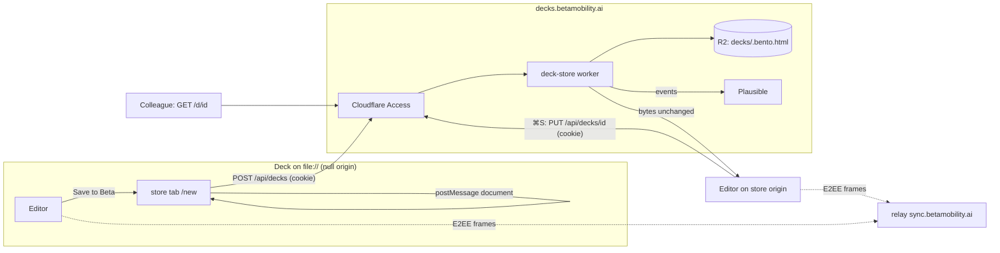
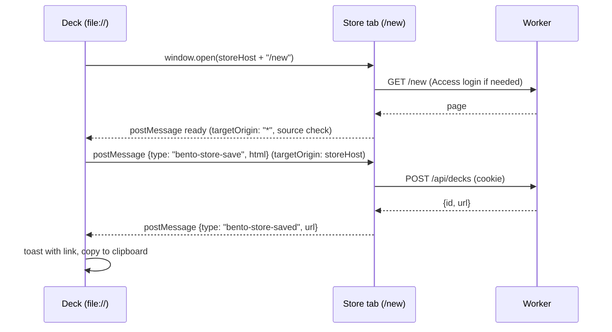

# Beta Slides v1.1 - review fixes and the deck store

## Goal Capsule

- **Objective:** close the eight findings from the 2026-09-08 review of release 2026.9.1 (stale committed templates, the update section, the About dialog, the language picker, the clipped layout picker, the favicon and splash mark, the plugin settings file) and add a deck store at `decks.betamobility.ai` so a deck can be saved to Beta, opened from a link, and shared with a colleague as a link instead of a download.
- **Authority hierarchy:** this plan; then the v1 plan `docs/plans/2026-09-08-001-feat-beta-slides-bento-fork-plan.md` for everything it settled and this plan does not reopen; then upstream's `docs/PLATFORM.md` invariants and `docs/PARALLEL-WORK.md` zones; then Beta's global conventions. Where this plan and a PLATFORM invariant disagree, the invariant wins.
- **Execution profile:** one branch per unit, merged into `main` by pull request. U1, U5 and U6 are independent of everything. U2, U3 and U4 touch `slides/src/editor/editor.ts` and land in that order to keep the diffs small. U7 lands before U8; U9 is last. Kernel-zone edits are limited to the one `AppConfig` field KTD5 names.
- **Stop conditions:** a unit needs a `kernel/src/` change beyond the `AppConfig` field; the store would have to modify a served deck's bytes; a stored deck would be served to a request that carries no valid Access assertion; `scripts/shell-gate.mjs` fails on a built shell; or a `docId` would be regenerated.
- **Tail ownership:** Johan enables R2 on the Cloudflare account (paid subscription), creates the `decks.betamobility.ai` Access application and the path-scoped service-token application, adds the DNS record, and cuts and signs the 2026.9.2 release. Everything else is the implementer's.
- **Product Contract preservation:** changed. The v1 plan listed "hosting decks behind a Beta login" as outside the product's identity. R9 to R13 reverse that for Beta-internal hosting only. The reason is recorded under Key Decisions; client-facing sharing stays the file or the `publish` pipeline.

---

## Product Contract

### Summary

Release 2026.9.1 works end to end: a template opens branded, Claude authors a deck through the plugin, it validates, and it exports to PowerPoint. The review found eight rough edges that make it feel like an upstream build wearing a Beta wordmark, and one structural gap: a deck reaches a colleague only as an attachment, because nothing gives it a link or a home. v1.1 fixes the eight and adds the home.

### Problem Frame

Seven of the findings are cosmetic or hygiene, but each one is the first thing a Beta author meets: the committed templates carry a pre-release shell and announce an update on first open, the About dialog says bento/slides and links to bento.page, the topbar offers eight UI languages nobody at Beta uses, the New-slide picker opens off the top of the viewport, and the tab shows bento's favicon. None of them is hard; together they undercut the claim that this is Beta's tool.

The eighth is the reason sharing "just pops a download". Upstream's model is that the file is the invitation: "Invite to edit" saves a copy carrying the invite key and you send that copy. Live co-editing then works through the relay with end-to-end encryption and no account. What is missing is storage and addressing. There is no place a new deck lands by default, no list of Beta's decks, and no link that opens one. A deck store behind Beta's existing Cloudflare Access login supplies all three without touching the relay's trust model.

### Key Decisions

- **The committed templates are generated output and stop being committed.** `scripts/release.mjs` already rebuilds every template from the shell it is releasing, and the published copies are correct. The stale files under `beta/templates/` were built once, before the version bump, and committed. Generated artifacts follow the `site/` rule: built in CI, never hand-edited, never committed. A gate proves a template's embedded shell is the released shell.
- **Beta-internal hosting is in; client hosting stays out.** The store holds decks as their owner saved them, including collaboration keys, and every request must carry a Cloudflare Access assertion for a `@betamobility.io` identity. That is the same trust boundary as Beta's other internal tools. A deck for a client still travels as a read-only file or through `publish`. This reverses one line of the v1 scope because the review showed the gap is internal collaboration, not client delivery.
- **The store is a different trust boundary from the relay, and the plan says so.** The relay stores ciphertext and never sees identity; the store holds plaintext behind identity. Neither learns anything from the other: the store never touches `doc.collab`, and the relay is unchanged.
- **A stored deck is served byte for byte.** The store never rewrites, re-splices or instruments the HTML it holds. The splice contract, self-save and signed self-update keep working because the file is the same file. Analytics for deck opens is recorded by the worker, not injected into the page.
- **Store ids are the store's, never `docId`.** A deck's `docId` is its identity for recovery and sync and is never used as an address. The store mints a short random id per stored deck and keeps `docId` inside the file untouched.
- **English only.** The language picker and the Languages dialog are removed from the Beta build and the UI locale is fixed to English at boot. The catalogues stay in the tree so the weekly upstream merge does not conflict.
- **Generic bugs are fixed here and offered upstream.** The layout picker clipping is an upstream defect in shared editor code. It ships in v1.1 and the patch is offered as an upstream pull request afterwards, following the two already open.

### Actors

- A1. **Beta author** — opens, authors, saves and shares decks; signs in with Google Workspace.
- A2. **Beta colleague** — receives a link, opens the deck behind the same login, edits live.
- A3. **Claude, through the `beta-slides` plugin** — downloads templates from the site, writes decks, and may save a deck to the store through the same API a browser uses.
- A4. **Maintainer (Johan)** — owns Cloudflare, DNS, Access, R2 and the release key.

### Requirements

| ID | Requirement |
|---|---|
| R1 | `beta/templates/` is not committed. CI builds the templates from the shell it just built, the rigs read them from that build, and the skill and README point only at `slides.betamobility.ai/templates/`. |
| R2 | A gate fails when any published template's embedded runtime differs from the released shell, on the same basis as the existing shell-consistency gate for gallery decks. |
| R3 | The About dialog is Beta's: Beta wordmark, links to `slides.betamobility.ai` and the fork's GitHub, "What's new" opening the fork's changelog for the current version, credits naming Inter, Playfair Display and DM Mono. No text mentions bento.page. |
| R4 | The update section shows one line, "Up to date, 2026.9.x", when the file is current. Release notes and the update buttons appear only when a newer manifest was found. The dialog never opens on its own; the topbar chip stays the signal. |
| R5 | The topbar has no language control, the ⋯ menu on phones has none, and the editor renders in English regardless of the browser locale. |
| R6 | The New-slide layout picker is fully visible at any window height of 600 px or more, with all six Beta layouts reachable by scrolling inside the picker when needed. |
| R7 | The browser tab, the boot splash and the release site show Beta's mark. |
| R8 | `.claude/settings.json` is committed so the plugin is enabled for anyone who opens the repo. |
| R9 | A worker at `decks.betamobility.ai` stores decks in R2 and serves them unchanged. Every route requires a valid Cloudflare Access assertion; a request without one gets the Access login, never a deck. |
| R10 | The store's index page lists every deck in the store (title, owner, updated time, size, link), because every signed-in identity is a trusted editor. |
| R11 | "Save to Beta" in the editor's Share panel stores the current deck and shows its link. A deck opened from a store link saves back to the store in place with ⌘S; a deck opened from disk hands its document to the store through a store tab. |
| R12 | "Invite to edit" on a stored deck copies the deck's link. The recipient opens it behind the same login and joins the live session through the relay as today. |
| R13 | Deck opens and saves are counted in Plausible under the `betamobility.ai` site with the canonical properties only. No deck id, title or content leaves the worker. |
| R14 | A signed 2026.9.2 release ships all of the above with a changelog section, and the store, Access application and DNS are live before the release is published. |

### Key Flows

- F1. Open a template
  - **Trigger:** A1 or A3 fetches a template from the site or opens the bare shell.
  - **Steps:** the deck boots on the released shell, the update check finds nothing newer, the About dialog stays closed, the tab shows Beta's mark.
  - **Covered by:** R1, R2, R4, R7
- F2. Save a new deck to Beta from disk
  - **Trigger:** A1 picks "Save to Beta" in the Share panel on a deck opened from `file://`.
  - **Steps:** the editor opens a store tab; the tab authenticates through Access if needed and announces readiness; the editor posts the serialized document to that tab; the tab uploads it, receives the store id, and shows the link; the editor shows the link too.
  - **Covered by:** R9, R11
- F3. Edit a stored deck
  - **Trigger:** A2 opens `decks.betamobility.ai/d/<id>`.
  - **Steps:** Access checks identity; the worker streams the stored file; the deck boots on the store origin, detects it, and routes ⌘S to the store's update route; the relay session joins as it would from disk.
  - **Covered by:** R9, R11, R12
- F4. Share a stored deck
  - **Trigger:** A1 picks "Invite to edit" on a stored deck.
  - **Steps:** the link is copied to the clipboard with a toast; nothing is downloaded.
  - **Covered by:** R12

### Acceptance Examples

- AE1. **Covers R1, R2.** Given the repository at the release commit, when CI builds the shell and templates, then every template's runtime payload hashes equal to the built shell's, and a template built against any other shell fails the gate.
- AE2. **Covers R4.** Given a deck on 2026.9.2 with the manifest also at 2026.9.2, when the author opens About, then the update section is one line and carries no buttons; when the manifest is bumped to 2026.9.3, the notes and buttons appear and the topbar chip shows.
- AE3. **Covers R6.** Given a 1280 by 600 window, when the author clicks New slide, then every layout thumbnail is on screen or reachable by scrolling inside the picker, and none is above the viewport.
- AE4. **Covers R9.** Given a store id, when a request arrives without an Access assertion, then the response is the Access login and not the deck; when it arrives with a valid assertion for `@betamobility.io`, then the response body is byte-identical to what was uploaded.
- AE5. **Covers R11.** Given a deck opened from a store link, when the author edits and presses ⌘S, then the store's object updates and a reload shows the edit; no download occurs.
- AE6. **Covers R11.** Given a deck opened from disk, when the author picks Save to Beta, then a store tab opens, and after sign-in the deck appears in the index with a working link.
- AE7. **Covers R13.** Given ten deck opens, when the Plausible dashboard is checked, then ten `deck_open` events show with `surface` and `outcome` only.

### Scope Boundaries

**Deferred for later**

- Client-facing links without a Beta login. Clients still receive a read-only file or a `publish` page.
- Store-side version history and trash. The deck keeps its own local version history; the store keeps the latest object only.
- Reader and presenter copies served from the store. v1.1 stores the owner's file; derived copies are still saved from the editor.
- A store-aware `beta-slides` skill step ("save this deck to Beta" from a file harness). The API supports it; the skill text follows once the API has run for a week.

**Outside this product's identity**

- Executing arbitrary code during a presentation.
- A parallel Beta template or theme format layered above Bento's own keys.
- A store that rewrites, indexes or decrypts deck content. That is `bento/vault`'s territory upstream and Beta tracks it rather than building it.

### Deferred to Follow-Up Work

- **Upstream pull request for the layout picker fix (U4).** Opened after v1.1 merges, from a branch without attribution trailers, per fork rule 1.
- **R2 blob offload for the relay.** Enabling R2 for the store removes the reason the relay was deployed without its `[[r2_buckets]]` binding. Restoring it is a one-line `wrangler.toml` change plus a deploy, tracked separately so v1.1 does not change relay behaviour.
- **Mission Control fleet manifest entry** for `decks.betamobility.ai` with `analytics_intent` and `analytics_site_id`, per the analytics rule's new-surface checklist.

### Dependencies and Assumptions

- R2 is not enabled on Beta's Cloudflare account and enabling it is a paid subscription. Johan enables it before U7 deploys. Without it the worker builds and tests locally against a Miniflare R2 stub but cannot go live.
- Cloudflare Access is already tenant-wide with Google Workspace restricted to `@betamobility.io`; the store needs one new application on its hostname and one path-scoped application for a service token, both created through the dashboard or an Access-scoped token, never through the DNS-only `CLOUDFLARE_API_TOKEN`.
- Wrangler runs with the OAuth login and `env -u CLOUDFLARE_API_TOKEN`, as recorded in `docs/solutions/workflow-issues/agent-run-first-release-rollout-traps.md` in the claude-config repository.
- Decks stay under a few megabytes. R2 object size is not a constraint; the worker's request body limit is 100 MB on the paid plan and the plan sets its own cap of 32 MB.
- A deck served from `https://decks.betamobility.ai` runs on that origin, so same-origin `fetch` with the Access cookie works from inside the deck. A deck on `file://` has a null origin and cannot call the store with credentials, which is why F2 goes through a store tab and `postMessage`.
- When the Access session has expired, Access answers a `fetch` with a redirect to the team login page, not a 401; `fetch` follows it and returns HTML from another origin. The editor therefore treats any store response that is not JSON from `storeHost` (`response.redirected`, or a non-JSON content type) as "signed out" and falls back to the file save with a sign-in prompt. The worker's own 401 covers only the case where Access is misconfigured and the assertion is missing.

### Outstanding Questions

**Deferred to implementation**

- Q1. Whether the store serves decks with `Content-Disposition: inline` only or also offers a download route for "Save a copy". Decide after the first browser smoke of U8.
- Q2. Whether the "Up to date" line in About should also show the manifest's check time. Cosmetic; decide in U2.

### Sources

- Review session findings, 2026-09-08, recorded in this conversation and reproduced in the Problem Frame.
- `scripts/release.mjs` around the `ownsSiteContent` block: templates are rebuilt from the released shell at release time.
- `scripts/publish-site.mjs` shell-consistency gate: hashes the `bento/deflate-b64` payloads of the released shell and every gallery deck.
- `slides/src/editor/editor.ts`: `openAbout` near the end of the class; launch auto-check around the `updatesB` button; `languageDropdown` and `openLanguages`; `openLayoutPicker` and its two positioning branches; `renderSharePanel` and `inviteToEdit`.
- `kernel/src/app.ts` `AppConfig` and `slides/src/main.ts` `configureApp`, marked `BETA FORK IDENTITY`.
- `server/sync-worker/src/worker.js` blob routes and `wrangler.toml` with the R2 binding commented out.
- `docs/collab-design.md` threat model and `docs/PLATFORM.md` sections 1 to 6.
- `docs/DECISIONS.md` entries on `bento/vault` (2026-07-27 and later) and `bento/home`.
- Beta docs: `Docs/auth-setup.md` (Access recipe, service tokens, `PUT` not `PATCH`), `Docs/cloudflare.md` (token limits, R2 status, Pages 308), `claude-config/docs/rules/analytics.md` (default-on, canonical properties).

---

## Planning Contract

### Key Technical Decisions

- **KTD1. Templates are built, not committed.** Add `beta/templates/` to `.gitignore` and delete the tracked files. CI already runs `build-beta-templates.mjs` before `test-beta-layouts.ts`; the rig keeps reading from `beta/templates/` because that is where the build writes. The skill's curl lines and `beta/README.md` already point at the site. A new rig, `scripts/test-beta-templates-current.ts`, hashes each template's `bento/deflate-b64` payload blocks against the built shell's, reusing the extraction the publish gate uses, and `publish-site.mjs` extends its existing gate to `site/templates/*`.
- **KTD2. The About dialog gets a Beta fragment file, not a rewrite.** `openAbout` stays upstream's. A new file `slides/src/beta/about.ts` exports the header mark, the promo line, the "What's new" URL builder, the credits line and the "up to date" line. `openAbout` calls those five in place of the upstream literals, which keeps the diff to a handful of lines and makes the next upstream merge a five-line conflict at most. Beta's changelog URL is `https://github.com/betamobility/slides/blob/main/CHANGELOG.md` with the version anchor.
- **KTD3. The update section collapses on "current".** The dialog's section builder already branches on whether `checkForUpdates` returned a release. The current branch renders one line; the found branch is unchanged. The launch check keeps badging the topbar chip and never calls `openAbout`. The post-update banner's "What's new" link routes through the same URL builder.
- **KTD4. Language removal is two call-site deletions and a boot pin.** Remove `langD` from the topbar `actions.append` and from the phone-chrome `demote` list; delete `languageDropdown` and `openLanguages` (they become unreachable and the typecheck would flag them). Pin `setLocale('en')` in `slides/src/main.ts` inside the `BETA FORK IDENTITY` block before the editor builds. Catalogues, `build-i18n.mjs` and the coverage rig stay untouched.
- **KTD5. One optional `AppConfig` field, `storeHost`.** `kernel/src/app.ts` is one of the three kernel files the fork may edit. `storeHost?: string` mirrors `syncHost`: optional, absent upstream, read lazily through `appConfig()`. `slides/src/main.ts` sets it to `https://decks.betamobility.ai`. It is offered upstream with the next `AppConfig` pull request revision.
- **KTD6. The layout picker always opens beside its anchor, clamped, with a viewport-bound max height.** Drop the "open upward from the add button" branch. Both anchors use the beside branch: left is the anchor's right edge plus a gutter, clamped to the window; top is clamped so the picker fits; `max-height` becomes `calc(100vh - 16px)` so scrolling inside the picker covers the rest. This is the change offered upstream.
- **KTD7. The store is a sibling worker, `server/deck-store/`.** Same shape as `server/sync-worker/`: `wrangler.toml` with a custom domain, one R2 binding `DECKS`, no Durable Object. Routes: `GET /` index page, `GET /api/decks` list, `POST /api/decks` create, `PUT /api/decks/:id` replace, `GET /d/:id` serve, `DELETE /api/decks/:id`. Objects are keyed `decks/<id>.bento.html` with custom metadata for title, owner email, `docId`, updated time and size; the list reads metadata only. Ids are 10 base62 characters from `crypto.getRandomValues`.
- **KTD8. Access is verified in the worker, not assumed from the header.** Every request validates the `Cf-Access-Jwt-Assertion` JWT against the team's JWKS with the application's audience, exactly as `Docs/auth-setup.md` prescribes. The email claim is recorded as owner on create and as the last writer on every `PUT`. Any valid identity may read, list and `PUT`, because the store's premise is that every `@betamobility.io` identity is a trusted editor; only `DELETE` is restricted to the owner. Service-token callers (Claude from a harness) arrive on a path-scoped application and identify through `common_name`. Anonymous requests never reach the worker's handlers because Access sits in front, and the worker still refuses if the assertion is missing, so a misconfigured Access policy fails closed.
- **KTD9. Serving is a stream of the stored bytes.** `GET /d/:id` streams the R2 object with `Content-Type: text/html; charset=utf-8`, `Cache-Control: private, no-store` and `X-Content-Type-Options: nosniff`. No body transformation, no HTMLRewriter. A `Content-Security-Policy` ships in v1.1 as `Content-Security-Policy-Report-Only`, derived from what the shell does: inline scripts and styles, `script-src blob:` for the inflated runtime, `data:` for fonts and images, `connect-src` for the relay's WebSocket host, the manifest host and the store itself, and `frame-src https:` because the fork's `embed` element layers a sandboxed iframe over any https URL. It is enforced only after the U8 browser smoke shows no reports.
- **KTD10. Two save paths, chosen by origin.** A new file `slides/src/beta/store.ts` exports `isStoreOrigin()`, `saveToStore(doc)` and `handoffToStore(doc)`. On the store origin, `saveToStore` is a same-origin `PUT` with the Access cookie and the editor's ⌘S calls it instead of the file write (one branch in the save path, gated on `isStoreOrigin()`). On `file://`, `handoffToStore` opens `<storeHost>/new` in a tab and, on a `ready` message from that tab, posts the serialized document; the tab uploads and replies with the link. Origin checks on both sides: the deck accepts messages only from `storeHost`; the store page accepts a document only from an opener and only once.
- **KTD11. Share panel wiring is one action each.** "Save to Beta" is a new `action()` in `renderSharePanel`. "Invite to edit" on a store-origin deck copies the link; off the store it keeps upstream's behaviour. Both are single `if` branches in the existing builders.
- **KTD12. Analytics is server-side.** The worker posts `deck_open` and `deck_save` events to Plausible's events API with `surface: deck-store` and `outcome`, using the request's user agent and no identifying fields. The index page loads the Plausible script. Nothing is injected into a deck.
- **KTD13. Favicon and marks come from one Beta asset file.** `slides/src/beta/marks.ts` carries the favicon as a data URI SVG (a charcoal rounded square with the cream "b" of Beta's wordmark, drawn from `beta/` assets, not fetched) and the splash mark. `slides/index.html` references the favicon data URI directly, marked `BETA FORK`, and the splash markup uses the same mark. The release site's `site-src/*.html` heads get the same `<link rel="icon">` and the generated `favicon.svg` at the site root.

### High-Level Technical Design

Two save paths and one serve path. The relay is untouched and drawn only to show the boundary.



Handoff sequence for a deck on disk (F2):



The `ready` message must go to `"*"` because the opener's origin is `null`; the deck compensates by checking `event.origin === storeHost` and `event.source === tab`. The document message goes only to `storeHost`.

Store worker request handling:

```mermaid
flowchart TD
  Q[request] --> J{Cf-Access-Jwt-Assertion valid?}
  J -- no --> X[401, no body]
  J -- yes --> R{route}
  R -- "GET /" --> I[index page: list for this email]
  R -- "GET /d/:id" --> S[stream object, private no-store]
  R -- "POST /api/decks" --> C[validate: size ≤ 32 MB, has #bento-doc block, format bento/slides] --> M[mint id, put with metadata] --> O[201 {id,url}]
  R -- "PUT /api/decks/:id" --> C2[same validation, object exists] --> M2[put, keep created, set updated] --> O2[200]
  R -- "DELETE /api/decks/:id" --> Dl[delete] --> O3[204]
  S --> Ev[deck_open event]
  O --> Ev2[deck_save event]
```

Validation on write is shape only: the body must contain one `#bento-doc` script block whose JSON parses and declares `format: bento/slides`. The worker never reads further into the document.

### Output Structure

```
server/deck-store/
├── README.md              deploy, Access setup, service token, local dev with Miniflare
├── wrangler.toml          name beta-decks, route decks.betamobility.ai, [[r2_buckets]] DECKS
├── src/
│   ├── worker.js          router, Access JWT verification, R2 handlers, Plausible events
│   ├── access.js          JWKS fetch and cache, assertion verification
│   └── pages.js           index page and /new handoff page as template strings
└── test/
    └── worker.test.mjs    run by scripts/test-beta-store.ts against Miniflare
slides/src/beta/
├── about.ts               About dialog fragments (KTD2)
├── marks.ts               favicon and splash mark (KTD13)
└── store.ts               isStoreOrigin, saveToStore, handoffToStore (KTD10)
scripts/
├── test-beta-templates-current.ts
└── test-beta-store.ts
```

### System-Wide Impact

- **Auth boundary.** `decks.betamobility.ai` becomes the first Beta-internal surface in this repository behind Access. The relay stays account-free. A deck served from the store carries the owner's collaboration keys, so store access equals editing rights on that deck's live session; the Product Contract states this and the Access policy is the control.
- **Splice contract.** Unaffected. The store never transforms a served deck, and the shell's own save path is what writes to the store.
- **Upstream merge surface.** `editor.ts` gains three small edits (About fragments, language removal, layout picker branch, share actions), `main.ts` two lines, `app.ts` one field, `index.html` one attribute. All are marked `BETA FORK` like the existing identity block.
- **Analytics.** A new surface under the `betamobility.ai` Plausible site with two events. Mission Control's fleet manifest entry is deferred work.

### Risks

- **R2 stays disabled.** Then U7 cannot deploy. Mitigation: U7 is testable end to end under Miniflare, and the Product Contract names the enablement as Johan's action before U9.
- **Access cookie and CORS.** A `file://` deck cannot call the store; the design routes that case through a store tab. If a browser blocks `postMessage` from a null-origin opener to a first-party tab, the fallback is a paste box on `/new` that accepts the document JSON. Decide after the first smoke in U8.
- **CSP too tight for the shell or the embed element.** The shell inflates its runtime from `blob:`, loads fonts from `data:`, and the `embed` element frames https URLs. KTD9 ships the policy report-only; the U8 smoke must show no reports on a deck that carries a live embed before it is enforced.
- **Upstream conflict in `openAbout`.** Contained by KTD2: the diff replaces five literals with five calls.
- **Deleting tracked template files** looks like a regression in review. The pull request for U1 explains that they are rebuilt in CI and by the release script.

### Documentation and Operational Notes

- `README.md` gains a "Deck store" section (hostname, Access application, R2 bucket, deploy command) and drops any mention of committed templates.
- `server/deck-store/README.md` records the Access setup steps in order, including SSL Full (Strict) before the proxied record, and the service-token application for harness callers.
- `CHANGELOG.md` gets a `## [2026.9.2]` section whose first six bold lead-ins are the signed release notes.
- `AGENTS.md`'s Beta section adds the store to fork rule 7's list of Beta hosts and records `server/deck-store/` as a Beta zone.

---

## Implementation Units

### U1. Templates are built, not committed

**Goal:** remove the stale committed templates and make version drift between a template and its shell impossible to publish.

**Requirements:** R1, R2. AE1.

**Dependencies:** none.

**Files:**
- `.gitignore` (add `beta/templates/`)
- `beta/templates/*.bento.html` (delete from git)
- `scripts/test-beta-templates-current.ts` (new)
- `scripts/publish-site.mjs` (extend the shell-consistency gate to `site/templates/*`)
- `scripts/test-beta-layouts.ts` (read templates from the CI build; no behaviour change expected)
- `.github/workflows/ci.yml` (add the new rig after `test-beta-layouts.ts`)
- `beta/README.md`, `README.md` (say templates are generated)

**Approach:** KTD1. The new rig extracts the `bento/deflate-b64` payload blocks with the same regular expression `publish-site.mjs` uses, hashes them for the built shell and for each template, and fails on any mismatch, naming the template. The publish gate gains the same loop over `site/templates/*`. `test-ci-registered.ts` will demand the new rig appears in `ci.yml`.

**Patterns to follow:** the shell-consistency block in `scripts/publish-site.mjs`; the `--check` idiom in `scripts/build-beta-starter.mjs`.

**Test scenarios:**
- Happy path: templates built from the current shell pass the rig with one line per template.
- Error path: a template file built from a shell with a different payload fails the rig, and the failure names the file.
- Edge case: a template with no payload blocks fails rather than passing vacuously.
- Integration: `publish-site.mjs` refuses to publish a `site/` tree whose `templates/` do not match `releases/slides/`. Covers AE1.

**Verification:** `git ls-files beta/templates` is empty; CI green with the new step; the rig fails when run against a template copied from the 2026.9.1 commit.

### U2. About dialog and update section

**Goal:** the About dialog reads as Beta's and is quiet when the file is current.

**Requirements:** R3, R4. AE2.

**Dependencies:** none (lands first of the editor units).

**Files:**
- `slides/src/beta/about.ts` (new)
- `slides/src/editor/editor.ts` (`openAbout`, the post-update banner, the launch check)
- `slides/src/i18n/*.ts` only if a new user-visible string is introduced; prefer reusing existing keys
- `scripts/test-beta-about.ts` (new, string-level)

**Approach:** KTD2 and KTD3. The fragment file owns every Beta literal. The "up to date" line reuses the existing `t('Version {v}')` style key if one exists, otherwise adds one string to all eight catalogues. Credits name the three OFL faces the Beta deck embeds. Confirm the launch check only badges the chip and never opens the dialog; if a code path opens it, gate that path off.

**Patterns to follow:** the `BETA_WORDMARK_SVG` topbar mark and its `// BETA FORK` comment; `slides/src/main.ts` identity block.

**Test scenarios:**
- Happy path: with `checkForUpdates` stubbed to "current", the dialog markup contains the one-line status and no update buttons.
- Happy path: with a newer release stubbed, the notes list and both buttons render and the "What's new" href points at the fork changelog with the version anchor. Covers AE2.
- Error path: with the check failing (offline), the status line says the check did not run and offers the manual button only.
- Edge case: no string in the rendered dialog contains "bento.page" or "nyblnet".
- Integration: the launch auto-check with a newer release badges the topbar chip and leaves no dialog in the DOM.

**Verification:** `test-beta-about.ts` passes; a browser smoke on a current deck shows the one-line section; grep of the built shell for `bento.page` finds only the offline-policy allowlist if any.

### U3. Remove the language picker

**Goal:** the Beta build is English-only with no language controls.

**Requirements:** R5.

**Dependencies:** U2 (same file, sequential to keep diffs clean).

**Files:**
- `slides/src/editor/editor.ts` (`actions.append`, `phoneChrome.demote`, delete `languageDropdown` and `openLanguages`)
- `slides/src/main.ts` (pin locale)
- `scripts/test-beta-appconfig.ts` (extend with a locale-pin assertion) or a small new rig

**Approach:** KTD4. Keep `slides/src/i18n.ts`, `packs.ts` and the catalogues intact. If the typecheck reports now-unused imports from `packs.ts`, remove those imports only.

**Patterns to follow:** the existing `BETA FORK IDENTITY` block in `main.ts`.

**Test scenarios:**
- Happy path: the built shell's topbar has no element with the language title, and the phone ⋯ menu lists no Language entry.
- Happy path: with `navigator.language` set to `de`, the editor renders English labels.
- Edge case: a deck saved by an upstream build with a `bento-lang` localStorage value still renders English.
- Test expectation for catalogues: none, unchanged by design.

**Verification:** `build-i18n.mjs --check` and the coverage rig still pass; browser smoke shows no globe button at desktop and phone widths.

### U4. Layout picker fits the viewport

**Goal:** the New-slide picker is always fully reachable.

**Requirements:** R6. AE3.

**Dependencies:** U3.

**Files:**
- `slides/src/editor/editor.ts` (`openLayoutPicker` positioning)
- `slides/src/styles.css` (`.ed-layoutpick` max-height)

**Approach:** KTD6. Compute the picker's natural height after appending it, then clamp top so bottom stays inside the viewport minus a margin; the CSS max-height guarantees the fallback scroll. Keep the dismiss-on-pointerdown behaviour.

**Patterns to follow:** the existing clamped branch in the same function.

**Test scenarios:**
- Happy path: at 1280 by 600, opening from the add button yields a picker whose bounding rect is within the viewport. Covers AE3.
- Happy path: opening from an insert gap near the bottom of the sidebar also stays within the viewport.
- Edge case: at 1280 by 400 the picker scrolls internally and its top is at the margin.
- Integration: choosing a layout after scrolling inside the picker inserts the slide and closes the picker.

**Verification:** browser smoke with a self-taken screenshot at 600 px height; the upstream pull request branch is cut from this unit after merge.

### U5. Beta favicon, splash mark and site icon

**Goal:** every surface shows Beta's mark.

**Requirements:** R7.

**Dependencies:** none.

**Files:**
- `slides/src/beta/marks.ts` (new)
- `slides/index.html` (favicon, splash mark)
- `site-src/landing.html`, `site-src/help.html`, `site-src/404.html` (icon link)
- `scripts/build-site.mjs` or the site build step that copies `site-src/` (emit `favicon.svg`)
- `scripts/postbuild-compress.mjs` (no change expected; confirm the favicon regex still matches)

**Approach:** KTD13. The SVG is hand-drawn from the wordmark's "b" in cream on charcoal at 32 px, kept under 1 KB. The splash's `.bs-mark` uses the same path. The site root gets a `favicon.svg` and each page a `<link rel="icon">`.

**Patterns to follow:** the inline data-URI favicon already in `index.html`; `BETA_WORDMARK_SVG`.

**Test scenarios:**
- Happy path: the built shell's `<link rel="icon">` href decodes to an SVG containing no upstream colour literals (`#16273E`, `#FF9E8A`).
- Happy path: `site/favicon.svg` exists after the site build and every `site-src` page links it.
- Test expectation for the splash: visual, covered by the smoke screenshot.

**Verification:** `shell-gate.mjs` passes; tab icon visible in a browser smoke screenshot of the editor and of the landing page.

### U6. Commit the plugin settings file

**Goal:** the plugin is enabled for anyone who opens the repository.

**Requirements:** R8.

**Dependencies:** none.

**Files:**
- `.claude/settings.json`

**Approach:** commit the file with only `enabledPlugins`. Confirm `.gitignore` does not exclude it.

**Test expectation:** none, configuration only.

**Verification:** `git ls-files .claude/settings.json` lists it; a fresh clone shows the plugin enabled in `/plugin`.

### U7. Deck store worker

**Goal:** a worker at `decks.betamobility.ai` that stores decks in R2, lists them, and serves them unchanged behind Access.

**Requirements:** R9, R10, R13. AE4, AE7.

**Dependencies:** none for code; Johan's R2 and Access setup for deployment.

**Files:**
- `server/deck-store/wrangler.toml`, `src/worker.js`, `src/access.js`, `src/pages.js`, `README.md` (new)
- `server/deck-store/test/worker.test.mjs` and `scripts/test-beta-store.ts` (new)
- `.github/workflows/ci.yml` (run the store rig)
- `README.md` (deck store section)

**Approach:** KTD7, KTD8, KTD9, KTD12. Plain JavaScript like the sync worker, no bundler. JWKS is fetched from the team domain and cached in memory with the certificate's expiry. The index page is a template string with Plausible's script and the list rendered server-side. The `/new` page carries the handoff script from KTD10's store side. Miniflare provides R2 in tests.

**Execution note:** start with a failing test for the request/response contract of each route, including the 401 on a missing assertion, before writing handlers.

**Patterns to follow:** `server/sync-worker/src/worker.js` routing and `wrangler.toml`; the JWT validation steps in `Docs/auth-setup.md`.

**Test scenarios:**
- Happy path: `POST /api/decks` with a valid assertion and a minimal deck returns 201 with an id and url; `GET /d/:id` returns byte-identical content with the expected headers. Covers AE4.
- Happy path: `GET /api/decks` lists every deck with owner and last writer, newest first.
- Happy path: `PUT /api/decks/:id` from a different valid identity than the owner replaces the object, keeps `created` and `owner`, sets `updated` and `writer`.
- Error path: no assertion, expired assertion, wrong audience, wrong issuer: 401 with no body, on every route including `GET /d/:id`.
- Error path: body over 32 MB, body without a `#bento-doc` block, block whose JSON does not parse, `format` not `bento/slides`: 400 with a one-word reason.
- Error path: unknown id: 404 with no body; `DELETE` on an id owned by another email: 403.
- Edge case: a deck whose `#bento-doc` holds a `bento/enc` envelope stores and serves fine (the worker only checks the block exists and parses).
- Edge case: a service-token assertion with empty `sub` is identified by `common_name`.
- Integration: each successful serve posts one `deck_open` event with `surface` and `outcome` and nothing else; a Plausible failure does not fail the response. Covers AE7.

**Verification:** `test-beta-store.ts` passes under Miniflare; `wrangler deploy` succeeds with `env -u CLOUDFLARE_API_TOKEN`; an authenticated browser at `https://decks.betamobility.ai/` shows the index and an anonymous curl gets the Access login.

### U8. Save to Beta and store-aware save in the editor

**Goal:** the editor can store a deck, save a stored deck in place, and share a stored deck as a link.

**Requirements:** R11, R12. AE5, AE6.

**Dependencies:** U7 for the API; U4 for editor sequencing.

**Files:**
- `kernel/src/app.ts` (`storeHost` field)
- `slides/src/main.ts` (set `storeHost`)
- `slides/src/beta/store.ts` (new)
- `slides/src/editor/editor.ts` (share actions, save branch)
- `scripts/test-beta-appconfig.ts` (assert `storeHost` is set and shaped)
- `scripts/test-beta-store-client.ts` (new: message protocol and origin checks with a fake tab)

**Approach:** KTD5, KTD10, KTD11. The save branch is one conditional in the existing ⌘S path: on the store origin, serialize through the encryption-aware `serializeAuto` and `PUT`; otherwise the upstream file path. `handoffToStore` serializes the same way, so an encrypted deck is stored encrypted. Toasts reuse the editor's existing toast helper. The "Saved" tag the autosave shows already exists and is reused for store saves.

**Execution note:** implement the message protocol test-first with a fake `window` pair, then wire the UI; the browser smoke is the proof for the real handoff.

**Patterns to follow:** `writeUpdatedFileAs` call sites in `editor.ts`; `serializeAuto` in `slides/src/save.ts`; the `syncHost` consumption in `kernel/src/sync/online.ts` for how an `AppConfig` field is read lazily.

**Test scenarios:**
- Happy path: on the store origin, ⌘S issues one `PUT` to `/api/decks/<id>` with the serialized document and shows "Saved". Covers AE5.
- Happy path: on `file://`, Save to Beta opens `storeHost/new`, waits for `ready` from that window, posts the document to `storeHost` only, and shows the returned link. Covers AE6.
- Error path: a `ready` message from a different origin or a different window is ignored; a document message arriving at the store page from a non-opener is ignored; a second document message is ignored.
- Error path: the Access session has expired, so the `PUT` follows a redirect and returns login HTML: the editor detects the non-JSON response, falls back to the file save and tells the author to sign in again. A bare 401 from the worker is handled the same way.
- Edge case: an encrypted deck round-trips through the store still encrypted; the store never sees plaintext for it.
- Edge case: Invite to edit on a store-origin deck copies the link and downloads nothing; off the store it behaves as before.
- Integration: a colleague opening the link in a second browser joins the live session and both replicas converge, exactly as two disk copies do.

**Verification:** rigs pass; browser smoke covers AE5 and AE6 with self-taken screenshots; the export-secrets rig still passes because no export path changed.

### U9. Release 2026.9.2

**Goal:** everything above ships as one signed release with the store live first.

**Requirements:** R14.

**Dependencies:** U1 to U8 merged; Johan's Access, DNS and R2 steps done.

**Files:**
- `slides/package.json` (version)
- `CHANGELOG.md`
- `AGENTS.md`, `README.md`
- `docs/DECISIONS.md` (one appended entry: Beta-internal hosting is in, reversing the v1 scope line, with the reason)

**Approach:** the release procedure in `README.md` "Releasing (Beta)" unchanged. Order: deploy the store worker, verify it behind Access, then cut the release so the shell's `storeHost` points at a live host. Johan signs and publishes.

**Test expectation:** none beyond the Verification Contract gates; this unit is procedure.

**Verification:** the manifest at `slides.betamobility.ai` reports 2026.9.2; a 2026.9.1 deck opened from disk offers the update; a template opened from the site reports "up to date".

---

## Verification Contract

Node 24, from `slides/` unless stated. Every gate in the v1 plan's contract still applies; these are the additions and the ones each unit must run.

| Gate | Command | Proves | Applies to |
|---|---|---|---|
| Typecheck | `node_modules/.bin/tsc -b` and `node_modules/.bin/tsc -p ../kernel` | app and kernel compile | all |
| Build and splice | `npm run build:single` then `node ../scripts/shell-gate.mjs dist-single/Bento_Slides.bento.html` | shell builds and honours PLATFORM §2 | all |
| Templates current | `node ../scripts/build-beta-templates.mjs` then `node ../scripts/test-beta-templates-current.ts` | every template embeds the built shell | U1, U9 |
| Publish gate | `node ../scripts/publish-site.mjs --dry-run` (or its check mode) | `site/templates/*` match the released shell | U1, U9 |
| About strings | `node ../scripts/test-beta-about.ts` | Beta dialog, no upstream links, quiet when current | U2 |
| i18n | `node ../scripts/build-i18n.mjs --check` and `node ../scripts/test-i18n-coverage.mjs` | catalogues untouched or complete | U2, U3 |
| AppConfig | `node ../scripts/test-beta-appconfig.ts` | identity, `storeHost`, locale pin | U3, U8 |
| Store worker | `node ../scripts/test-beta-store.ts` | route contract, Access verification, byte-identical serve | U7 |
| Store client | `node ../scripts/test-beta-store-client.ts` | message protocol and origin checks | U8 |
| Offline policy | `node ../scripts/test-offline.ts` | only `net.ts` reaches the network; `storeHost` calls go through it | U8 |
| Export safety | `node ../scripts/test-export-secrets.ts` | no export path carries `collab` | U8 |
| CI registration | `node ../scripts/test-ci-registered.ts` | every new rig has a CI step | U1, U7, U8 |
| Layouts and theme | `node ../scripts/test-beta-layouts.ts`, `test-beta-theme.ts` | fork did not regress them | U1, U5 |
| Browser smoke | open the built shell from `file://` and from `https://decks.betamobility.ai/d/<id>`; check the tab icon, About, no globe, picker at 600 px height, Save to Beta, ⌘S on the store, Invite to edit copies a link; console shows no CSP violations | the thing works where it will be used | U2 to U8 |
| Release site | fetch manifest, shell, `agents.md` and one template from `slides.betamobility.ai`; verify the signature; open the template and confirm "up to date" | shipped files update and templates are current | U9 |

---

## Definition of Done

**Global**

- All Verification Contract gates pass on `main` after U9 merges.
- A template opened from the site on 2026.9.2 shows Beta's favicon and splash, a quiet About dialog with Beta links, no language control, and a fully visible layout picker at 600 px window height.
- A deck opened from disk is saved to Beta through the store tab, appears in the index, opens from its link behind Access in a second browser, saves in place there with ⌘S, and both browsers converge through the relay.
- An anonymous request to any store URL gets the Access login and never a deck.
- `git ls-files beta/templates` is empty and CI builds the templates itself.
- The upstream pull request for the layout picker fix is opened from an attribution-free branch after v1.1 merges and linked in `README.md`.
- No abandoned-approach code remains; experiments are deleted, not commented out.
- `README.md`, `AGENTS.md`, `server/deck-store/README.md` and `CHANGELOG.md` describe what shipped.

**Per unit**

| Unit | Done when |
|---|---|
| U1 | templates are untracked, the current-shell rig passes in CI and fails against the 2026.9.1 template files |
| U2 | `test-beta-about.ts` passes and a current deck's About shows the one-line status |
| U3 | no language control at any width and a German-locale browser renders English |
| U4 | screenshot at 1280 by 600 shows the whole picker; upstream branch cut |
| U5 | tab, splash and landing page show Beta's mark in screenshots |
| U6 | the settings file is tracked and a fresh clone shows the plugin enabled |
| U7 | store rig passes under Miniflare; live index loads behind Access; anonymous curl gets the login |
| U8 | AE5 and AE6 pass in a browser with screenshots; a colleague joins from the link |
| U9 | manifest reports 2026.9.2, a 2026.9.1 deck offers the update, a site template says up to date |
