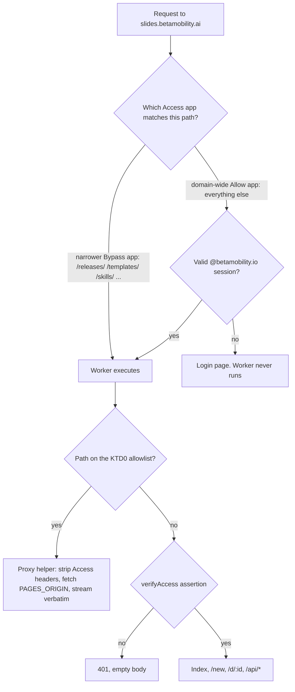
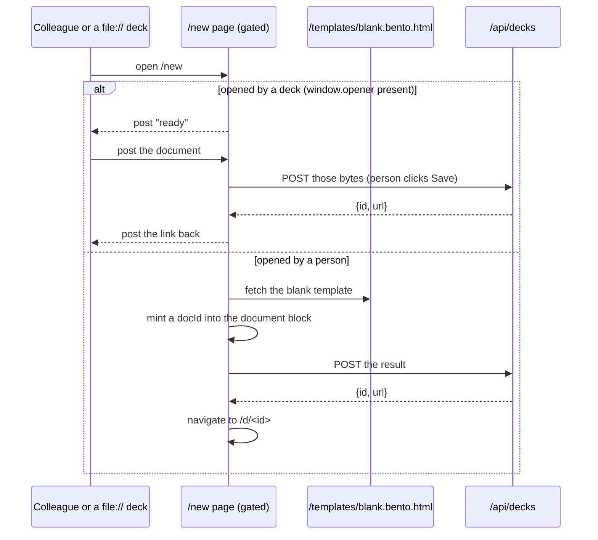

# feat: slides.betamobility.ai becomes the deck surface

## Goal Capsule

**Objective.** Make `slides.betamobility.ai` the one address a colleague uses: signing in shows their decks, `/new` mints a blank deck and opens it for editing, and a deck saves back to its own link. The release channel keeps its current URLs on that host, public and unlinked, so decks already shipped keep self-updating. `decks.betamobility.ai` is retired to a redirect.

**Authority hierarchy.** `docs/PLATFORM.md` wins over this plan; `AGENTS.md` fork rules win over convenience; this plan wins over habit. Where this plan and `server/deck-store/README.md` disagree, this plan is newer — and the README's claim that a service token gets `403` on `/api/decks` is already wrong in production (Access refuses first with a redirect), so fix the README rather than matching it.

**Stop conditions.** Stop and ask before: deleting the Pages project (it is the rollback), touching `~/.bento/release-key.json` or attempting a release, widening an Access policy beyond the prefixes in KTD0, or writing anything into a stored deck's bytes.

**Execution profile.** U1–U7 are ordinary TDD against the Miniflare rig and are never deployed by an agent. U8 (cutover) and U9 (release) are the maintainer's.

**Tail ownership (Johan only).** Detaching the Pages custom domain and attaching the worker's; creating and ordering the Access applications; editing `ACCESS_AUDS`; confirming on the record that this production domain may be reassigned; cutting and signing release v2026.9.3; flipping the two rollout flags.

---

## Product Contract

### Summary

Move the deck store onto `slides.betamobility.ai` and give it a `/new` that creates a blank deck in one click, so starting a presentation is a URL rather than a download. Keep the machine-facing files on that same host, public but invisible, and retire `decks.betamobility.ai` to a redirect that spares the one path already-shipped decks depend on.

### Problem Frame

A colleague who wants to make a presentation today has no entry point. `slides.betamobility.ai` serves a page about a release channel; the three starter templates are reachable only by knowing their URLs; and the deck store — the thing that actually makes a deck shareable — lives on a second hostname nobody has been told about, whose index assumes you already have a deck open. Every deck therefore starts life as a file in someone's Downloads folder, which is exactly what the store exists to end.

The store has no users yet, which is what makes this the cheapest moment to change its shape. Note the precision: it is the *store* that is unused. The hostname it is moving onto is not — see KTD4.

### Requirements

- **R1.** A signed-in colleague opening `slides.betamobility.ai` sees the decks in the store, newest first.
- **R2.** Opening `slides.betamobility.ai/new` creates a blank Beta-branded deck and lands the person in the editor on that deck's own link, with no file download and no extra click.
- **R3.** A deck opens at `slides.betamobility.ai/d/<id>` and ⌘S saves back to the same link in place.
- **R4.** Every path in the KTD0 allowlist stays reachable with no login and byte-identical to what Pages serves today. That table is authoritative; this requirement does not restate it, so the two cannot drift.
- **R5.** No surface a colleague sees links the paths in R4, with one deliberate exception: the plugin-install instruction points at `/skills/`, and that instruction is meant to be shared.
- **R6.** The Claude skill publishes through `slides.betamobility.ai/api/harness/*` with the existing service token, and the skill's own instructions name that host.
- **R7.** `decks.betamobility.ai` answers `301` to the same path on `slides.betamobility.ai` for a grace period, then is deleted by the maintainer.
- **R8.** The app knows exactly one store host. No shell carries a list of hosts, and `kernel/src/app.ts` is unchanged.
- **R9.** A gated path never serves content without an Access assertion the worker itself verified. Access config governs availability; the worker governs confidentiality.
- **R10.** The public release-channel landing page stops being an entry point. Its two plugin-install lines move into the footer of the deck list.
- **R11.** A deck already shipped keeps working: its Share handoff still reaches a page that answers, on the origin its own shell names, and the document it was publishing is not lost.
- **R12.** An anonymous visitor to the host root gets the Beta login page. This is intended for an internal tool and is stated so it is a decision rather than a side effect.

### Acceptance Examples

- **AE1.** Given a signed-in colleague, when they open `slides.betamobility.ai/new`, then a deck exists in the store carrying a real `docId`, the browser ends up on `/d/<id>` for it, and the editor opens rather than a viewer.
- **AE2.** Given that deck, when they type a title and press ⌘S, then the store holds the edited bytes at the same id and no file is downloaded.
- **AE3.** Given an anonymous client with no cookie, when it fetches `/releases/slides/manifest.json`, then the response is `200` with the manifest JSON — not a redirect to a login page.
- **AE4.** Given an anonymous client, when it fetches `/releases/slides/Bento_Slides.bento.html` with either `Accept: */*` or a browser `Accept` header, then both bodies are identical to each other and to what the Pages origin serves, and the sha256 matches the manifest's signed payload.
- **AE5.** Given an anonymous client, when it fetches `/d/<a real id>`, then Access answers with a redirect to the login page and no deck bytes are served.
- **AE6.** Given the harness service token, when it `POST`s a deck to `/api/harness/decks`, then the answer is `201` with an id and url on the new host; when it `GET`s `/api/decks`, it is refused.
- **AE7.** Given a link of the form `decks.betamobility.ai/d/<id>`, when it is opened, then the browser lands on `slides.betamobility.ai/d/<id>`.
- **AE8.** Given a deck file downloaded before this work, when the person uses Share → Save to Beta, then the handoff tab answers on the origin that deck's shell names, the person presses Save, and a link comes back — with no stray blank deck created.
- **AE9.** Given an unmodified deck built from release 2026.9.2, when its update check runs after the cutover and the new release, then it finds 2026.9.3, verifies it, and applies it.

### Scope Boundaries

**In scope.** The worker's routing, the Access shape, the blank-deck route, a minimal pass on the deck list, retiring the old host, one release that changes the store host, and the docs that describe all of it.

**Deferred for later.**
- Making the deck list genuinely designed (search, grouping, thumbnails). R1 asks only that it read as a home.
- A template picker at `/new`. Blank only, by decision.
- The Mission Control fleet-manifest entry for the store, already outstanding from the v1.1 plan and now covering a second surface on the same worker.
- Deleting `decks.betamobility.ai`, removing its `routes` entry, pruning its AUD from `ACCESS_AUDS`, and updating the editor tooltip's hostname. These are one follow-up, not four, and they happen when the grace period ends.

**Outside this product's identity.** Any change to who may sign in (`@betamobility.io` only), and any change to how decks are stored. The worker still never rewrites, indexes or decrypts a deck.

### Sources

- `server/deck-store/README.md` — the store's route contract, Access setup, and the SSL/TLS Full (Strict) requirement.
- `docs/plans/2026-09-08-002-feat-beta-slides-v1-1-plan.md` (U7, U8) — the store's origin, and the deploy-then-release ordering this plan repeats.
- `docs/DECISIONS.md`, 2026-09-08 "Beta-internal deck hosting is in" — the premise that every writer is a signed-in colleague. This plan adds a third consequence (KTD8).
- `docs/DECISIONS.md`, 2026-08-02 "Publishing one app may never delete another's artifacts" — 47 live files were once deleted with every gate green, because the gates were fail-open.
- `docs/DECISIONS.md` (~line 846) — Cloudflare's edge once injected a 359-byte analytics beacon into a shell fetched with a browser `Accept` header, breaking the sha256 pin.
- `slides/src/beta/store.ts` — `handoffToStore` opens `${storeHost}/new` and rejects any reply whose `ev.origin` is not that same host. The constraint behind KTD9.
- `server/guestbook-daemon/wrangler.toml` — records a worker fallback that cannot work because its target redirects back onto the worker's own route.
- [Workers × Cloudflare Access](https://developers.cloudflare.com/workers/configuration/cloudflare-access/) — "every request is checked before your Worker runs."
- [Access policies](https://developers.cloudflare.com/cloudflare-one/access-controls/policies/) — Bypass "does not enforce any Access security controls and requests are not logged"; within one application, precedence is policy order; posture checks in a Bypass fail when Workers intercept.
- [Application paths](https://developers.cloudflare.com/cloudflare-one/access-controls/policies/app-paths/) — "the more specific rule takes precedence" *between applications*, and no rule is inherited from the broader path.
- [Worker Custom Domains](https://developers.cloudflare.com/workers/configuration/routing/custom-domains/) — a Custom Domain cannot be created on a hostname that already has a CNAME record.
- [Workers limits](https://developers.cloudflare.com/workers/platform/limits/) — a Worker on a Custom Domain that fetches its own hostname re-invokes itself.

---

## Planning Contract

### Alternatives considered

**Keep the store on its own host and just link to it.** R1, R2, R3 and R6 are all achievable on `decks.betamobility.ai` as it stands, with `slides.betamobility.ai` linking to it and the skill naming it. That option avoids everything expensive in this plan: a production-domain reassignment, a downtime window, a proxy in the signed-update path, unlogged Bypass policies, and KTD8's mixed-trust origin. It is rejected because the owner's ask was explicitly that colleagues see one address and that `slides.betamobility.ai/new` be the thing they type — a second hostname behind a link is the shape being removed, not a cheaper way to keep it. Recorded here so a later reader can see the trade was made deliberately and knows what reverting would buy back.

**Workers Static Assets instead of a proxy** — see KTD2. **A Worker Route in front of the existing DNS record instead of a domain move** — see KTD4.

### Key Technical Decisions

**KTD0. The public allowlist, verified against the live host on 2026-09-10.**
This table is authoritative. The worker's allowlist, the Access Bypass applications and the route sweep are all derived from it; R4 points here rather than repeating it.

| Prefix | Who fetches it | Verified |
|---|---|---|
| `/releases/` | shipped decks checking for updates; the skill downloading a shell | manifest, shell and `packs.json` all `200` |
| `/templates/` | the skill; the `/new` page cloning the blank deck | three templates `200`, `blank` added by U2 |
| `/agents.md` | the skill and any agent harness | `200` |
| `/slides/agents.md` | the same guide at its per-app path; a rig asserts it is published | `200` |
| `/skills/` | `/plugin marketplace add betamobility/slides` fetches `SKILL.md` and the zip | both `200` |
| `/logo/` | favicons for the pages | `200` |
| `/robots.txt`, `/sitemap.xml`, `/404.html`, `/LICENSE` | crawlers and the site's own furniture | all `200` |

`/q` and `/help` are upstream's pages and already answer `404` on this host, so nothing is lost by omitting them. Anything not on this list is gated — a forgotten path costs a login prompt, never a leaked deck. The list is hand-compiled, which is why the sweep in the Verification Contract is inverted: it asserts against the *published inventory*, not against this table, so a newly published path fails the check instead of quietly needing a login.

**KTD1. Access shape: one path-scoped Bypass application per allowlisted prefix, created before the domain-wide Allow application.**
Access enforces before the Worker *executes*, so an anonymous request to a gated path is answered by Access and the worker never runs. A public path therefore needs Access-side treatment; there is no worker-only solution. The mechanism is *per-application path scoping*, where the narrower application wins and inherits nothing from the broader one — not policy ordering inside a single application, which is a different rule and would not give path specificity. So each prefix in KTD0 gets its own application carrying a single Bypass policy, and those are created **before** the domain-wide Allow application, or the machine paths are gated for however long the gap lasts. Two consequences to hold: bypassed requests carry no assertion and are not logged, which is acceptable for anonymous fetches of already-public signed bytes; and those applications' AUDs stay **out** of `ACCESS_AUDS`, since there is no assertion for the worker to verify on those paths. Never put a device-posture check in a Bypass policy — that combination is documented as broken when a Worker intercepts the request. The worker keeps verifying the assertion itself, so a wrong Access policy costs availability, never deck confidentiality (R9).

**KTD2. Pages stays the source of the signed bytes; the worker is in their delivery path.**
Workers Static Assets would serve the static tree and the store logic from one Worker with no cross-zone subrequest, and the tree fits its limits comfortably. It is rejected because it would make the release channel's *contents* come from whatever tree sits on the deploying machine, and the worker is the one component an agent deploys. Claim the narrow thing only: this protects against a stale working tree becoming the channel. It does **not** take the worker out of the delivery path — after this change every update check traverses it, so an agent-deployed proxy regression can still withhold or alter the bytes. That residual is why the shell's hash is asserted after every worker deploy, not only at cutover.

**KTD3. Proxy fidelity rules, each with a reason.**
Fetch the Pages project host from a `[vars]` entry (`PAGES_ORIGIN`) — never a host derived from the incoming request, which would re-invoke the worker. Let `fetch` follow redirects, because Pages `308`s `.html` URLs to their extensionless form. Return the upstream body unread and unmodified, preserving status and headers, so the manifest's sha256 pin holds. Send `Accept: */*`. Set no `cf` cache options: whether they are honored against another account's Cloudflare zone is undocumented, and the default middleware behaviour is what Cloudflare recommends. Strip `Cf-Access-Jwt-Assertion`, `Cf-Access-Authenticated-User-Email`, `CF-Access-Client-Id`, `CF-Access-Client-Secret` and `Cookie` from the subrequest: the assertion is a bearer credential bound to this application's audience and must not reach another origin. **Every** outbound subrequest goes through this one helper, so a second call site cannot forget a rule.

**KTD4. Take the documented cutover and name what the window costs.**
A Worker Custom Domain cannot be created on a hostname that already has a CNAME, and the Pages custom domain is one. A Worker *Route* in front of that record might avoid downtime, but no Cloudflare page says a Route may attach to a Pages hostname, so it is not relied on. The window is accepted — but not because "nothing is in use". What is unused is the *store*; the host that loses its origin is `slides.betamobility.ai`, and KTD0 enumerates its live consumers. During the window: shipped decks' update checks fail (they retry on next launch, and a failed check is silent by design), `/plugin marketplace add betamobility/slides` fails, and the skill cannot download a shell or a template. Nothing is corrupted and nothing needs repair afterwards, which is what makes the window acceptable rather than free. Do not delete the Pages project — re-attaching its domain is the rollback.

**KTD5. One store host, so the kernel is untouched.**
Retiring the old host removes the reason for a list of store origins: after the cutover there is one origin that serves decks. `slides/src/main.ts` changes its `storeHost` string and `kernel/src/app.ts` is not edited, keeping this out of the kernel zone and out of an upstream pull request. Two consequences to accept, both bounded by the store being unused: a deck stored *before* the cutover carries a shell naming the old host, so ⌘S on it downloads a file instead of saving in place (remedy in OQ1 — download, then `PUT` the bytes back, which is not the same action as "re-save"); and a deck created from a 2026.9.2 shell inherits that same limitation until it is re-saved from a 2026.9.3 shell.

**KTD6. `/new` is a page, not a redirect, and the client mints the identity.**
The route serves a small gated page that fetches `templates/blank.bento.html` from the public path, mints a `docId` into the document block, `POST`s the result to `/api/decks`, and navigates to the returned link. Three problems dissolve at once. The stored bytes are a *real deck from the outset*, so a fresh link has one stable identity — whereas storing a template verbatim would leave `parseDoc` minting a different `docId` on every open, so two colleagues opening the same fresh link would save two different identities under one store id and a reload before the first save would orphan the autosave snapshot keyed by that `docId`. No `kind: 'new'` metadata workaround is needed. And the template fetch is the *client's*, so no Access assertion is ever forwarded to another origin by the worker, and deck creation does not depend on the `/templates/` Bypass policy being right. The worker still never rewrites a deck: minting identity on load is exactly what the app itself does in `parseDoc`.

**KTD7. The pass-through is not tracked.**
Release-channel fetches are anonymous machine requests from shipped files; sending them to Plausible would add volume and no insight. Keep `deck_open` and `deck_save`, add `deck_new`, all with `surface: deck-store` and an `outcome` and nothing else. No id, title, email, path or content leaves the worker.

**KTD8. Deck scripts now share an origin with the release channel.**
The 2026-09-08 decision accepted that a script inside a stored deck runs first-party on the store origin, because every writer is a signed-in colleague. That origin now also serves the public release channel. The exposure is bounded and reviewed as such: the public surface is read-only `GET` of maintainer-published bytes, and no deck script has a write path into it. Record it in `docs/DECISIONS.md` (U7), because the entry says a change of this character reopens it.

**KTD9. The old host keeps serving `/new`, and the redirect is flag-gated.**
`handoffToStore` in a shipped shell opens `${storeHost}/new` and then **rejects any reply whose origin is not that same host**. So a blanket redirect breaks the handoff twice over: the tab lands on the wrong origin, and `/new` there now means something else. The person would watch a stray blank deck appear while the document they were publishing was silently discarded after a ten-minute timeout. Therefore: `/new` on the old host keeps serving the handoff page, everything else on that host redirects, and the redirect itself sits behind a `[vars]` flag that is off until the new host actually answers (see the cutover table). On the new host, `/new` serves the page from KTD6 — which also answers a handoff when it has a `window.opener`, so a 2026.9.3 shell's Share flow works on the new host with no second URL. R11 is satisfied without asking anyone to re-download anything.

### High-Level Technical Design

Request handling on the new host, in enforcement order. The left column is decided by Cloudflare before any of our code runs.

Two independent gates guard a deck — the Access policy and the worker's own verification — and the allowlist is a prefix-boundary match, so a path nobody thought about is gated by default.

What `/new` does. One page serves both a person and a shipped deck, discriminated by whether it was opened by another window:

Cutover order, with the two flags that make the ordering real rather than aspirational:

| # | Step | Whose | Reversible |
|---|---|---|---|
| 1 | Land U1–U7 on a branch, rigs green | agent | yes |
| 2 | Deploy the worker — `REDIRECT_OLD_HOST` off, `NEW_ENABLED` off | maintainer | yes |
| 3 | Detach the Pages custom domain, attach the worker's | maintainer | yes, re-attach Pages |
| 4 | Create the per-prefix Bypass applications, **then** the domain-wide Allow application; delete the old host's Access application; set `ACCESS_AUDS`; redeploy with `REDIRECT_OLD_HOST` on | maintainer | yes |
| 5 | Verify: inverted route sweep, byte fidelity under both `Accept` headers, signed-in pass, anonymous refusal, service-token pair, old-host redirect | either | n/a |
| 6 | Cut release v2026.9.3 | maintainer | **no** — a version is never re-signed |
| 7 | Publish the site: templates rebuilt from the new shell | maintainer | yes |
| 8 | Re-verify byte fidelity against the *new* shell, and apply an update from an untouched 2026.9.2 deck (AE9) | either | n/a |
| 9 | Redeploy with `NEW_ENABLED` on | maintainer | yes |

Step 2 keeps the redirect off because the new host is still Pages at that point — a redirect there would send deck opens and harness publishes to a host with no such routes. Step 9 is last because the `/new` page clones the published blank template, and a pre-release clone would name the old store host; the flag makes that a control rather than an accident, and U4 hides the New link while it is off. Step 8 exists because the byte-fidelity check at step 5 tests the bytes that step 6 replaces — checking only before the release would leave the plan's one invisible failure mode unverified.

### Assumptions

- The store holds no deck whose link has been shared (OQ1).
- The `betamobility.ai` zone is still SSL/TLS Full (Strict). Flexible in front of an HTTPS origin produces a redirect loop only authenticated users see.
- Cloudflare Web Analytics is not enabled on the zone (OQ3). If it is, the edge may inject bytes into proxied HTML and break the shell's hash.
- The Pages project keeps serving on its `*.pages.dev` hostname after its custom domain is detached.

### Open Questions

- **OQ1 (deferred, one browser check).** Does the store hold any decks? The harness token may create and replace but not list, so this cannot be answered from a shell. If it holds decks, the remedy for each is: open it, let ⌘S download the file, then `PUT` those bytes to `/api/decks/<id>` so the stored shell names the new host. "Re-save it" is not the remedy — the reason it needs attention is that ⌘S no longer saves in place.
- **OQ2 (blocking for U8, cheap).** Does an Access application path like `/releases/` match as a true prefix, or does it need an explicit wildcard? The docs establish precedence between applications but not the matching semantics. Confirm in the Access UI before creating eleven applications on a guess.
- **OQ3 (deferred, one dashboard check).** Is Cloudflare Web Analytics enabled on the zone? The shell's hash depends on the answer.
- **OQ4 (deferred, verify at step 5).** Do conditional (`If-None-Match`) and `Range` requests survive the proxy faithfully? Neither is documented for a Worker proxy, and nothing in the update path is known to use them.

---

## Implementation Units

### U1. The proxy helper and the public allowlist

**Goal.** The worker serves the machine paths to anonymous callers, byte-identically, through one helper every subrequest must use.

**Requirements.** R4, R5, R9.

**Dependencies.** None.

**Files.** `server/deck-store/src/worker.js`, `server/deck-store/wrangler.toml`, `server/deck-store/test/worker.test.mjs`.

**Approach.** Add a prefix allowlist resolved as the new first statement of `fetch()`, above the `verifyAccess` call — there is no existing hook point, and the comment above that call about nothing being enumerable without Access needs rewriting rather than deleting, because enumerability now stops at the allowlist. Everything unmatched falls through unchanged. Put the proxy behaviour in a single named helper implementing KTD3 in full, so U3 and anything later cannot re-implement it and drop a rule. Wrap the subrequest so an upstream failure is a readable error rather than a platform one, mirroring how `server/sync-worker/src/worker.js` wraps its Durable Object subrequests. Change `MANIFEST_HOST` in the report-only CSP: the manifest is now same-origin, so `'self'` covers it, and one rig assertion pins the old literal.

Change the rig's `outboundService` default for an unrecognised URL from `502` to a **throw**. As it stands it returns `502`, which is the same status the error-wrapper scenario asserts — so a worker that fetched the wrong host would pass. A throw makes a misdirected subrequest a distinct failure.

**Test scenarios.**
- Each allowlisted prefix returns `200` with the stub origin's exact bytes when the request carries no assertion at all.
- The body is byte-identical to the stub's, and upstream `content-type` and `cache-control` survive.
- The outbound subrequest carries none of `cf-access-jwt-assertion`, `cf-access-authenticated-user-email`, `cf-access-client-id`, `cf-access-client-secret`, `cookie`, and does carry `accept: */*`.
- The subrequest host is the configured `PAGES_ORIGIN`, never the request's own host.
- An upstream `308` to an extensionless path resolves to the final bytes rather than being returned as a redirect.
- An upstream `500` surfaces as the wrapper's readable error — and, because the stub now throws on unknown URLs, this can only pass through the wrapper.
- Covers AE5. `/d/<id>`, `/api/decks`, `/`, and an unknown path each still answer `401` with an empty body unauthenticated, with a gated path retained in the sweep so it cannot pass vacuously.
- A path that starts similarly to an allowlisted one but is not on it (`/releases-secret`) is gated, proving a prefix-boundary match rather than a substring.
- No Plausible event fires for a pass-through request.

**Verification.** `node scripts/test-beta-store.ts` green, including the existing Access-refusal and service-token sweeps.

**Execution note.** Write the "public without any assertion" test first and watch it fail against the current router — that failure is the unit, and it is the one behaviour a shipped deck depends on.

### U2. A blank deck to clone

**Goal.** `templates/blank.bento.html` is built and published alongside the three starters.

**Requirements.** R2.

**Dependencies.** None.

**Files.** `scripts/lib/beta-layouts.mjs`, `scripts/test-beta-layouts.ts`, `beta/README.md`, `docs/agents.md`.

**Approach.** Add a fourth entry to `betaTemplates` — one slide from the `beta-title` layout with placeholder title and subtitle, the same theme, fonts and six layouts as its siblings, `template: true`, no `docId`, no `collab`. `scripts/build-beta-templates.mjs` iterates the object and needs no change; `scripts/release.mjs` publishes whatever the builder emits. Exactly one rig hardcodes the set of three: `scripts/test-beta-layouts.ts`, which iterates a literal name list. `scripts/test-publish-gate.mjs` does **not** — its fixtures are invented names and it asserts a glob, so it needs no edit and a scenario there would prove only that a glob matches. `scripts/test-beta-templates-current.ts` derives from the directory and covers the fourth file for free.

Do not name the blank template in `SKILL.md`: `scripts/test-beta-skill.mjs` asserts the skill names exactly three templates, and `/new` is how a person gets a blank deck.

**Test scenarios.**
- The blank template is under 2 MB, its document block is plaintext and extractable, and it carries `template: true` with no `docId` and no `collab`.
- Its embedded document is byte-equal to what the builder produces for that name.
- `parseDoc` on it clears `template` and mints a fresh `docId`.
- `validateDoc` is clean apart from the one tolerated unknown-key warning.
- Its deflated payload hash equals the shell it was built from, so a stale template cannot be published.

**Verification.** `node scripts/build-beta-templates.mjs`, then `node scripts/test-beta-layouts.ts` and `node scripts/test-beta-templates-current.ts` green.

### U3. `/new`

**Goal.** `/new` serves one page that creates a blank deck for a person and answers a handoff for a deck.

**Requirements.** R2, R11.

**Dependencies.** U1 (the allowlist and the proxy helper), U2 (the template exists).

**Files.** `server/deck-store/src/worker.js`, `server/deck-store/src/pages.js`, `server/deck-store/test/worker.test.mjs`.

**Approach.** Keep the existing handoff page's protocol exactly as it is — its message types, its `window.opener` and origin checks, its single delivery flag and its one `POST` to `/api/decks` are a contract shared with `slides/src/beta/store.ts`. Extend it: when there is no `window.opener`, the page instead fetches the blank template, mints a `docId` into the document block (escaping every `<` as the `<` sequence the builders use, and refusing to proceed if a literal closing script tag would survive), `POST`s the bytes, and navigates to the returned link. Both paths already end in the same `POST`. Gate the whole route on the `NEW_ENABLED` var; while off, the route is absent and U4 hides the link.

The client does the template fetch, so the worker makes no subrequest here and no assertion can leak (KTD6). The page runs on the store origin, so its fetch of `/templates/blank.bento.html` is same-origin.

**Test scenarios.**
- Covers AE1. With `NEW_ENABLED` on, a signed-in `GET /new` serves the page, and the page's script contains both branches: the opener handshake and the create-and-navigate path.
- The document block the create path builds parses as a `bento/slides` document carrying a `docId` and no `template` flag — asserted by running the page's minting logic over the real blank template.
- The minting logic never emits a literal closing script tag, tested with a document whose content contains that string.
- Covers AE8. The handoff branch still posts `ready` only to `window.opener`, still accepts a document only from that opener, and still `POST`s exactly once.
- With `NEW_ENABLED` off, `/new` on the new host is `404` while `/new` on the old host still serves the handoff page.
- An unauthenticated `GET /new` is refused; a service token is refused.
- `deck_new` reaches the stubbed Plausible endpoint with `surface: deck-store` and no id, path or email.

**Verification.** `node scripts/test-beta-store.ts` green, plus the flow exercised against `npx wrangler dev` in a browser — a page whose two branches were only asserted statically is not proven.

**Execution note.** The handoff protocol is shipped code on the other side. Change nothing about the existing branch; add beside it.

### U4. The deck list reads as a home

**Goal.** The signed-in root looks like a place you start work.

**Requirements.** R1, R10.

**Dependencies.** U3.

**Files.** `server/deck-store/src/pages.js`, `server/deck-store/test/worker.test.mjs`.

**Approach.** Keep the table and the Beta tokens already inlined in that file; change what it leads with. A prominent link to `/new`, shown only when `NEW_ENABLED` is on; deck title and when it changed as the primary columns; owner and size demoted; `kind` shown only when it is not an ordinary deck. Replace the footer's mention of the old host with the two plugin-install lines the retired landing page carried. The empty state points at `/new`.

**Test scenarios.**
- The page contains a link to `/new` when the flag is on, and no such link when it is off.
- A deck title containing markup characters is still escaped.
- The footer contains the plugin-install text and no longer names the old host.
- The empty state renders when the store is empty.

**Verification.** `node scripts/test-beta-store.ts` green, plus a look at the rendered page in a browser.

### U5. One store host in the app

**Goal.** The shell names the new host as its store, and the skill publishes there.

**Requirements.** R3, R6, R8.

**Dependencies.** None in code; must not be *released* before the host answers.

**Files.** `slides/src/main.ts`, `slides/src/beta/store.ts`, `scripts/test-beta-appconfig.ts`, `scripts/test-beta-store-client.ts`, `plugins/beta-slides/skills/beta-slides/SKILL.md`, `scripts/test-beta-skill.mjs`.

**Approach.** One string changes in `slides/src/main.ts`. `slides/src/beta/store.ts` is in this unit because it is where the handoff URL is built — the target stays `/new` per KTD9, so what changes there is only the comments that describe which host answers. `scripts/test-beta-appconfig.ts` pins the old host literally and must pin the new one; `scripts/test-beta-store-client.ts` pins the store origin in its fake `location` and in its handoff assertion. In the skill, the harness `curl` commands and surrounding prose move to the new host. `kernel/src/app.ts` is deliberately untouched (KTD5) — if editing it starts to look necessary, stop: that is a kernel-zone edit and a different unit.

`scripts/test-beta-skill.mjs` will fail here for a non-obvious reason: it asserts every URL the skill names under the site origin is in a `published` set of static release paths, and the skill is about to name `/api/harness/decks`, which is a route. Extend the rig so store routes are legitimate rather than deleting the check — it is what stops the skill pointing at a URL the site does not serve.

The editor's Save-to-Beta tooltip names the old host in English and eight catalogs. Left alone deliberately: it stays true while the redirect lives, and changing it invokes the all-catalogs rule for a string that will be revisited when the host is deleted.

**Test scenarios.**
- The app-config rig sees exactly one store host and it is the new one.
- The client rig's handoff test opens `<new host>/new` and rejects a message from any other origin.
- A save from a deck served on the store origin resolves to an in-place `PUT`, not a download.
- The skill rig accepts store routes as legitimate URLs under the site origin, and still refuses a skill URL the site genuinely does not serve.
- The harness host in the skill matches the app's configured store host.

**Verification.** `slides/node_modules/.bin/tsc -b`, then `node scripts/test-beta-appconfig.ts`, `node scripts/test-beta-store-client.ts`, `node scripts/test-beta-skill.mjs`, `node scripts/test-offline.ts`.

### U6. The old host redirects, except `/new`

**Goal.** Old links land on the new host, without breaking the handoff shipped decks depend on.

**Requirements.** R7, R11.

**Dependencies.** U1, U3.

**Files.** `server/deck-store/src/worker.js`, `server/deck-store/wrangler.toml`, `server/deck-store/test/worker.test.mjs`.

**Approach.** Keep the old hostname on the same worker. When `REDIRECT_OLD_HOST` is on, answer every request to that host with a `301` to the same path and query on the new host — except `/new`, which keeps serving the handoff page there, because a shipped shell rejects a reply from any origin but the one it opened (KTD9). The branch sits with the allowlist, before `verifyAccess`, so a signed-out person following an old link is redirected rather than bounced through a login on a host that is going away; that is also why the old host's Access application is deleted in U8, since otherwise Access answers before the worker and the redirect never fires.

`wrangler.toml` gains `{ pattern = "slides.betamobility.ai", custom_domain = true }` alongside the existing route, and both flags as `[vars]`. Without that entry a `wrangler deploy` from a fresh clone would reproduce only the retired address.

This unit flips the rig's origin: `worker.test.mjs` hardcodes one `ORIGIN` constant and routes every dispatch through it, and two assertions compare a returned `url` against it. That constant becomes the new host for the whole suite, with a second `OLD_ORIGIN` introduced only for the redirect cases — otherwise every existing assertion receives a `301` and the suite goes red for reasons unrelated to the change.

**Test scenarios.**
- Covers AE7. With the flag on, `GET /d/<id>` on the old host answers `301` to the same path on the new host.
- A query string survives the redirect.
- The redirect fires with no assertion present.
- `/new` on the old host is **not** redirected and still serves the handoff page, with the flag on.
- With the flag off, the old host behaves exactly as it does today.
- A request to the new host is never redirected.

**Verification.** `node scripts/test-beta-store.ts` green with both origins exercised.

### U7. Say what changed, and give the sweep something to run

**Goal.** The docs describe the new shape, and the route sweep the Definition of Done depends on exists as a runnable script.

**Requirements.** R4, R5, R9, R10.

**Dependencies.** U1, U3, U4, U5, U6.

**Files.** `scripts/check-store-live.mjs`, `server/deck-store/README.md`, `docs/DECISIONS.md`, `AGENTS.md`, `README.md`.

**Approach.** Write `scripts/check-store-live.mjs`: it imports `walk` from `scripts/site-inventory.mjs` (which exports helpers and has no command-line entry point of its own, and reads the published clone at `BENTO_SITE_DIR`), enumerates every published path, fetches each anonymously against the live host, and asserts each is either `200` or listed in a committed `intentionally-gated` list beside it. A path that is published and neither reachable nor explicitly excepted fails the check. The name deliberately avoids the `test-*` prefix, because `scripts/test-ci-registered.ts` requires every `test-*` rig to run in CI and this one needs the network and a live host.

Then the docs: rewrite the store README's route table for two hosts and the allowlist, correct its Access-refusal claim, fix the team-domain example, and document the Access application shape including the ordering and the no-posture rule. Add a `docs/DECISIONS.md` entry covering KTD1, KTD2's narrowed claim, KTD6 and KTD8. Update fork rule 7's host list in `AGENTS.md` and the host line at the top of `README.md`. Note in the README that the retired landing page remains in the published tree, unreferenced, so a later reader does not treat it as live.

**Test scenarios.** The checker is itself testable without the network: given a fake inventory and a stubbed fetch, it passes when every published path is reachable, fails when a published path is gated and unlisted, and passes when that path is on the exception list. Write those three. The doc edits carry `Test expectation: none -- documentation only.`

**Verification.** The three checker cases pass; grep the repo for the old hostname and confirm every surviving mention is deliberately about the redirect or the tooltip follow-up.

### U8. Cutover (maintainer)

**Goal.** The new host serves the store, and the machine paths still answer anonymously.

**Requirements.** R1, R4, R6, R9, R12.

**Dependencies.** U1–U7 merged; OQ2 answered.

**Files.** `server/deck-store/wrangler.toml` (`ACCESS_AUDS` and the two flags).

**Approach.** Follow the cutover table, steps 2 to 5. Answer OQ2 in the Access UI first, because the application count depends on it. Create the per-prefix Bypass applications **before** the domain-wide Allow application (KTD1). Delete the old host's Access application, or U6's redirect never fires for the anonymous caller it exists for. Recreate the service-token application scoped to `/api/harness/` on the new hostname. Put the human and service-token AUDs into `ACCESS_AUDS` and leave the Bypass applications' AUDs out; prune the old host's AUD when that host is deleted, not now. Keep the Pages project. Use `env -u CLOUDFLARE_API_TOKEN npx wrangler ...` — the shell's token is DNS-only and shadows the OAuth login. Access applications are edited with `PUT` and the whole object, never `PATCH`.

If the Worker Route idea from KTD4 is tried on a throwaway subdomain, remove every trace from `wrangler.toml` afterwards.

**Test scenarios.** `Test expectation: none -- this is a deploy.` The proof is the live checks below, all of which must pass before U9.

**Verification.** Every live check in the Verification Contract, in order.

### U9. Release v2026.9.3, verify, then enable `/new` (maintainer)

**Goal.** Shipped shells learn the new store host, and `/new` clones a shell that names it.

**Requirements.** R2, R3, R8.

**Dependencies.** U8 verified.

**Files.** None beyond the release's own artifacts.

**Approach.** Cutover table steps 6 to 9: cut and sign the release from a clean checkout, publish the site so all four templates are rebuilt from the new shell, re-verify byte fidelity against the *new* shell, apply an update from an untouched 2026.9.2 deck, and only then redeploy with `NEW_ENABLED` on. A version is never re-signed, so nothing about the store host can be corrected after step 6 without a new version — which is why step 8 is a gate and not a formality.

**Test scenarios.** `Test expectation: none -- release and publish.` Its proof is AE9 and the re-run fidelity check.

**Verification.** The manifest reports 2026.9.3; the new shell's sha256 matches its signed payload under both `Accept` headers; Covers AE9 — an untouched 2026.9.2 deck detects, verifies and applies the update; a fresh `/new` deck saves in place with ⌘S.

---

## System-Wide Impact

**The auth boundary gains a second gate and a second failure mode.** Confidentiality still rests on the worker's own assertion check, which is unchanged. What is new is that *availability* of the public paths depends on Access configuration that lives in a dashboard, not in this repo. The asymmetry is deliberate: a wrong policy costs a login prompt on a machine path, never a served deck. It is also unaudited — bypassed requests are not logged — so drift would be silent. The live checker in U7 is the only thing that would catch it; running it after any Access change is worth making a habit.

**The release channel acquires a dependency it did not have.** Every update check now traverses our worker. KTD2 keeps the *bytes* on the safe path, but the route to them is now agent-deployable, which is why the shell hash is asserted after every worker deploy rather than only at cutover.

**Analytics gains a surface.** The same worker now answers anonymous machine traffic. KTD7 keeps it untracked, so no new event shape appears, but the outstanding Mission Control fleet entry for this store now covers two surfaces.

**The Claude skill's contract moves.** The publishing host in `plugins/beta-slides/skills/beta-slides/SKILL.md` is what an agent reads before publishing. It changes in U5, and the rig that guards it changes with it. A skill left on the old host keeps working through the redirect and then silently stops when the host is deleted.

**The report-only CSP simplifies.** `MANIFEST_HOST` names the manifest host as foreign; it becomes same-origin, and one rig assertion moves with it.

**Eight locale catalogs hold a hostname**, in the Save-to-Beta tooltip. Deliberately deferred with the other old-host cleanups.

---

## Risks & Dependencies

| Risk | If it happens | Mitigation |
|---|---|---|
| An Access application covers a machine prefix that should be public, or the Bypass applications are created after the domain-wide Allow | Every shipped deck's update check gets a login page instead of a manifest, silently — no user sees an error | Ordering is explicit in KTD1 and step 4. The inverted route sweep is run before the release, and re-run after any Access change. Rollback is re-attaching the Pages custom domain |
| A Bypass application's path is broader than intended and covers a deck path | A deck is reachable without a login | The worker verifies the assertion itself for every non-allowlisted path, so the deck is still refused. The sweep asserts each gated path answers a redirect anonymously |
| The proxy or the edge alters bytes — an injected beacon, a re-compression | Shells fail their sha256 pin and silently refuse to update | Body returned unread (KTD3); fidelity asserted under both `Accept` headers, against the Pages origin's own bytes, before *and* after the release, plus after every worker deploy. There is a recorded 359-byte precedent |
| A published path is added later and nobody adds it to the allowlist | It quietly requires a login; a machine consumer breaks with no error | The sweep is inverted — it fails on any published path that is neither anonymously reachable nor on a committed exception list |
| The store already holds decks from before the cutover | Their ⌘S downloads a file instead of saving in place | OQ1 answers whether any exist. Remedy per deck: download via ⌘S, then `PUT` those bytes back to `/api/decks/<id>` |
| The old host is deleted before old links stop circulating | Shared links stop resolving | The redirect ships here; deletion is a separate later action and is not in the Definition of Done |
| The cutover window runs long on certificate issuance | Update checks, the plugin marketplace fetch and the skill's downloads fail for the duration | Accepted and bounded in KTD4: nothing is corrupted, nothing needs repair. Do not delete the Pages project; poll the worker's domain status rather than probing the hostname, which can poison the local resolver for the negative TTL |

**Dependencies.** R2 (Cloudflare) and the `beta-decks` bucket — already live. The zone on SSL/TLS Full (Strict) — already set, worth re-confirming. Wrangler on the OAuth login, with the shell's DNS-only token unset for every Workers or Pages call. OQ2 answered before U8. Cloudflare Web Analytics off (OQ3).

---

## Verification Contract

**Repo gates**, in the order the `beta` CI job runs them: `slides/node_modules/.bin/tsc -b`; `npm run build:single` in `slides/`; `node scripts/shell-gate.mjs slides/dist-single/Bento_Slides.bento.html`; `node scripts/build-beta-templates.mjs` before any rig that reads `beta/templates/`; then `node scripts/test-beta-layouts.ts`, `node scripts/test-beta-templates-current.ts`, `node scripts/test-beta-appconfig.ts`, `node scripts/test-beta-skill.mjs`, `node scripts/test-publish-gate.mjs`, `node scripts/test-offline.ts`, `node scripts/test-beta-store.ts`, `node scripts/test-beta-store-client.ts`, `node scripts/test-ci-registered.ts`.

`scripts/check-store-live.mjs` is new but is not a `test-*` rig and does not run in CI: it needs the network and the live host. Its three offline cases run with the repo gates.

**Live checks after the cutover.** Miniflare proves the worker and nothing about the certificate, the team domain, the Access precedence or a token's scope.

1. **Inverted route sweep, anonymous.** `node scripts/check-store-live.mjs` — every path in the published inventory must answer `200` with no cookie, or appear on the committed exception list. A published path that is silently gated fails.
2. **Byte fidelity, both ways.** Fetch the manifest and the shell with `Accept: */*` and again with a browser `Accept` header; the two bodies must be identical to each other and to what the Pages origin serves directly, and the shell's sha256 must equal the `sha256` inside the manifest's signed payload (the payload is a JSON string inside the manifest JSON — parse twice). Repeat after the release against the new shell.
3. **Signed-in pass, in a browser.** Open the root, click through to `/new`, confirm the editor opens on `/d/<id>`, type a title, ⌘S, reload the link and see the change.
4. **Anonymous refusal.** `/d/<a real id>` — created for the purpose if the store is empty — plus `/api/decks`, each answering a redirect to the login page with no deck bytes anywhere in the response.
5. **Service token pair.** `POST /api/harness/decks` answers `201`; `GET /api/decks` with the same token is refused.
6. **Old host.** An old-form deck link answers `301` to the new host, and the old host's `/new` still serves the handoff page.
7. **A real update.** From an untouched 2026.9.2 deck, run the update check and apply it (AE9).

## Definition of Done

- R1–R12 each satisfied, with R4 proven by the inverted sweep rather than by inspection.
- Every repo gate green locally and in CI.
- The blank-deck flow and the shipped-deck handoff both exercised in a browser by Johan on the deployed host — AE8 matters as much as AE1, and only one of them is new.
- The store README, `AGENTS.md` fork rule 7, `README.md` and a `docs/DECISIONS.md` entry updated; no doc presents the old host as the store's primary address.
- The old-host cleanup recorded as one follow-up: delete the host, remove its `routes` entry, prune its AUD, update the editor tooltip.
- OQ1 answered, and any pre-cutover deck fixed by the download-then-`PUT` remedy or explicitly accepted as download-only. OQ2 answered before U8.
- No abandoned experiment in the diff — in particular nothing from a Worker Route trial survives in `wrangler.toml`.
- Rollback still available: the Pages project exists and its custom domain can be re-attached.

## Appendix: three mistakes this plan is shaped to avoid

**Serving the release channel from anything an agent deploys.** The signed bytes are pinned by hash inside a signature already shipped. If the bytes come from a working tree, a stale tree publishes a broken channel with every gate green.

**Believing an anonymous probe.** The recorded SSL/TLS incident produced a redirect loop that *only authenticated users* saw, because Access intercepted every anonymous check first. The inverse now also holds: an anonymous check exercises a second origin a signed-in check does not. Both get verified, in a browser, by a person.

**Renaming a URL that shipped inside other software.** `/new` is not ours to redefine unilaterally — a deck already on someone's disk opens it and refuses any answer from another origin. The old host keeps serving that one path for exactly that reason, and the new host's `/new` answers both audiences rather than choosing one.
