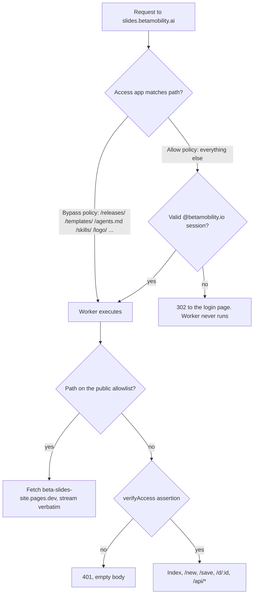

# feat: slides.betamobility.ai becomes the deck surface

## Goal Capsule

**Objective.** Make `slides.betamobility.ai` the one address a colleague uses: signing in shows their decks, `/new` mints a blank deck and opens it for editing, and a deck saves back to its own link. The release channel keeps its current URLs on that host, public and unlinked, so decks already shipped keep self-updating. `decks.betamobility.ai` is retired to a redirect.

**Authority hierarchy.** `docs/PLATFORM.md` wins over this plan; `AGENTS.md` fork rules win over convenience; this plan wins over habit. Where this plan and `server/deck-store/README.md` disagree, this plan is newer — and the README's claim that a service token gets `403` on `/api/decks` is already wrong in production (Access refuses first with a redirect), so fix the README rather than matching it.

**Stop conditions.** Stop and ask before: deleting the Pages project (it is the rollback), touching `~/.bento/release-key.json` or attempting a release, widening an Access policy beyond the prefixes named in KTD1, or writing anything into a stored deck's bytes.

**Execution profile.** The worker changes are ordinary TDD against the Miniflare rig. The cutover (U8) and the release (U9) are the maintainer's and are not agent work. Nothing in U1–U7 is deployed by an agent.

**Tail ownership (Johan only).** Detaching the Pages custom domain and attaching the worker's; creating and scoping the Access applications; adding the new AUD to `ACCESS_AUDS`; confirming on the record that this production domain may be reassigned; cutting and signing release v2026.9.3.

---

## Product Contract

### Summary

Move the deck store onto `slides.betamobility.ai` and give it a `/new` that creates a blank deck in one click, so starting a presentation is a URL rather than a download. Keep the machine-facing files on that same host, public but invisible, and retire `decks.betamobility.ai` to a redirect.

### Problem Frame

A colleague who wants to make a presentation today has no entry point. `slides.betamobility.ai` serves a page about a release channel; the three starter templates are reachable only by knowing their URLs; and the deck store — the thing that actually makes a deck shareable — lives on a second hostname nobody has been told about, whose index assumes you already have a deck open. Every deck therefore starts life as a file in someone's Downloads folder, which is exactly what the store exists to end.

Nothing is in use yet, so this is the cheapest moment to fix the shape.

### Requirements

- **R1.** A signed-in colleague opening `slides.betamobility.ai` sees the decks in the store, newest first.
- **R2.** Opening `slides.betamobility.ai/new` creates a blank Beta-branded deck and lands the person in the editor on that deck's own link, with no file download and no handoff step.
- **R3.** A deck opens at `slides.betamobility.ai/d/<id>` and ⌘S saves back to the same link in place.
- **R4.** Every path that shipped software or the Claude skill fetches stays reachable with no login and byte-identical to what Pages serves today: `/releases/*`, `/templates/*`, `/agents.md`, `/slides/agents.md`, `/skills/*`, `/logo/*`, `/robots.txt`, `/sitemap.xml`, `/404.html`, `/LICENSE`.
- **R5.** No human surface links the paths in R4. They are public in the sense that an anonymous fetch succeeds, invisible in the sense that nothing points at them.
- **R6.** The Claude skill publishes through `slides.betamobility.ai/api/harness/*` with the existing service token, and the skill's own instructions name that host.
- **R7.** `decks.betamobility.ai` answers `301` to the same path on `slides.betamobility.ai` for a grace period, then is deleted by the maintainer.
- **R8.** The app knows exactly one store host. No shell carries a list of hosts, and `kernel/src/app.ts` is unchanged.
- **R9.** A gated path never serves content without an Access assertion the worker itself verified. Access config governs availability; the worker governs confidentiality.
- **R10.** The public release-channel landing page is retired. Its two plugin-install lines move into the footer of the deck list, where a colleague would look for them.
- **R11.** The page a `file://` deck hands its document to moves from `/new` to `/save`.

### Acceptance Examples

- **AE1.** Given a signed-in colleague, when they open `slides.betamobility.ai/new`, then a new deck exists in the store, the browser ends up on `/d/<id>` for that deck, and the deck opens in the editor rather than a viewer.
- **AE2.** Given that same deck, when they type a title and press ⌘S, then the store holds the edited bytes at the same id and no file is downloaded.
- **AE3.** Given an anonymous client with no cookie, when it fetches `/releases/slides/manifest.json`, then the response is `200` with the manifest JSON — not a redirect to a login page.
- **AE4.** Given an anonymous client, when it fetches `/releases/slides/Bento_Slides.bento.html` with `Accept: */*`, then the body's sha256 equals the `sha256` inside the manifest's signed payload.
- **AE5.** Given an anonymous client, when it fetches `/d/<a real id>`, then Access answers with a redirect to the login page and no deck bytes are served.
- **AE6.** Given the harness service token, when it `POST`s a deck to `/api/harness/decks`, then the answer is `201` with an id and url on the new host; when it `GET`s `/api/decks`, it is refused.
- **AE7.** Given a link of the form `decks.betamobility.ai/d/<id>`, when it is opened, then the browser lands on `slides.betamobility.ai/d/<id>`.

### Scope Boundaries

**In scope.** The worker's routing, the Access shape, the blank-deck route, a minimal pass on the deck list so it reads as a home, retiring the old host, one release that changes the store host, and the docs that describe all of it.

**Deferred for later.**
- Making the deck list genuinely designed (search, grouping, thumbnails). R1 asks only that it read as a home: title, when it changed, a New button, the plugin lines in the footer.
- A template picker at `/new`. Blank only, by decision.
- The Mission Control fleet-manifest entry for the store, which was already outstanding from the v1.1 plan and now covers a second surface on the same worker.
- Deleting `decks.betamobility.ai` — the redirect ships here, the deletion is a later maintainer action.

**Outside this product's identity.** Any change to who may sign in (`@betamobility.io` only), and any change to how decks are stored. The worker still never rewrites, indexes or decrypts a deck.

### Sources

- `server/deck-store/README.md` — the store's route contract, Access setup, and the SSL/TLS Full (Strict) requirement.
- `docs/plans/2026-09-08-002-feat-beta-slides-v1-1-plan.md` (U7, U8) — the store's origin, and the deploy-then-release ordering habit this plan repeats.
- `docs/DECISIONS.md`, 2026-09-08 "Beta-internal deck hosting is in" — the premise that every writer is a signed-in colleague, and the two consequences accepted on that basis. This plan adds a third (KTD8).
- `docs/DECISIONS.md`, 2026-08-02 "Publishing one app may never delete another's artifacts" — 47 live files were once deleted with every gate green, because the gates were fail-open. `scripts/site-inventory.mjs` is the fail-closed enumerator this plan reuses.
- `docs/DECISIONS.md` (~line 846) — Cloudflare's edge once injected a 359-byte analytics beacon into a shell fetched with a browser `Accept` header, breaking the sha256 pin. The reason KTD3 sends `Accept: */*`.
- [Workers × Cloudflare Access](https://developers.cloudflare.com/workers/configuration/cloudflare-access/) — "every request is checked before your Worker runs."
- [Access policies](https://developers.cloudflare.com/cloudflare-one/access-controls/policies/) — Bypass "does not enforce any Access security controls and requests are not logged"; posture checks in a Bypass policy fail when Workers intercept.
- [Application paths](https://developers.cloudflare.com/cloudflare-one/access-controls/policies/app-paths/) — "the more specific rule takes precedence" and no rule is inherited from the broader path; query strings, ports and anchors are unsupported in paths.
- [Worker Custom Domains](https://developers.cloudflare.com/workers/configuration/routing/custom-domains/) — "You cannot create a Custom Domain on a hostname with an existing CNAME DNS record." A Pages custom domain is one.
- [Workers limits](https://developers.cloudflare.com/workers/platform/limits/) — a Worker on a Custom Domain fetching its own hostname re-invokes itself; subrequests are 1,000+ on paid, and each redirect in a chain counts.
- `/Users/johan/Dev/Beta Mobility/Docs/auth-setup.md` — a machine caller gets its own path-scoped app, never a second policy on the domain-wide app; app edits are `PUT`, not `PATCH`; `sub` is empty for service tokens.

---

## Planning Contract

### Key Technical Decisions

**KTD1. Access shape: one gated application on the hostname, plus Bypass policies on the machine prefixes.**
Access enforces before the Worker *executes*, so an anonymous request to a gated path is answered by Access and the worker never runs. A public path therefore needs Access-side treatment; there is no worker-only solution. Two shapes work — a narrower app per public prefix, or Bypass policies — and Bypass is chosen because it keeps the root as the deck list with no redirect hop. The cost is that bypassed requests are not logged, which is acceptable for anonymous machine fetches of already-public signed bytes. Never put a device-posture check in these Bypass policies: that combination is documented as broken when a Worker intercepts the request. The worker keeps verifying the assertion itself, so a wrong Access policy costs availability, never deck confidentiality (R9).

**KTD2. Pages stays the origin of the signed bytes; the worker proxies them.**
Workers Static Assets would serve the static tree and the store logic from one Worker with no cross-zone subrequest, and the tree fits its limits comfortably. It is rejected anyway: it moves the signed release bytes into `wrangler deploy`, so the release channel's contents would come from whatever tree sits on the deploying machine — and the worker is the one component an agent deploys. Pages keeps those bytes behind the maintainer's existing publish flow and its fail-closed deletion inventory. The proxy's unknowns degrade to "slower"; this failure mode is unrepairable.

**KTD3. Proxy fidelity rules, each with a reason.**
Fetch the Pages project host (`beta-slides-site.pages.dev`) from a `[vars]` entry — never a host derived from the incoming request, which would re-invoke the worker (the guestbook worker's origin fallback is documented as non-functional for exactly this reason). Let `fetch` follow redirects, because Pages `308`s `.html` URLs to their extensionless form. Return the upstream body unread and unmodified, preserving status and headers, so the manifest's sha256 pin holds. Send `Accept: */*`. Set no `cf` cache options: whether they are honored against another account's Cloudflare zone is undocumented, and the default middleware behaviour is what Cloudflare recommends. Strip `Cf-Access-Jwt-Assertion`, `Cf-Access-Authenticated-User-Email`, `CF-Access-Client-Id`, `CF-Access-Client-Secret` and `Cookie` from the subrequest: the assertion is a bearer credential bound to this application's audience and must not reach another origin.

**KTD4. Take the documented cutover and accept the gap.**
A Worker Custom Domain cannot be created on a hostname that already has a CNAME, and the Pages custom domain is one. A Worker *Route* in front of that record might avoid any downtime, but no Cloudflare page says a Route may attach to a Pages hostname. Since nothing is in use yet, downtime is acceptable, so: detach the Pages custom domain, attach the worker's, verify. Do not delete the Pages project — re-attaching its domain is the rollback.

**KTD5. One store host, so the kernel is untouched.**
Retiring `decks.betamobility.ai` removes the reason for a list of store origins: after the cutover there is exactly one origin that serves decks. `slides/src/main.ts` changes its `storeHost` string and `kernel/src/app.ts` is not edited, which keeps this work out of the kernel zone and out of an upstream pull request. The consequence to accept: a deck stored *before* the cutover carries a shell naming the old host, so its ⌘S would fall back to downloading a file until it is re-saved. Open Question OQ1 confirms whether any such deck exists.

**KTD6. `/new` stores the blank template verbatim; the client mints the identity.**
The worker fetches `templates/blank.bento.html` from its own public path and writes those bytes under a fresh id. It does not splice in a `docId` — that would be rewriting a deck, which the store's premise forbids. The template's `template: true` flag is load-bearing: `parseDoc` in `slides/src/model.ts` drops it and mints a fresh `docId` on open, so two people clicking `/new` never collide. Because the stored bytes are a template until the first save, the worker records `kind: 'new'` in R2 custom metadata at creation so the list does not label a fresh deck "template"; the first `PUT` recomputes kind from the bytes as it already does.

**KTD7. The pass-through is not tracked.**
Release-channel fetches are anonymous machine requests from shipped files; sending them to Plausible would add volume and no insight. Keep `deck_open` and `deck_save`, add `deck_new` for R2's route, all with `surface: deck-store` and an `outcome` and nothing else. No id, title, email, path or content leaves the worker.

**KTD8. Deck scripts now share an origin with the release channel.**
The 2026-09-08 decision accepted that a script inside any stored deck runs first-party on the store origin, because every writer is a signed-in colleague. After this change that origin also serves the public release channel. The exposure is bounded — the public surface is read-only `GET` of already-public bytes, and no deck can write to it — but it is a new consequence of an entry that says a change of this character reopens it. Record it in `docs/DECISIONS.md` (U7).

### High-Level Technical Design

Request handling on the new host, in enforcement order. The left column is decided by Cloudflare before any of our code runs.



Two independent gates guard a deck: the Access policy and the worker's own verification. The allowlist is a prefix allowlist, so a path nobody thought about is gated by default.

What `/new` does, and why the person never sees a file:

```mermaid
sequenceDiagram
    participant P as Colleague
    participant W as Worker (slides host)
    participant T as templates/blank.bento.html
    participant R as R2
    P->>W: GET /new (signed in)
    W->>T: fetch own public path (cached)
    T-->>W: blank Beta deck bytes
    W->>R: put decks/<fresh id>, kind "new"
    W-->>P: 302 /d/<id>
    P->>W: GET /d/<id>
    W-->>P: the deck; parseDoc mints a fresh docId on open
    P->>W: ⌘S -> PUT /api/decks/<id>
    W->>R: replace in place, kind recomputed
```

Cutover order matters, because two of these steps are irreversible from an agent's side and one is the maintainer's alone:

| # | Step | Whose | Reversible |
|---|---|---|---|
| 1 | Land U1–U7 on a branch, rigs green | agent | yes |
| 2 | Deploy the worker (still only on the old host) | maintainer | yes |
| 3 | Detach the Pages custom domain, attach the worker's | maintainer | yes, re-attach Pages |
| 4 | Create the Access apps and Bypass policies, fill `ACCESS_AUDS`, redeploy | maintainer | yes |
| 5 | Verify anonymously and signed-in, including the shell's sha256 | either | n/a |
| 6 | Cut release v2026.9.3 | maintainer | no, a version is never re-signed |
| 7 | Rebuild and publish templates from that shell, then enable `/new` | maintainer + agent | yes |

`/new` is enabled last on purpose. It clones whatever shell the blank template was built from, and a pre-release clone would name the old store host — so ⌘S on a brand-new deck would download a file instead of saving. Serving `/new` before step 7 breaks the one flow this plan exists to create.

### Assumptions

- The store holds no deck whose link has been shared, and none whose loss of in-place save would matter (OQ1).
- The `betamobility.ai` zone is still SSL/TLS Full (Strict), set when the store was stood up. Flexible in front of an HTTPS origin produces a redirect loop only authenticated users see.
- Cloudflare Web Analytics is not enabled on the zone. If it is, the edge may inject bytes into proxied HTML and break the shell's hash.
- The Pages project `beta-slides-site` keeps serving on `beta-slides-site.pages.dev` after its custom domain is detached.

### Open Questions

- **OQ1 (deferred, one browser check).** Does the store currently hold any decks? The harness service token may create and replace but not list, so this cannot be answered from a shell. Johan opens the list and says. If it holds decks, re-save each after the release, or accept that ⌘S on them downloads a file.
- **OQ2 (deferred, verify after step 5).** Do conditional requests (`If-None-Match` → `304`) and `Range` requests pass through the proxy faithfully? Neither is documented for a Worker proxy. Nothing in the update path depends on them today; measure rather than assume.

---

## Implementation Units

### U1. Public allowlist and the Pages pass-through

**Goal.** The worker serves the machine paths to anonymous callers, byte-identically, and gates everything else exactly as before.

**Requirements.** R4, R5, R9.

**Dependencies.** None.

**Files.** `server/deck-store/src/worker.js`, `server/deck-store/wrangler.toml`, `server/deck-store/test/worker.test.mjs`.

**Approach.** Add a prefix allowlist resolved as the new first statement of `fetch()`, above the `verifyAccess` call — there is no existing hook point, and the comment above that call ("an unknown path without an assertion is 401, not 404, so nothing about the store is enumerable") needs rewriting rather than deleting, because enumerability now stops at the allowlist rather than at the first line. Everything not matched falls through to the existing behaviour unchanged. The proxy follows KTD3 in full; put the upstream host in `[vars]` as `PAGES_ORIGIN` so no code names it. Wrap the subrequest so an upstream failure is a readable `502` rather than a platform error, mirroring how `server/sync-worker/src/worker.js` wraps its Durable Object subrequests. In the same unit, change `MANIFEST_HOST` in the report-only CSP: the manifest is now same-origin, so `'self'` covers it.

**Patterns to follow.** `server/guestbook-daemon/src/worker.js` for "upstream host as a wrangler var", and its own `wrangler.toml` comment for why the upstream must never be this worker's own hostname.

**Test scenarios.**
- Each allowlisted prefix returns `200` with the stubbed origin's exact bytes when the request carries no assertion at all.
- The response body is byte-identical to the stub's, and upstream `content-type` and `cache-control` survive.
- The outbound subrequest carries none of `cf-access-jwt-assertion`, `cf-access-authenticated-user-email`, `cf-access-client-id`, `cf-access-client-secret`, `cookie`, and does carry `accept: */*`.
- The subrequest URL host is the configured `PAGES_ORIGIN`, never the request's own host.
- An upstream `308` to an extensionless path resolves to the final bytes rather than being returned as a redirect.
- An upstream `500` surfaces as a readable `502` and does not throw.
- Covers AE5. `/d/<id>`, `/api/decks`, `/`, and an unknown path each still answer `401` with an empty body when unauthenticated — the existing sweep must keep a gated path in it so it cannot pass vacuously.
- A path that merely *starts* similarly to an allowlisted one but is not on it (for example `/releases-secret`) is gated, proving the match is on a prefix boundary rather than a substring.
- No Plausible event fires for a pass-through request (KTD7).

**Verification.** `node scripts/test-beta-store.ts` green, including the existing Access-refusal and service-token sweeps.

**Execution note.** Write the "public without any assertion" test first and watch it fail against the current router — that failure is the whole point of the unit, and it is the one behaviour a shipped deck depends on.

### U2. A blank deck to clone

**Goal.** `templates/blank.bento.html` is built and published alongside the three starters.

**Requirements.** R2.

**Dependencies.** None.

**Files.** `scripts/lib/beta-layouts.mjs`, `scripts/test-beta-layouts.ts`, `scripts/test-publish-gate.mjs`, `beta/README.md`, `docs/agents.md`.

**Approach.** Add a fourth entry to `betaTemplates` — one slide from the `beta-title` layout with placeholder title and subtitle, carrying the same theme, fonts and six layouts as its siblings, `template: true`, no `docId`, no `collab`. `scripts/build-beta-templates.mjs` iterates the object, so it needs no change, and `scripts/release.mjs` publishes whatever the builder emits. Two rigs hardcode the set of three: `scripts/test-beta-layouts.ts` iterates a literal name list, and `scripts/test-publish-gate.mjs` uses hand-written published-path fixtures. Both take the new name. `scripts/test-beta-templates-current.ts` derives from the directory and covers the fourth file for free.

**Patterns to follow.** `betaTemplates` in `scripts/lib/beta-layouts.mjs`; the `base(...)` helper already sets every field a template needs.

**Test scenarios.**
- The blank template is under 2 MB, its document block is plaintext and extractable, and it carries `template: true` with no `docId` and no `collab`.
- Its embedded document is byte-equal to what the builder produces for that name.
- `parseDoc` on it mints a fresh `docId` and clears `template` — the property KTD6 depends on.
- `validateDoc` is clean apart from the one tolerated unknown-key warning.
- Its deflated payload hash equals the shell it was built from, so a stale template cannot be published.
- The publish gate sees `templates/blank.bento.html` as an embedded shell deck and trips if it is stale or blockless.

**Verification.** `node scripts/build-beta-templates.mjs` then `node scripts/test-beta-layouts.ts`, `node scripts/test-beta-templates-current.ts` and `node scripts/test-publish-gate.mjs` green.

### U3. `/new` creates a deck; the handoff moves to `/save`

**Goal.** A signed-in `GET /new` creates a blank deck and redirects to it; the page a `file://` deck posts to lives at `/save`.

**Requirements.** R2, R11.

**Dependencies.** U1 (the allowlist gives the worker a public path to fetch the template from), U2 (the template exists).

**Files.** `server/deck-store/src/worker.js`, `server/deck-store/src/pages.js`, `server/deck-store/test/worker.test.mjs`.

**Approach.** `/new` becomes a route with no page: fetch `templates/blank.bento.html`, run it through the existing `inspect` validation so a malformed template is refused rather than stored, write it under a fresh `mintId()` with `kind: 'new'` in custom metadata, and answer `302` to `/d/<id>`. Cache the template fetch so a burst of clicks does not re-fetch it. Move `newPage` to `/save` unchanged — the postMessage protocol, its origin checks and its single `POST` to `/api/decks` are a contract shared with `slides/src/beta/store.ts` and must not drift. Emit `deck_new` per KTD7.

**Test scenarios.**
- Covers AE1. A signed-in `GET /new` answers `302`, the `Location` is `/d/<id>` on the requesting origin, and exactly one new object exists in the bucket.
- The stored bytes equal the template the stub origin served.
- Two successive `GET /new` calls produce two different ids and two objects.
- The created deck's metadata records the caller as owner and `kind: 'new'`; a subsequent `PUT` of a real deck recomputes kind to `deck` and preserves owner and created.
- An unauthenticated `GET /new` is refused, and a service token is refused (it may only create and replace on the harness routes).
- A `GET /new` when the template fetch fails answers a readable error and creates nothing.
- `/save` serves the handoff page, and the static assertions that used to run against `/new` now run against it: the three message types, the `window.opener` check, `/api/decks` named exactly once, the click handler, the single-delivery flag.
- `deck_new` reaches the stubbed Plausible endpoint with `surface: deck-store` and no id, path or email in the payload.

**Verification.** `node scripts/test-beta-store.ts` green; the `/new` entries come out of the 401 and 403 sweeps and are replaced by their new meanings.

### U4. The deck list reads as a home

**Goal.** The signed-in root looks like a place you start work, not an admin table.

**Requirements.** R1, R10.

**Dependencies.** U3 (there is a `/new` to point at).

**Files.** `server/deck-store/src/pages.js`, `server/deck-store/test/worker.test.mjs`.

**Approach.** Keep the table and the Beta tokens already inlined in that file; change what it leads with. A prominent link to `/new` above the list, deck title and when it changed as the primary columns, owner and size demoted, and `kind` shown only when it is not an ordinary deck. Replace the footer's "Stored at decks.betamobility.ai" with the two plugin-install lines the retired landing page carried, so the one piece of onboarding on that page survives where people are. The empty state points at `/new` rather than at a Share panel.

**Test scenarios.**
- The rendered page contains a link whose target is `/new`.
- A deck's title is rendered escaped — the existing escaping assertion must keep passing for a title containing markup characters.
- The footer contains the plugin-install text and no longer names the old host.
- The empty state renders when the store is empty and mentions `/new`.

**Verification.** `node scripts/test-beta-store.ts` green, plus a look at the rendered page in a browser against `npx wrangler dev` before calling it done.

### U5. One store host in the app

**Goal.** The shell names `slides.betamobility.ai` as its store, and the skill publishes there.

**Requirements.** R3, R6, R8.

**Dependencies.** None in code, but it must not be released before the host answers (see the cutover table).

**Files.** `slides/src/main.ts`, `scripts/test-beta-appconfig.ts`, `scripts/test-beta-store-client.ts`, `plugins/beta-slides/skills/beta-slides/SKILL.md`, `scripts/test-beta-skill.mjs`.

**Approach.** One string changes in `slides/src/main.ts`. `scripts/test-beta-appconfig.ts` pins the old value literally and must pin the new one; `scripts/test-beta-store-client.ts` pins the store origin in its fake `location` and in its assertion about which URL the handoff opens, which now ends `/save`. In the skill, the two harness `curl` commands and the surrounding prose move to the new host. `kernel/src/app.ts` is deliberately untouched (KTD5) — if a change there starts to look necessary, stop: that is a kernel-zone edit and a different unit.

The editor's Save-to-Beta tooltip names the old host in English and in eight locale catalogs. Leave it for now: it stays true while the redirect is live, and changing it triggers the all-catalogs rule for a string that will be revisited when the old host is deleted. Note it as follow-up rather than half-doing it.

**Test scenarios.**
- The app config rig sees exactly one store host and it is the new one.
- The client rig's handoff test opens `<store>/save` and rejects a message from any other origin.
- A save from a deck served on the store origin still resolves to an in-place `PUT` rather than a download.
- The skill rig still finds every template URL it names in the published set, and the harness host in the skill matches the app's store host.

**Verification.** `slides/node_modules/.bin/tsc -b`, `node scripts/test-beta-appconfig.ts`, `node scripts/test-beta-store-client.ts`, `node scripts/test-beta-skill.mjs`, `node scripts/test-offline.ts`.

### U6. The old host redirects

**Goal.** Every path on `decks.betamobility.ai` answers `301` to the same path on the new host.

**Requirements.** R7.

**Dependencies.** U1 (the router already branches before the assertion check, which is where this branch belongs).

**Files.** `server/deck-store/src/worker.js`, `server/deck-store/wrangler.toml`, `server/deck-store/test/worker.test.mjs`.

**Approach.** Keep the old hostname on the same worker and answer every request to it with a `301` to `https://slides.betamobility.ai` plus the original path and query. The branch sits with the allowlist, before `verifyAccess`, so a redirect does not require a session — a signed-out person following an old link should land on the new host and sign in there, not be bounced through a login on a host that is going away. The old host's Access app can then be deleted with its Pages-era siblings; the redirect needs no identity.

**Test scenarios.**
- Covers AE7. A `GET` for `/d/<id>` on the old host answers `301` with `Location` on the new host and the same path.
- A query string survives the redirect.
- The redirect fires with no assertion present.
- A request to the new host is not redirected.

**Verification.** `node scripts/test-beta-store.ts` green, with the rig dispatching against both origins.

### U7. Say what changed

**Goal.** The docs describe the new shape, and the decision that reopens is recorded.

**Requirements.** R5, R9, and the reasoning behind KTD1, KTD2 and KTD8.

**Dependencies.** U1, U3, U4, U5, U6.

**Files.** `server/deck-store/README.md`, `docs/DECISIONS.md`, `AGENTS.md`, `README.md`.

**Approach.** Rewrite the store README's route table for two hosts and the public allowlist, correct its Access-refusal claim (an unauthenticated request gets a redirect, not a `403`), fix the team-domain example to the real one, and document the Access apps including the no-posture-in-Bypass rule. Add a `docs/DECISIONS.md` entry covering KTD1, KTD2 (with the reason Workers Static Assets was rejected) and KTD8's shared origin. Fork rule 7 in `AGENTS.md` lists the hosts and needs the store's new address. The top of `README.md` names both hosts and should now name one plus a retiring redirect.

**Test scenarios.** `Test expectation: none -- documentation only.` The claim to check by hand is that no doc still tells a reader the store lives on the old host as its primary address.

**Verification.** Grep the repo for the old hostname and confirm every surviving mention is deliberately about the redirect or the tooltip follow-up.

### U8. Cutover (maintainer)

**Goal.** The new host serves the store, and the machine paths still answer anonymously.

**Requirements.** R1, R4, R6, R9.

**Dependencies.** U1–U7 merged.

**Files.** None in the repo — Cloudflare dashboard and `server/deck-store/wrangler.toml`'s `ACCESS_AUDS`.

**Approach.** Follow the cutover table. Detach the Pages custom domain (delete the CNAME, then remove the domain from the project), attach the worker's custom domain, create the Access application on the hostname with the existing Google policy restricted to `@betamobility.io`, add Bypass policies for the machine prefixes with no posture checks, recreate the service-token application scoped to `/api/harness/` on the new hostname, put both new AUDs into `ACCESS_AUDS`, redeploy. Keep the Pages project. Use `env -u CLOUDFLARE_API_TOKEN npx wrangler ...` — the token in the shell is DNS-only and shadows the OAuth login. Access applications are edited with `PUT` and the whole object, never `PATCH`.

**Test scenarios.** `Test expectation: none -- this is a deploy.` The proof is the Verification Contract's live checks, which must all pass before U9.

**Verification.** Every live check below, run in this order: anonymous route sweep, shell hash, signed-in browser pass, anonymous deck refusal, service-token pair.

### U9. Release v2026.9.3 and enable `/new` (maintainer)

**Goal.** Shipped shells know the new store host, and `/new` clones a shell that does.

**Requirements.** R2, R3, R8.

**Dependencies.** U8 verified.

**Files.** None beyond the release's own artifacts.

**Approach.** Cut and sign the release from a clean checkout, publish the site (which rebuilds and publishes all four templates from the new shell), then let `/new` serve. A version is never re-signed, so nothing about the store host can be corrected after this step without a new version — which is why U8's verification is a gate, not a formality.

**Test scenarios.** `Test expectation: none -- release and publish.`

**Verification.** The manifest reports 2026.9.3; a fresh `/new` deck saves in place with ⌘S rather than downloading; a template opened from the site reports up to date.

---

## Verification Contract

**Repo gates**, in the order the `beta` CI job runs them: `slides/node_modules/.bin/tsc -b`; `npm run build:single` in `slides/`; `node scripts/shell-gate.mjs slides/dist-single/Bento_Slides.bento.html`; `node scripts/build-beta-templates.mjs` before any rig that reads `beta/templates/`; then `node scripts/test-beta-layouts.ts`, `node scripts/test-beta-templates-current.ts`, `node scripts/test-beta-appconfig.ts`, `node scripts/test-beta-skill.mjs`, `node scripts/test-publish-gate.mjs`, `node scripts/test-offline.ts`, `node scripts/test-beta-store.ts`, `node scripts/test-beta-store-client.ts`, `node scripts/test-ci-registered.ts`.

No new rig file is introduced, so nothing new needs registering in `.github/workflows/ci.yml`. The live post-cutover checker (below) is deliberately **not** named `test-*`: it needs the network and the real host, and the registration rig would otherwise demand CI run it.

**Live checks after the cutover.** These are the ones that matter, because Miniflare proves the worker and nothing about the certificate, the team domain, the Access precedence or the token's scope.

1. **Derived route sweep, anonymous.** Enumerate the published tree with `scripts/site-inventory.mjs` — the same code the publish gate uses — and fetch every path that R4 covers with no cookie. Each must be `200`. A derived enumeration is the requirement; a hand-written list of paths I happened to think of is what let 47 files disappear once with every gate green.
2. **Byte fidelity.** `curl -sL -H 'Accept: */*'` the shell and confirm its sha256 equals the `sha256` inside the manifest's signed payload (the payload is a JSON string inside the manifest JSON — parse twice).
3. **Signed-in pass, in a browser.** Open the root, click through to `/new`, confirm the editor opens on `/d/<id>`, type a title, ⌘S, reload the link and see the change. A `200` on the root proves nothing about this.
4. **Anonymous refusal.** `/d/<a real id>`, `/api/decks` and `/save` each answer a redirect to the login page, and no deck bytes appear in any response.
5. **Service token pair.** `POST /api/harness/decks` with the token answers `201`; `GET /api/decks` with the same token is refused.
6. **Old host.** An old-form deck link answers `301` to the new host.

## Definition of Done

- R1–R11 each satisfied, with R4 proven by the derived sweep rather than by inspection.
- Every repo gate above green locally and in CI.
- The blank-deck flow exercised end to end in a browser by Johan, on the deployed host, after the release.
- The store README, `AGENTS.md` fork rule 7, `README.md` and a `docs/DECISIONS.md` entry updated; no doc presents the old host as the store's primary address.
- Both follow-ups recorded rather than silently dropped: the editor tooltip's hostname, and deleting `decks.betamobility.ai` once the redirect has run its grace period.
- OQ1 answered, and if the store held decks, each re-saved or explicitly accepted as download-only.
- No abandoned experiment left in the diff — in particular, if the Worker Route approach from KTD4 is tried on a throwaway subdomain, nothing from it survives in `wrangler.toml`.
- Rollback still available: the Pages project exists and its custom domain can be re-attached.

## Appendix: two mistakes this plan is shaped to avoid

**Serving the release channel through anything an agent deploys.** The signed bytes are pinned by hash inside a signature that shipped to users. If the bytes come from a machine's working tree, a stale tree publishes a broken channel with every gate green. Pages stays the origin for that reason alone (KTD2).

**Believing an anonymous probe.** The recorded SSL/TLS incident produced a redirect loop that *only authenticated users* saw, because Access intercepted every anonymous check before it reached the origin. After this change the inverse also holds: an anonymous check now exercises a second origin that a signed-in check does not. Both paths get verified, in a browser, by a person.
