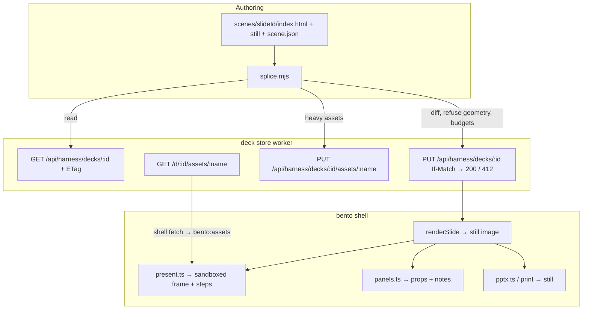
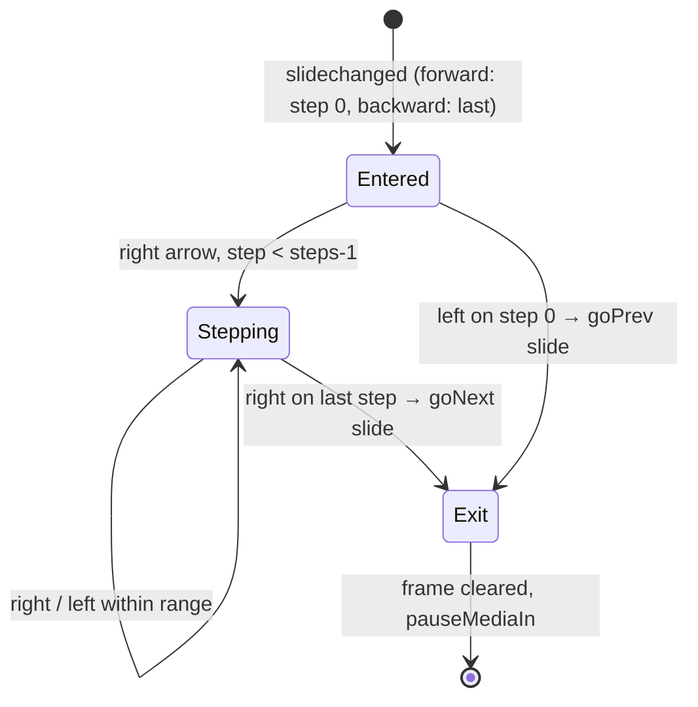
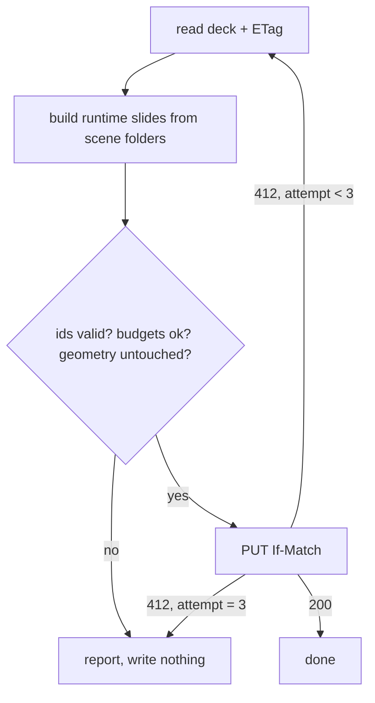

# Runtime Slides - Plan

## Goal Capsule

- **Objective:** Let a bento deck carry live HTML scenes as whole slides that Claude authors and updates, while every native slide stays editable in the UI and survives Claude's updates.
- **Product authority:** the Product Contract below (from the 2026-09-14 brainstorm), then `docs/beta-claude-authoring-handoff.md`, then the two reveal.js reference decks (Claude Code Meetup, Danmarks Mobilitetsatlas).
- **Technical authority:** `docs/PLATFORM.md` over this plan; `AGENTS.md` fork rules (kernel untouched, one guard block per surface, additions in new files) over any unit's approach.
- **Stop conditions:** a change under `kernel/src/` other than the three named files; a change that regenerates a `docId`; a shell release or worker deploy (maintainer only, on request); a Product Contract change beyond the additive ones recorded in Product Contract preservation.
- **Execution profile:** three tracks (store, shell, skill) landed as separate PRs in dependency order; the acceptance rebuild of Robert's deck runs last and needs a released shell.
- **Tail ownership:** the implementer opens PRs and asks Johan to cut the release and deploy the worker; Johan runs the acceptance test with Robert.
- **Open blockers:** none.

---

## Product Contract

**Product Contract preservation:** changed, additively: R19 (retry cap) and AE8 to AE10 (splice integrity) added from flow analysis; R9 sharpened to say the still is always inline. No R-ID was removed or reworded otherwise.

### Summary

Add a second slide kind, the runtime slide: a whole slide that is a live HTML scene stored inside the deck file (or pointed at a URL), shown as a still everywhere except present mode, with presenter-advanced steps. Claude authors scenes as small files and splices them into the deck by slide id after reading the deck and refusing to overwrite a version it has not seen.

### Problem Frame

Robert built a 33-slide deck for the frokost seminar with Claude. Two things went wrong. Claude could not give him the map and demo slides he wanted: it either pasted blurry screenshots or spent a long time tracing vectors, and one map became a 6 MB SVG. And every time he asked Claude for a change, Claude regenerated the whole deck from a script with hardcoded geometry, wiping the layout fixes he had made in the UI. The script could not read the deck back because the service token can only create and replace.

Johan's hand-rolled reveal.js decks show what he wants the runtime side to feel like: the Mobilitetsatlas deck has 15 sections, 22 fragment steps driving staged map animations, a live interactive iframe to mobilitetsatlas.dk, and maps fetched at runtime from multi-megabyte SVGs. The same map is the 6 MB blob in Robert's bento deck.

Every external "Claude + HTML slides" workflow surveyed converges on one self-contained HTML file with embedded JSON, which is bento's shape. Deckary's framing decides the matter: framework choice depends on who edits draft two. Robert edits draft two in the UI. The platform is right; the gaps are a slide kind for live scenes and a round trip that respects what people did in the UI.

### Key Decisions

- **Whole-slide kind, not an extension of the embed box.** A runtime slide is one scene filling the slide. Cleaner for authors and for the ownership rule; new ground in the format, so older shells only ever see the still.
- **Scene source lives inline in the deck, with an optional URL override.** The deck stays one self-contained file that works offline. A slide may point at a hosted page instead when it needs infrastructure the file cannot carry (the mobilitetsatlas.dk iframe).
- **Ownership rule: Claude owns content, the UI owns geometry.** Claude replaces runtime slides wholesale and may change text, image and chart data on native elements by id; it never changes an element's position or size. UI edits to layout always survive.
- **Claude's version of a runtime slide wins over values a presenter set in the UI.** The exposed properties are a presenter convenience before a talk, not a durable edit. One rule, no merge logic.
- **The service token may read a deck by id, and a replace is refused when the deck changed since that read.** Ids are ten random characters and are not listable, so a leaked token still cannot enumerate decks. This loosens a documented security property in the deck store on Johan's explicit decision (2026-09-14).
- **Claude produces the still when it writes the slide.** The app never captures a sandboxed frame; the still is always current with the code.
- **Scenes are self-contained.** Each carries the CSS, JS and data it needs. A shared per-deck runtime (the atlas deck's single 44 KB script and 15 KB stylesheet) is deferred.
- **Heavy assets are referenced, not inlined.** A per-scene weight budget keeps the deck small; a 7 MB map lives in the deck store's asset route or at a URL and needs a network.
- **Authoring is scene files plus a splice step.** Each scene is a small HTML file next to its still in a project folder, previewable in a browser; a publish step reads the deck, swaps scenes in by slide id and writes back. Johan's "split the file", built on the read-then-replace store routes.

### Actors

- A1. **Robert** (deck owner): builds a deck with Claude, then edits native slides in the bento UI, reorders slides, writes notes, tweaks a runtime slide's exposed properties, presents.
- A2. **Claude** (authoring agent, in Claude Code or Cowork with the `beta-slides` skill): creates decks, authors scenes as files, splices them in, updates native content by id, never touches geometry.
- A3. **Presenter** (Robert or a colleague): advances through a runtime slide's steps with the arrow keys, interacts with the scene, exports a PDF hand-out.
- A4. **The deck store** at `slides.betamobility.ai`: holds decks, serves them to people behind Access, accepts service-token reads and conditional replaces.

### Requirements

**Runtime slide in the format and the app**

- R1. A slide can be a runtime slide: one scene that fills the slide, stored as inline HTML in the document, or as a URL when the override is set.
- R2. A runtime slide always carries a still (an image or SVG) that is what thumbnails, print, PDF and PowerPoint export show.
- R3. In present mode the scene runs live in a sandboxed frame with no same-origin access, and the presenter can interact with it (clicks, scroll, keyboard inside the scene).
- R4. A scene may declare steps; the arrow keys advance through the steps before leaving the slide, and step backwards before returning to the previous slide.
- R5. A scene may declare named properties (a title, a number, a colour) with default values; the editor shows them in the slide panel and a presenter can change them; the scene receives the current values.
- R6. The editor shows a runtime slide as its still, with reorder, delete, duplicate, speaker notes and the declared properties; scene code is not editable in the UI.
- R7. A runtime slide with the URL override shows its still when offline or when the page fails to load.
- R8. A deck opened in an older shell that does not know the slide kind shows the still and nothing breaks.
- R9. A scene has a weight budget; the still is always inline; the skill and the splice step refuse to inline scene source above the budget and direct heavy assets to the deck store's asset route or a URL.

**Round trip: a Claude-made deck stays the deck**

- R10. A service token may read a deck it knows the id of; it still cannot list decks.
- R11. A replace by service token is refused when the deck changed since the version the caller read, and the caller is told to re-read.
- R12. When Claude updates a deck it reads the current deck first, changes only what the ownership rule allows, and writes back conditionally.
- R13. Claude may change the content of native elements by element id (text, image, chart data, table cells) and never their position, size or rotation.
- R14. Claude replaces a runtime slide wholesale (source, still, declared properties and their defaults); values a presenter set in the UI do not survive the replace.
- R15. The `beta-slides` skill and `agents.md` document the ownership rule, the read-then-replace workflow, animated SVG with keyframes as a first-class option, the still as a placeholder rather than a screenshot, and the weight budget.
- R19. After a refused write the splice step re-reads and re-applies at most three times, re-deriving its changes against each fresh read, then stops and reports the conflict.

**Scene authoring**

- R16. A scene is a small HTML file in a project folder next to its still and any referenced assets, previewable on its own in a browser.
- R17. A splice step reads the deck, replaces the runtime slides whose ids match scene files, leaves every other slide untouched, and writes the deck back conditionally.
- R18. The splice step works from Claude Code and from Cowork.

### Key Flows

- F1. **Build a deck with runtime slides**
  - **Trigger:** Robert asks Claude for the frokost deck with a live map and a product demo.
  - **Actors:** A1, A2, A4
  - **Steps:** Claude authors native slides from the template; for the map and demo it writes a scene file and a still each; the splice step creates the deck in the store with the scenes inlined; Claude returns the deck URL.
  - **Outcome:** Robert opens the deck, sees stills for the two runtime slides in the editor, presents and the scenes run live.
- F2. **Edit in the UI, then ask Claude for a change**
  - **Trigger:** Robert moves three text boxes, rewrites a heading, reorders slides, then asks Claude to update the map scene and fix a typo on slide 4.
  - **Actors:** A1, A2, A4
  - **Steps:** Claude reads the deck by id; replaces the map runtime slide; changes the text of the element with the typo by id; writes back with the version it read.
  - **Outcome:** Robert's moved boxes, rewritten heading and slide order are intact; the map scene and the typo are updated.
- F3. **Concurrent edit is refused**
  - **Trigger:** Robert edits in the UI between Claude's read and Claude's write.
  - **Actors:** A1, A2, A4
  - **Steps:** The store refuses the replace; Claude reads again, reapplies its changes, writes again.
  - **Outcome:** Nothing Robert did is lost; Claude's changes land on the second try.
- F4. **Present a stepped scene**
  - **Trigger:** The presenter reaches the mode-sequence slide with five steps.
  - **Actors:** A3
  - **Steps:** Right arrow advances steps one to five inside the scene; the sixth right arrow leaves for the next slide; left arrow reverses in the same way.
  - **Outcome:** The scene animates through its states; navigation never gets stuck.
- F5. **Iterate on a scene**
  - **Trigger:** Robert wants the map to zoom into Bergen.
  - **Actors:** A1, A2
  - **Steps:** Claude edits the scene file, Robert opens it in a browser, they iterate; Claude re-renders the still; the splice step replaces that one slide in the deck.
  - **Outcome:** Only the map slide changed in the deck.

### Acceptance Examples

- AE1. **Covers R13, F2.** Given Robert dragged element `t-04` from x 120 to x 300 and Claude then updates that element's text, when Claude writes back, then the element's text is new and its x is still 300.
- AE2. **Covers R11, F3.** Given Claude read version A and Robert saved version B, when Claude writes based on A, then the store refuses and Claude's next read returns B.
- AE3. **Covers R14.** Given Robert set the map slide's exposed title to "Bergen" in the UI and Claude then replaces the map slide, when Robert opens the deck, then the title shows Claude's default again.
- AE4. **Covers R4, F4.** Given a scene declares five steps and the presenter is on step five, when the presenter presses right, then the next slide shows; when on step one and the presenter presses left, then the previous slide shows.
- AE5. **Covers R2, R8.** Given a deck with a runtime slide opened in a shell built before this feature, when the deck renders, then the runtime slide shows its still and no error is raised.
- AE6. **Covers R9.** Given a scene that references a 7 MB SVG, when Claude splices it, then the SVG is not inlined and the scene loads it from the asset route or a URL.
- AE7. **Covers R7.** Given a runtime slide with a URL override and no network, when presented, then the still shows.
- AE8. **Covers R17.** Given a scene folder names a slide id that is not in the deck, when the splice runs, then it writes nothing and lists the missing id.
- AE9. **Covers R17.** Given two scene folders name the same slide id, when the splice runs, then it writes nothing and names the collision.
- AE10. **Covers R17, R13.** Given a scene folder names the id of a native slide, when the splice runs, then it writes nothing and refuses to convert the slide.

### Success Criteria

- Robert's frokost deck at `/d/Api0W36RwG` rebuilt with the maps and demos as runtime slides; he edits three native slides in the UI, asks Claude for a change, and nothing he did is lost. This is the acceptance test.
- The rebuilt deck is under 3 MB with the map referenced from the asset route.

### Scope Boundaries

**Deferred for later**

- Claude as a live collaborator in the sync room (headless CRDT client).
- Porting either reveal.js deck wholesale.
- A shared per-deck runtime (common script, stylesheet and data across scenes).
- Editing scene code inside the bento UI.
- Merging presenter-set property values with Claude's replace.
- A conditional save for a person's own editor save; in v1 the editor's save stays an unconditional overwrite.
- Telling open collaborators that Claude replaced the deck in the store; a deck that is live-shared at the moment of a replace is unsupported in v1.
- Runtime slides as interactive states (`stateOf`), or steps that jump to a state slide.

**Outside this feature**

- The data pipelines that build map assets (GeoJSON to SVG); they stay in the scene's project folder.
- Page-level CSS and JS across native slides; native slides keep bento's model.
- Any change to Drive or Cowork integration.

### Dependencies / Assumptions

- Upstream's embed decision (2026-08-19) settles that a sandboxed `srcdoc` frame works and that the objection was weight, not the mechanism; a runtime slide follows the same still-plus-source-plus-opt-in-frame shape.
- The deck store's R2 bucket (`beta-decks`) can hold referenced scene assets behind the same Access policy; there is no existing asset route, so one is built (U2).
- A scene without a network still works if it carries its own data; scenes that need live data or a hosted map need a network, and the still covers the rest.
- Cowork can run the splice script (Node available in its shell); unverified, checked in U7's verification.

### Outstanding Questions

**Deferred to Planning:** none remaining; the mechanism questions from the brainstorm are settled in Key Technical Decisions.

**Deferred to Implementation**

- Whether Cloudflare Access cookies reach a request made from inside the sandboxed frame; the plan avoids depending on it (KTD6) and U4 verifies the chosen path in a browser.
- Whether Miniflare surfaces a failed `onlyIf` precondition as a `null` result or a thrown error; U1 asserts the observable 412, not the mechanism.

### Sources

- `docs/beta-claude-authoring-handoff.md`: the step-back this contract descends from, with measured facts about the shell, the sync stack and the meetup deck.
- `docs/DECISIONS.md`, entry 2026-08-19: the embed tiers and the sandboxed frame.
- `slides/src/render.ts` (`liveFrameAllowed`, `liveFrame`, the embed case) and `slides/src/present.ts` (slide enter and exit hooks, `restartSvgAnimations`).
- `server/deck-store/src/worker.js`: harness routes and the write-only token comment.
- Reveal.js reference decks: Claude Code Meetup (37 sections, six keyframes) and Danmarks Mobilitetsatlas (15 sections, 22 fragment steps, live iframe, runtime-fetched maps).
- https://github.com/bluedusk/html-slides
- https://deckary.com/blog/claude-code-presentations

---

## Planning Contract

### Key Technical Decisions

- **KTD1. The still is an ordinary full-bleed `image` element in `slide.elements`; the runtime fields sit beside it on the slide.** Old shells paint only `elements`, so a runtime slide with an empty element list would render blank (`render.ts renderSlide` loops elements; `docs/PLATFORM.md` §3 preserves unknown fields but does not render them). With the still as the one element, R8 holds with zero code in old shells, thumbnails and print need nothing new, and the first-page preview's image tiers apply unchanged. New shells replace the image with the frame in present mode only.
- **KTD2. Runtime fields live in one optional `slide.runtime` object; source and still are `asset:` refs.** Shape (directional): `{ src: 'asset:<key>' | undefined, url?: string, still: 'asset:<key>', steps: number, props: [{ key, label, kind: 'text'|'number'|'color', default }], values?: Record<key, value> }`. `asset:` refs reuse `internAsset` dedupe, `sanitizeAssets` limits and clipboard round-trip. Claude's replace writes the whole `runtime` object, so `values` (presenter-set) reset, which is R14. Adding the field is the three-place format change: `model.ts` `Slide`, regenerate `slides/src/modelkeys.generated.ts`, add `SLIDE_CHECKS` in `slides/src/untrusted.ts`.
- **KTD3. Steps, properties, reduced motion and assets cross the frame boundary by `postMessage`; the frame's content is set on slide enter and cleared on exit.** Keys never cross a sandboxed frame, and `viewDistance: 2` mounts neighbours, so `srcdoc`/`src` are set in the `slidechanged` handler beside `startMediaIn` and cleared beside `pauseMediaIn`, never at render time. Messages (directional): shell to scene `bento:init {step, steps, props, reduceMotion}`, `bento:step {index}`, `bento:props {values}`, `bento:motion {reduce}`, `bento:assets {name: Blob}`; scene to shell `bento:ready`, `bento:navigate {dir}` (a scene may hand an arrow back to the shell). The shell checks `ev.source === frame.contentWindow`.
- **KTD4. Steps are counted by the shell from the declaration, not discovered by running the scene.** Step state lives in `present.ts goNext/goPrev` beside the `stateOf` logic: forward entry lands on step 0, backward entry on the last step, swipe and speaker-view keys behave like the arrows, a thumbnail-rail click resets to step 0. The speaker view's next-slide preview shows the still. A runtime slide cannot be a `stateOf` state in v1.
- **KTD5. Conditional replace uses R2's `httpEtag`: harness GET returns `ETag`, harness PUT requires `If-Match` and calls `put` with `onlyIf: { etagMatches }`, answering 412 on mismatch and 428 when `If-Match` is absent.** Versions never go into `customMetadata` (2 KB budget). The people routes (`PUT /api/decks/:id`) stay unconditional in v1. A human save changes the etag, so any concurrent save forces Claude to re-read; that is accepted over inventing a content-only version.
- **KTD6. Heavy scene assets go to a new Access-gated asset route on the deck store, and the shell fetches them and hands the bytes to the scene.** `PUT /api/harness/decks/:id/assets/:name` (service token, 16 MB cap) stores under `assets/<deckId>/<name>` in `beta-decks`; `GET /d/:id/assets/:name` serves them to people. The scene declares `assets: [names]` in its manifest; on slide enter the shell fetches each (same origin, carries the Access cookie), then posts them as Blobs (`bento:assets`). The sandboxed frame never makes a credentialed request, which sidesteps the cookie question. Offline, the fetch fails and the still stays.
- **KTD7. Weight budget constants in `model.ts` beside `MEDIA_EMBED_BUDGET`:** `RUNTIME_SRC_BUDGET` 256 KB for inline scene source, `RUNTIME_STILL_BUDGET` 200 KB for the still, `RUNTIME_ASSET_BUDGET` 16 MB per referenced asset. The splice tool enforces them; the editor never authors runtime slides so it only validates on paste.
- **KTD8. The ownership rule is enforced in the splice tool, not the store.** The tool diffs its intended output against the fresh read and refuses if any native element's `x`, `y`, `w`, `h` or `rotate` differs, if a slide id is missing, duplicated or belongs to a native slide, or if a budget is exceeded. It never partially writes. After a 412 it re-reads and re-derives at most three times (R19).
- **KTD9. One guard block per surface, delegating to `slides/src/runtime.ts`.** `renderSlide` early return (still unless `liveMedia`), `present.ts` section build and nav, `pptx.ts mapDeck` before the element loop, `panels.ts buildSlidePanel` top, `untrusted.ts` checks. Fork rule 2: additions are one `case` or one new file.
- **KTD10. Encrypted decks may carry runtime slides.** Source and still sit inside the `bento/enc` envelope like every other asset; the preview veto is unchanged and the frame only ever receives decrypted bytes in memory.
- **KTD11. The splice tool lives in the plugin (`plugins/beta-slides/scripts/splice.mjs`), Node with no dependencies, reusing `spliceDoc` extracted to `scripts/lib/bento-doc.mjs`.** It reads the deck like `scripts/export-pptx.mjs` (regex on the `#bento-doc` block, `<` unescape), never regenerates `docId`, and re-escapes `<` on write. A scene project folder is `scenes/<slideId>/index.html`, `still.png|svg`, `scene.json` (`steps`, `props`, `assets`, `url`).

### High-Level Technical Design

Directional, not implementation specification.

Present-mode navigation with steps (state per runtime slide):

Splice run (all-or-nothing):

### Assumptions

- `viewDistance: 2` stays; frames are therefore mounted lazily on enter, not on section build.
- Miniflare 4.2026 in `slides/node_modules` implements `onlyIf: { etagMatches }`; the rig asserts the 412 either way.
- The deck store's report-only CSP (`frame-src https:`, `connect-src 'self' …`) stays report-only for this feature; a scene that fetches off-origin appears in reports only.

### Sequencing

Store first (U1, U2) because the splice tool and the acceptance test depend on it and it deploys independently. Shell next (U3 to U6) in one release. Skill last (U7, U8) once both are live. Acceptance (U9) after the release.

### System-Wide Impact

- **Security posture:** the service token gains read-by-id. The worker header comment (`server/deck-store/src/worker.js`), two places in `server/deck-store/README.md` (the route table and the harness section) and `plugins/beta-slides/skills/beta-slides/SKILL.md` all restate the old "cannot read" property and must change together; `server/deck-store/test/worker.test.mjs` pins the route behaviour (403 on list) and `scripts/test-beta-skill.mjs` pins the URL shapes.
- **Format:** `Slide.runtime` is additive; upstream shells preserve it and paint the still (KTD1). `docs/DECISIONS.md` gets an entry.
- **Collab:** `slide.runtime` is a whole-value LWW register under CRDT like `table.rows`; concurrent presenter property edits on two machines are last-writer-wins. A store replace while live-shared is unsupported (Scope Boundaries).
- **i18n:** new panel and present strings go into all eight catalogs (`ls slides/src/i18n/`).
- **CI:** two new rigs registered in `.github/workflows/ci.yml` (`scripts/test-ci-registered.ts` enforces it); rigs importing `model.ts` are esbuild-bundled like `test-beta-embed.ts`.

### Risks

- **Scenes that need credentials from inside the frame.** Avoided by KTD6 (shell fetches, posts Blobs). If a scene needs a live authenticated API, it uses the URL override to a page that owns its own auth.
- **Weight creep.** A 256 KB source budget and an inline-only still keep decks small; the tool refuses rather than warns.
- **Presenter confusion on steps.** A scene with steps that also handles arrows itself would double-step; the skill tells scenes to leave arrows to the shell and use `bento:step`.
- **Two write paths (editor save, harness replace) with one conditional.** Accepted for v1 and named in Scope Boundaries; a lost Claude change is re-run, a lost human change never happens.

---

## Implementation Units

### U1. Harness read and conditional replace on the deck store

**Goal:** A service token can fetch a deck by id with an `ETag`, and a replace with a stale `If-Match` is refused with 412.
**Requirements:** R10, R11, AE2
**Dependencies:** none
**Files:** `server/deck-store/src/worker.js`, `server/deck-store/test/worker.test.mjs`, `server/deck-store/README.md`
**Approach:** Add `GET /api/harness/decks/:id` in the harness block above the `who.kind !== 'user'` check, streaming the object like `serve()` plus `ETag: obj.httpEtag`. Extend `replace()` so harness callers must send `If-Match` (428 without it) and the `put` passes `onlyIf: { etagMatches }`; a failed precondition answers 412 with a short JSON body telling the caller to re-read. People routes keep today's unconditional replace. Update the header comment and both README places (route table and harness section) to say the token can read a deck by id but not list.
**Patterns to follow:** `serve()` for streaming and headers, `replace()` for metadata preservation, the harness section of the test rig for claims and `call()`.
**Test scenarios:**
- Happy path: service token GET of an existing id returns 200, the bytes, `content-type`, `ETag`; a second GET returns the same `ETag`.
- Happy path: PUT with matching `If-Match` returns 200 and the stored bytes change; the new `ETag` differs.
- Edge: GET of an unknown id returns 404; GET by a service token of a deck created by a person works (read is not owner-scoped).
- Error: PUT with a stale `If-Match` returns 412 and the stored bytes are unchanged; PUT without `If-Match` from a service token returns 428; a person's PUT without `If-Match` still returns 200.
- Error: a body that fails `inspect()` still returns the existing 400s, before any precondition.
- Integration: harness token cannot `GET /api/decks` (list) and cannot `GET /d/:id`; both stay 403.
**Verification:** `node scripts/test-beta-store.ts` green with the new cases; README table and comment block updated; `scripts/check-store-live.mjs --selftest` still passes.

### U2. Asset route for heavy scene assets

**Goal:** A service token can upload a named asset for a deck, and people can fetch it behind Access.
**Requirements:** R9, AE6
**Dependencies:** U1
**Files:** `server/deck-store/src/worker.js`, `server/deck-store/test/worker.test.mjs`, `server/deck-store/README.md`
**Approach:** `PUT /api/harness/decks/:id/assets/:name` stores under `assets/<id>/<name>` in `DECKS` with the request's content type, 16 MB cap, name restricted to `[A-Za-z0-9._-]{1,80}`, refuses when the deck id does not exist. `GET /d/:id/assets/:name` streams to people with `cache-control: private, max-age=3600` and the stored content type. `DELETE /api/decks/:id` also deletes the deck's assets (list by prefix).
**Patterns to follow:** `storeBytes()` for put options, `serve()` for streaming, `remove()` for owner checks.
**Test scenarios:**
- Happy path: upload an SVG then GET it as a person; bytes and content type round-trip.
- Edge: name with a slash or over 80 chars returns 400; upload for an unknown deck returns 404; 16 MB + 1 byte returns 413.
- Error: a person cannot PUT to the harness asset route (403); a service token cannot GET `/d/:id/assets/:name` (403).
- Integration: deleting the deck removes its assets (GET returns 404 afterwards).
**Verification:** rig green; README route table lists both routes.

### U3. Format: the runtime slide record

**Goal:** `Slide.runtime` exists in the model, survives paste, validation and sanitisation, and the still is an image element.
**Requirements:** R1, R2, R8, R9, AE5
**Dependencies:** none
**Files:** `slides/src/model.ts`, `slides/src/modelkeys.generated.ts`, `slides/src/untrusted.ts`, `slides/src/validate.ts`, `slides/src/runtime.ts` (new), `scripts/test-beta-runtime.ts` (new), `.github/workflows/ci.yml`
**Approach:** Add the optional `runtime` field per KTD2 and the three budget constants (KTD7). `slides/src/runtime.ts` exports `isRuntimeSlide(slide)`, `runtimeStill(slide, doc)` (the still element or the `asset:` ref), `runtimeSource(slide, doc)`, and a `checkRuntime` used by `SLIDE_CHECKS` (props kinds limited to text, number, color; `steps` a non-negative integer; `src` an `asset:` ref; `url` https only). Regenerate modelkeys. `validateDoc` warns when a runtime slide has no image element or its still ref is missing.
**Patterns to follow:** `MediaElement` for a typed optional object with kinds; `SLIDE_CHECKS` and `checkElementProp` in `untrusted.ts`; `test-beta-embed.ts` for a bundled rig.
**Test scenarios:**
- Happy path: a doc with a runtime slide parses, validates without warnings, and survives `sanitizeSlide` with `runtime` intact.
- Happy path: clipboard round-trip of a runtime slide keeps `runtime`, remaps its `asset:` keys with the still and source.
- Edge: `runtime` with an unknown prop kind is dropped to defaults; `steps: -1` is coerced to 0; `url: 'javascript:'` is stripped.
- Edge: a runtime slide whose image element is missing validates with a warning, not an error.
- Error: `src` above `RUNTIME_SRC_BUDGET` fails `checkRuntime` on paste.
- Integration: `scripts/build-modelkeys.mjs --check` and `scripts/test-clipboard.ts` pass (the checked-keys parity test).
**Verification:** `tsc -b`, the new rig, `test-clipboard.ts`, `test-sanitize.ts` and `build-modelkeys.mjs --check` green; rig registered in `ci.yml`.

### U4. Render and present: the live frame and steps

**Goal:** In present mode a runtime slide runs its scene in a sandboxed frame with steps, properties, reduced motion and assets delivered by messages; everywhere else it renders its still.
**Requirements:** R3, R4, R5, R7, AE4, AE7
**Dependencies:** U3
**Files:** `slides/src/render.ts`, `slides/src/present.ts`, `slides/src/runtime.ts`, `slides/src/styles.css`, `scripts/test-beta-runtime.ts`
**Approach:** `renderSlide` early return: when `isRuntimeSlide` and not `opts.liveMedia`, render the still image only (KTD1 means the normal path already does this; the guard exists so a new shell never paints stray elements). In `present.ts`, on `slidechanged` enter: create the frame (`sandbox="allow-scripts allow-forms"`, `referrerpolicy="no-referrer"`, `pointer-events` on), set `srcdoc` from the source asset or `src` from `url` when `liveFrameAllowed`-style checks pass (online, https, not `remoteSrcBlocked`), layer it over the still, post `bento:init`, fetch declared assets from `/d/:id/assets/<name>` and post `bento:assets`. On exit: clear `srcdoc`/`src`, remove the frame. `goNext/goPrev` consult step state first (KTD4). `setReduceMotion` re-posts `bento:motion`. A frame `error` or a 10 s load timeout removes the frame and leaves the still. Speaker view renders without `liveMedia` and so shows the still.
**Execution note:** verify in a browser with a stepped scene fixture; the DOM measurement gotchas in `AGENTS.md` (hidden tabs throttle rAF) apply.
**Patterns to follow:** `liveFrame` and `liveFrameAllowed` for sandbox and offline checks; `startMediaIn`/`pauseMediaIn` call sites; `stateOf` handling in `goNext/goPrev`; the speaker popup's own keydown handler.
**Test scenarios:**
- Happy path (rig, pure functions): step reducer given `steps: 5` and forward entry starts at 0, advances to 4, then signals leave; backward entry starts at 4.
- Happy path (browser): a fixture scene logs `bento:init` with the declared props and `bento:step` on each arrow; the sixth right arrow changes slide.
- Edge: `steps: 0` behaves like a native slide for navigation; a rail click while on step 3 re-enters at step 0.
- Edge: reduced motion toggled mid-slide posts `bento:motion` to the open frame.
- Error: URL-override scene with `navigator.onLine === false` never creates a frame; a frame `error` event leaves the still visible with no empty box.
- Error: a message whose `source` is not the frame's window is ignored.
- Integration: leaving the slide clears `srcdoc`; re-entering reloads the scene from step 0 (no resumed state).
**Verification:** rig green; browser check of F4 on a fixture deck built from `slides/dist-single`; `restartSvgAnimations` and media behaviour on neighbouring native slides unchanged.

### U5. Editor: the slide panel and slide operations

**Goal:** The editor shows a runtime slide as its still with reorder, delete, duplicate, notes and the declared properties, and nothing else.
**Requirements:** R6, R5, AE3
**Dependencies:** U3
**Files:** `slides/src/editor/panels.ts`, `slides/src/editor/editor.ts`, `slides/src/editor/canvas.ts`, `slides/src/i18n/*.ts` (all eight), `slides/src/i18n/packed.ts`
**Approach:** `buildSlidePanel` branches at the top for runtime slides: a "Live scene" section listing each declared prop as a row (text, number, colour) writing into `runtime.values` through `this.edit`, a read-only line naming inline vs URL and the source size, then the existing speaker notes. Background, transition and layout sections are skipped. The insert group and paste are disabled while a runtime slide is current (mirror `enterReaderMode`'s hide, scoped to the slide). Canvas selection of the still image is suppressed so it cannot be moved. Duplicate keeps `runtime` (JSON copy already does) and gets a fresh slide id.
**Patterns to follow:** `buildMediaProps` for a typed property section; `applyAccordion`; `enterReaderMode` for hiding insert controls.
**Test scenarios:**
- Happy path (browser): selecting a runtime slide shows the Live scene section with the props; changing a number updates `runtime.values` and undo restores it.
- Edge: a runtime slide with no props shows the section with a "no adjustable values" line; notes still editable.
- Edge: duplicating a runtime slide yields a second runtime slide with a new id and the same `runtime`.
- Error: paste of elements while on a runtime slide is refused with a toast.
- Integration: `build-i18n.mjs --check` and `test-i18n-coverage.mjs` pass with the new strings in all eight catalogs.
**Verification:** `tsc -b`, i18n checks, browser walk-through of the panel on a fixture deck; native slide panel unchanged.

### U6. Export: PowerPoint, print and preview

**Goal:** A runtime slide exports as a picture of its still in PPTX, prints as its still, and a runtime first slide gets a first-page preview.
**Requirements:** R2, AE5
**Dependencies:** U3
**Files:** `slides/src/export/pptx.ts`, `scripts/test-beta-pptx.ts`, `scripts/test-preview.ts`
**Approach:** In `mapDeck`, before the element loop, a runtime slide places the still full-bleed via `picture()` (rasterised through `svgPicture` when SVG) and records `degrade(slide.id, '*', 'runtime', …)`, then skips the element loop. Print needs no change (KTD1). Preview needs no change; add a rig case proving a runtime first slide with a 150 KB PNG still lands in the full tier and an oversize still degrades to the tinted-box tier.
**Patterns to follow:** the `embed` case in `pptx.ts`; `test-preview.ts` tiers.
**Test scenarios:**
- Happy path: a deck with one runtime slide exports one slide with one picture and one degrade note.
- Edge: SVG still with a `<script>` is stripped by `SVG_BANNED` and still exports.
- Edge: runtime slide marked `hidden` exports hidden like other slides.
- Integration: preview rig cases above.
**Verification:** `test-beta-pptx.ts` and `test-preview.ts` green.

### U7. The splice tool

**Goal:** One command reads a deck, builds runtime slides from a scene folder, applies content-only edits to native elements, refuses anything the ownership rule forbids, and writes back conditionally with bounded retries.
**Requirements:** R12, R13, R14, R16, R17, R18, R19, AE1, AE2, AE6, AE8, AE9, AE10
**Dependencies:** U1, U2, U3
**Files:** `plugins/beta-slides/scripts/splice.mjs` (new), `scripts/lib/bento-doc.mjs` (new, extracted from `scripts/build-beta-templates.mjs`), `scripts/build-beta-templates.mjs`, `scripts/test-beta-splice.ts` (new), `.github/workflows/ci.yml`
**Approach:** CLI: `splice.mjs <deckId> <projectDir> [--edits edits.json] [--dry-run]`, credentials from `CF_ACCESS_CLIENT_ID`/`CF_ACCESS_CLIENT_SECRET`. Read via harness GET, keep the `ETag`. For each `scenes/<slideId>/`: read `index.html`, `still.*`, `scene.json`; enforce budgets; upload assets over the budget to U2's route; intern source and still as assets; build `runtime` and the still image element; require the target slide to exist and already be a runtime slide (or be a placeholder slide flagged `runtime: {}` by the deck author). Apply `edits.json` entries `{slideId, elementId, html|src|option|rows}` to native elements. Diff against the read: refuse if any native element's geometry keys differ, any id is missing or duplicated, or a native slide would change kind. Write with `If-Match`; on 412 re-read and re-derive, three attempts, then exit non-zero with the conflict. Never regenerate `docId`; escape `<` in the block.
**Execution note:** test-first against a local Miniflare store using the U1 rig's fixtures; the tool must be exercised end to end against a real deck before U8 documents it.
**Patterns to follow:** `scripts/export-pptx.mjs` for headless read; `spliceDoc` for the block write; `test-beta-store.ts` for driving Miniflare from a rig.
**Test scenarios:**
- Happy path: two scene folders replace two runtime slides; native slides byte-identical; `docId` unchanged. Covers F2.
- Happy path: `edits.json` changes `t-04`'s html; its `x` stays as read. Covers AE1.
- Happy path: a 7 MB SVG in a scene's `assets` is uploaded, not inlined; the scene manifest lists it. Covers AE6.
- Edge: `--dry-run` reports the plan and writes nothing.
- Edge: presenter `values` on a replaced runtime slide are absent after the run. Covers AE3.
- Error: missing id, duplicate id, native-slide id each abort before any PUT. Covers AE8, AE9, AE10.
- Error: an edit that changes `w` is refused with the offending element named.
- Error: source over 256 KB or still over 200 KB refused.
- Integration: the store answers 412 once (fixture bumps the deck between read and write); the tool retries and succeeds; four consecutive 412s exit non-zero. Covers AE2, R19.
**Verification:** new rig green and registered; a manual run against a scratch deck in the real store round-trips; run from a Cowork session confirms Node is available (or the assumption is recorded as false and U8 documents the Claude Code-only path).

### U8. Skill, agents.md and decisions

**Goal:** Every Claude that authors Beta decks knows the runtime slide, the scene folder, the ownership rule, the read-then-replace workflow, animated SVG, the still as a placeholder, and the weight budget.
**Requirements:** R15, R18
**Dependencies:** U7
**Files:** `plugins/beta-slides/skills/beta-slides/SKILL.md`, `docs/agents.md`, `scripts/test-beta-skill.mjs`, `docs/DECISIONS.md`, `CHANGELOG.md`, `docs/beta-claude-authoring-handoff.md`
**Approach:** SKILL.md: a "Runtime slides" section (when to use one, the scene folder, `scene.json`, the still, budgets, steps and props protocol summary, `splice.mjs` usage, the three-retry behaviour, the ownership rule as a hard rule, the "read before you write" rule, the "cannot list, can read by id" wording). `docs/agents.md` "Beta build": the same for any harness, plus animated SVG with `@keyframes` as first-class, and the still as a hand-drawn placeholder rather than a screenshot. `test-beta-skill.mjs` gains assertions for the new section headings and the ownership sentence. `DECISIONS.md` entry dated 2026-09-14 recording KTD1, KTD5, KTD6 and KTD8. CHANGELOG lead-in for the release. The handoff doc's "Open items" updated.
**Patterns to follow:** existing `## Beta build` subsections; `test-beta-skill.mjs` URL and wording assertions.
**Test scenarios:**
- `test-beta-skill.mjs` asserts the new headings, the splice command, and that every URL named is published.
- Test expectation for prose: none beyond the rig; reviewed by Johan.
**Verification:** rig green; a fresh Claude Code session with the plugin produces a runtime slide from the instructions alone.

### U9. Acceptance: rebuild the frokost deck

**Goal:** Prove the round trip and the runtime slide on Robert's real deck.
**Requirements:** Success Criteria; F1 to F5
**Dependencies:** U1 to U8, a released shell and a deployed worker
**Files:** none in this repo; a scene project folder in Robert's project (Drive)
**Approach:** Rebuild `/d/Api0W36RwG`: native slides from the template, the map and the demos as scenes with hand-drawn SVG stills, the 6 MB map as a referenced asset. Robert edits three native slides in the UI; Claude runs one update through the splice tool; check nothing moved. Present the stepped map.
**Test scenarios:**
- Test expectation: manual, per Success Criteria; record the deck size and the etag sequence in the PR that closes the plan.
**Verification:** Johan and Robert confirm in the browser; deck under 3 MB.

---

## Verification Contract

| Gate | Command | Applies to |
|---|---|---|
| Typecheck | `cd slides && node_modules/.bin/tsc -b && node_modules/.bin/tsc -p ../kernel` | U3 to U6 |
| Shell build and splice conformance | `cd slides && npm run build:single && node ../scripts/shell-gate.mjs dist-single/Bento_Slides.bento.html` | U3 to U6 |
| Model keys parity | `node scripts/build-modelkeys.mjs --check` | U3 |
| Clipboard and sanitiser rigs | `node scripts/test-clipboard.ts`, `node scripts/test-sanitize.ts` (bundled as in `ci.yml`) | U3 |
| Runtime rig | `node scripts/test-beta-runtime.ts` | U3, U4 |
| Export and preview rigs | `node scripts/test-beta-pptx.ts`, `node scripts/test-preview.ts` | U6 |
| Sync rig (unchanged behaviour) | `node scripts/test-sync.ts` | U3 |
| i18n | `node scripts/build-i18n.mjs --check && node scripts/test-i18n-coverage.mjs` | U5 |
| Store rig | `node scripts/test-beta-store.ts` | U1, U2 |
| Splice rig | `node scripts/test-beta-splice.ts` | U7 |
| Skill rig | `node scripts/test-beta-skill.mjs` | U8 |
| CI registration | `node scripts/test-ci-registered.ts` | U3, U7 |
| Browser | present a fixture deck with a stepped scene from `slides/dist-single`; check F4, AE7, reduced motion, speaker view | U4, U5 |
| Live store | `env -u CLOUDFLARE_API_TOKEN npx wrangler deploy` in `server/deck-store` (maintainer), then `node scripts/check-store-live.mjs` | U1, U2 |

The shell release follows `docs/RELEASING.md` and is cut by the maintainer on request; U9 waits for it.

---

## Definition of Done

**Global**

- All gates above green on `main`; the three PRs squash-merged in order (store, shell, skill).
- Worker deployed; shell released as `v2026.9.x`; templates rebuilt.
- U9 passed: Robert's rebuilt deck under 3 MB, one UI-edit-then-Claude-update cycle with nothing lost, a stepped scene presented.
- Documentation updated in the same PRs: README route table, `docs/security.md`, `SKILL.md`, `docs/agents.md`, `DECISIONS.md`, CHANGELOG.
- No abandoned attempts left in the diff; no kernel file touched beyond the three allowed.

**Per unit**

- U1: rig covers GET, 200/412/428, list still 403; wording updated in the worker comment and both README places.
- U2: upload, fetch, delete-cascade covered.
- U3: modelkeys parity and clipboard parity pass; `runtime` survives paste.
- U4: browser check of F4 and AE7 done and noted in the PR.
- U5: eight catalogs updated; panel walk-through done.
- U6: PPTX and preview rigs cover runtime slides.
- U7: AE1, AE2, AE3, AE6, AE8 to AE10 each map to a passing rig case; a real-store round trip done.
- U8: skill rig green; a fresh session reproduces a runtime slide from the docs.
- U9: manual sign-off recorded.
