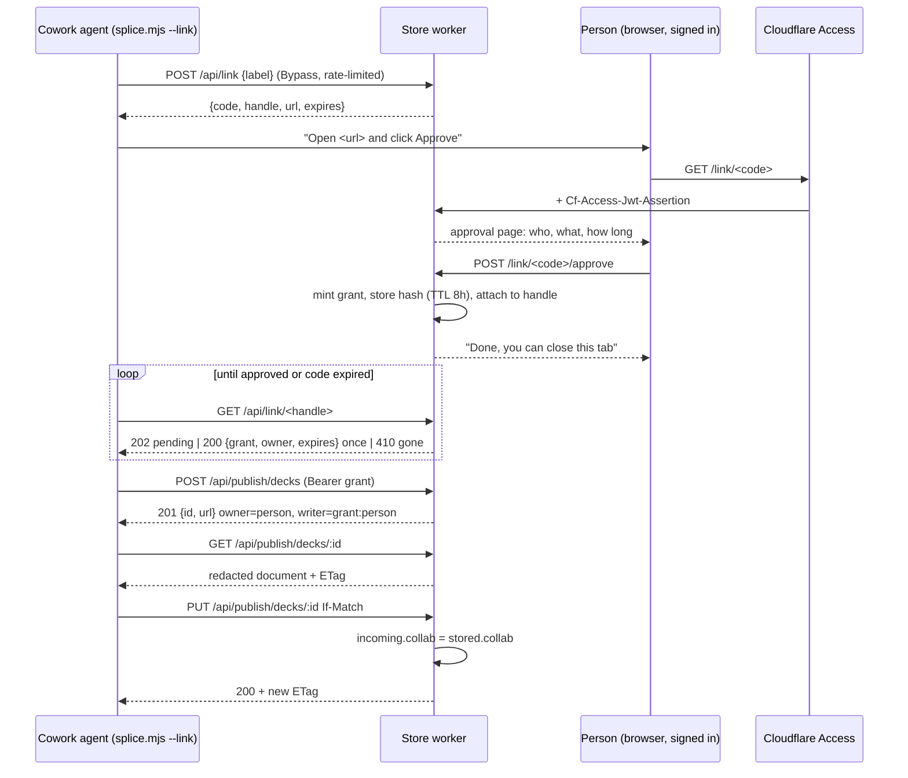

# One-Click Publish From Cowork - Plan

## Goal Capsule

**Objective.** A colleague working in Cowork gets a deck published to the store with one click in a browser tab they already have open. No file changes hands, no secret is pasted, and no administrator is involved.

**Authority.** `docs/PLATFORM.md` over this plan; this plan's Product Contract over its Planning Contract; Johan's decisions of 2026-09-15 and 2026-09-16 (pairing, 8-hour grants, KV, live scenes in, tool-run pairing) over the defaults below. The store's premise stands: every writer is a signed-in `@betamobility.io` colleague, and a grant only ever acts as one.

**Stop conditions.** Stop and ask when: a change would touch `kernel/src/` or `slides/src/` (none is planned); a grant would need to reach list or delete; redaction would need to touch anything other than the three private fields in `stripCollabSecrets`; or the Cowork sandbox turns out unable to run Node or reach the store (U7), which changes the tool's shape rather than its routes.

**Execution profile.** Server-side worker plus one Node tool plus docs. Test-first on the worker rig for every new route and refusal; the rig already mints Access assertions and runs under Miniflare. Nothing here is a UI build; the two new pages are the same server-rendered HTML the index already is.

**Tail ownership.** Creating the KV namespace, deploying the worker, adding two Bypass destinations in Access, and running the live checks are the maintainer's (U7). The colleague's first real run from Cowork is the acceptance.

**Product Contract preservation.** Changed: Dependencies and Assumptions (the worker takes no secret after all; the grant is an opaque token looked up by hash) and Outstanding Questions (the pre-planning question is resolved). R-IDs, flows and acceptance examples are unchanged.

---

## Product Contract

### Summary

The agent asks the store to start a pairing, shows the person a link, and the person approves in one click from the session they are already signed into. The store hands the agent a short-lived grant bound to that person, and the agent publishes as them.

### Problem Frame

Half of all decks now begin outside a terminal. Cowork cannot hold `CF_ACCESS_CLIENT_ID` and `CF_ACCESS_CLIENT_SECRET`: its cloud sandbox holds only session-scoped credentials, and connector tokens are handled server-side and never reach the shell. KTD13 assumed otherwise and recorded that "the worker needs no change".

So the agent authors a complete deck and then stops. The only route to a store link is a person downloading the file, opening it, and using Share to Save to Beta. A colleague hit exactly this on 2026-09-14.

Every design that keeps a credential in the picture fails the bar. Handing over the existing service token is unsafe: it runs to 2027-09-14, and `docs/DECISIONS.md` (2026-09-14) records that a harness read returns the whole file including `doc.collab.ownerPriv`. Minting a short-lived token per request is safe but puts an administrator in the loop for half of all decks. Both ask a colleague to handle a secret, which is the thing the product must never do.

Chat needs nothing built. A chat AI cannot call an endpoint at all, but New deck plus About to Replace from JSON already lands a document in the store in two steps.

### Key Decisions

**The agent borrows the person's session; it never holds a credential of its own.** Pairing is the only mechanism that is simultaneously self-service, administrator-free, and free of secret handling. Every token-based alternative fails at least one of the three.

**The person approves in the browser, where they are already signed in.** Access still guards the approval page, so the store learns who is approving without implementing any login of its own.

**The grant is short-lived and publish-scoped.** It expires on its own, and it reaches create, a redacted read, a key-preserving replace and scene-asset upload. Nothing else.

**A delegated read never returns live-session keys, and a delegated replace preserves the stored `collab` block.** Redaction alone would make the agent's first read-modify-write strip a deck's keys permanently, which is data loss rather than safety.

**The publish endpoint is verified by the worker, not by Access.** The agent has no cookie, so Access cannot gate it. `server/deck-store/README.md` already states the worker verifies every assertion itself regardless of Access, so this narrows an existing property rather than introducing one.

**Decks are owned by the approving person.** Ownership follows the grant, so a published deck is deletable by the person who asked for it. A token-owned deck cannot be deleted once its token is gone; the store already holds one such orphan (`/d/NjUTLPOcTq`).

**Chat is out of scope because it is already served**, not because it is hard.

### Actors

- A1. The colleague — a signed-in `@betamobility.io` identity who wants a deck and a link back, and who is never asked to handle a secret.
- A2. The Cowork agent — authors the deck, starts the pairing, waits, publishes.
- A3. The store worker — issues pairing codes, verifies the approval, mints and verifies the grant, redacts and preserves.
- A4. Cloudflare Access — guards the approval page, which is how the worker learns who approved.

### Requirements

**Pairing**

- R1. The agent starts a pairing without any credential and receives a short human-readable code and a polling handle.
- R2. The person approves at a stable URL by clicking once, from the session they are already signed into.
- R3. The approval page names what is being granted, to whom, and for how long, before the person clicks.
- R4. A pairing code expires quickly if nobody approves it, and is single-use.
- R5. The pairing-start endpoint is public and therefore rate-limited; an unapproved pairing grants nothing.

**The grant**

- R6. The grant is bound to the approving person's identity and carries their id, not a token's.
- R7. The grant is short-lived and expires without anyone revoking it.
- R8. The grant reaches create, read, replace and scene-asset upload on the publish path, and nothing else.
- R9. The grant may not list decks and may not delete a deck.
- R10. A person can see and revoke their active grants.

**Key protection**

- R11. A delegated read returns the document with the live-session private keys removed.
- R12. A delegated replace writes the stored `collab` block, not the one in the request body.
- R13. A deck created under a grant is owned by the approving person and is theirs to delete.

**Experience**

- R14. From the person's side the whole flow is: read one line, click one button, receive one link.
- R15. A second deck in the same Cowork session does not require a second approval while the grant is alive.
- R16. When the grant expires mid-session the agent says so plainly and offers to re-pair, rather than falling back to a hand-written replace or asking for a token.

**Operations**

- R17. `scripts/check-store-live.mjs` covers the new public endpoints and asserts that the publish path refuses an unapproved or expired grant.
- R18. The `beta-slides` skill documents the pairing flow and supersedes the Save to Beta hand-back it currently prescribes for Cowork.

### Key Flows

- F1. First publish from Cowork
  - **Trigger:** A1 asks A2 for a deck; A2 has authored it.
  - **Steps:** A2 starts a pairing and shows A1 the link. A1 opens it, sees what is being granted, and approves. A2's poll returns the grant. A2 creates the deck. The store records A1 as owner. A2 returns the link.
  - **Outcome:** A1 clicked once and has a store link.

- F2. Revision in the same session
  - **Trigger:** A1 asks A2 to change content in a deck it just published.
  - **Steps:** A2 reuses the live grant. It reads the deck redacted, changes content under the ownership rule, and replaces with `If-Match`. The worker restores the stored `collab` block.
  - **Outcome:** The deck changes with no further approval; keys and layout survive.

- F3. The grant expires
  - **Trigger:** A2 attempts a write after the grant's lifetime.
  - **Steps:** The store refuses. A2 tells A1 the approval lapsed and offers to re-pair.
  - **Outcome:** No partial write, and nobody is asked for a credential.

- F4. Nobody approves
  - **Trigger:** A2 starts a pairing; A1 never clicks.
  - **Steps:** The code expires. A2 reports that the deck is built and unpublished, and that the file is a complete deck on its own.
  - **Outcome:** A1 has lost nothing.

### Acceptance Examples

- AE1. **Covers R14.** Given a finished deck in Cowork, when A1 follows the flow, then A1 has performed exactly one click in the browser and typed no secret.
- AE2. **Covers R6, R13.** Given A1 approves a pairing and the agent creates a deck, when A1 opens the store index, then the deck is listed as theirs and is deletable by them.
- AE3. **Covers R11, R12.** Given a deck carrying `doc.collab.ownerPriv`, when a grant reads it, then no private key is returned; and when that document is written back with one text element changed, then the stored deck still carries its original `ownerPriv`.
- AE4. **Covers R5.** Given an unapproved pairing code, when it is used against the publish path, then the store refuses and no deck is created.
- AE5. **Covers R9.** Given a live grant, when it calls the list or delete route, then the store refuses.
- AE6. **Covers R15.** Given one approval, when the agent publishes a second deck before the grant expires, then no second approval is requested.

### Scope Boundaries

- Access service tokens as the delegated credential. Rejected: they cannot be bound to a person, and every variant makes someone handle a secret.
- Administrator-minted per-request credentials. Rejected on the same grounds; it also puts one person in the loop for half of all decks.
- Chat. Served by New deck plus Replace from JSON.
- Import-from-link. A cheaper first-publish path with no update loop; not part of this.
- Any change to the relay, the release channel, `kernel/src/` or `slides/src/`. The editor needs no change: a grant-created deck has no `collab` until a person opens it, and the editor already mints one then.

#### Deferred to Follow-Up Work

- A `--revoke` flag on the splice tool. Revocation lives on the index page in v1.
- A grant that survives across Cowork sessions for the same person. The sandbox is temporary, so the grant dies with it; a fresh session pairs again.
- Retiring the existing Cowork service token in Access once the pairing flow has carried a real deck.

### Dependencies and Assumptions

- The approval page sits behind the existing Access application, so the worker reads the approver's identity from the assertion it already verifies.
- The splice tool's ownership check is unaffected by redaction: it diffs what it derived against what it read, and redaction happens before it reads. Verified in `plugins/beta-slides/scripts/splice.mjs` (`derive` never touches `collab`).
- The worker takes no secret. A grant is an opaque random token; the store holds its hash. `wrangler.toml` stays `[vars]` only, and `README.md`'s "none of these are secrets" stays true.
- The Cowork sandbox can run Node and reach `slides.betamobility.ai` over HTTPS. Unverified until U7; the risk section says what changes if not.

### Outstanding Questions

**Deferred to implementation**

- OQ1. Whether Miniflare supports the Workers Rate Limiting binding. If not, the worker treats an absent binding as "no limit" and the rig covers single-use and expiry only; the live check covers the limit.
- OQ2. Where the grant file lives in the Cowork sandbox. The tool tries the home directory, then the working directory, and prints which.

### Sources

- `server/deck-store/src/access.js` `verifyAccess` — the only place identity is derived; a person is an `@betamobility.io` email, a service is a `common_name`.
- `server/deck-store/src/worker.js` router (`fetch`), `replace`, `harnessRead`, `storeBytes`, `inspect`, `putAsset` — the handlers the publish path reuses.
- `server/deck-store/src/pages.js` `indexPage`, `newPage`, `mintDocIntoBlock` — the server-rendered pages and the one existing block rewrite.
- `server/deck-store/test/worker.test.mjs` — the Miniflare rig, with `human()`/`service()` claim builders and the `call()` dispatcher every new scenario follows.
- `scripts/test-beta-splice.ts` — the splice rig: a `node:http` proxy playing Access in front of Miniflare.
- `slides/src/editor/editor.ts` `stripCollabSecrets` — the field list redaction mirrors: `writerPriv`, `ownerPriv`, `invite`.
- `kernel/src/sync/session.ts` `attach`/`ensureCollab` — a deck with no `collab` gets one minted on open, so the store never has to.
- `server/deck-store/README.md` "Setup, in order" — how Bypass destinations are added, and why their AUDs stay out of `ACCESS_AUDS`.
- `docs/DECISIONS.md` 2026-09-14 (service token reads by id; KTD13) and 2026-09-10 (destination-path scoping).
- Cloudflare Workers Rate Limiting binding docs — `simple.limit` with `period` 10 or 60 seconds, `limit({key})` returning `{success}`, per-location and eventually consistent.
- Cloudflare create-service-token API — checked and set aside: `duration` exists, but a service token cannot be bound to a person.

---

## Planning Contract

### Key Technical Decisions

**KTD1. Pairing is the device-authorization shape, with the code in the URL.** The agent posts to a public endpoint and gets two values: a `code` that goes into the approval URL and a `handle` that only the agent knows. The person opens `/link/<code>` (gated by the human Access application), sees what is being granted, and clicks Approve. The agent polls `/api/link/<handle>` (public) and receives the grant once. Two values, not one, so anyone who sees the URL over a shoulder cannot collect the grant. The code is a fresh `mintId()` (ten base62 characters, the deck-id minter), single-use, expiring after ten minutes.

**KTD2. A grant is an opaque random token; the store keeps its hash.** 32 random bytes, base64url, sent as `Authorization: Bearer`. The store holds `sha256(token)` as a KV key with the person's email, the expiry and a label, under `expirationTtl` of eight hours. No signing, no worker secret, and nothing to rotate. A second KV entry keyed by person lists the grants for the index page; both are written together and deleted together.

**KTD3. Grants live in a new KV namespace, `GRANTS`.** KV has native expiry and per-key reads; R2 has neither, and the deck bucket's `customMetadata` is full. It is the account's first KV namespace. Its eventual consistency (up to a minute) is acceptable for revocation of an eight-hour grant.

**KTD4. The publish path is `/api/publish/`, a Bypass destination, verified by the worker.** Access is configured to Bypass `/api/link/` and `/api/publish/` the way it bypasses the release channel, so those requests arrive with no assertion and the worker resolves identity from the bearer instead. The approval page `/link/<code>` and the grant list stay under the domain-wide human application. Both Bypass AUDs stay out of `ACCESS_AUDS`.

**KTD5. A grant identity is a third `kind`, resolved by a separate module.** `verifyGrant(req, env)` in a new `src/grant.js` returns `{ kind: 'grant', id: <email>, grant: <hash> }`. The router tries it on publish paths before anything else; `verifyAccess` is untouched. Handlers already branch on `who.kind`, so `create`, `replace` and `putAsset` are reused with one extra case each rather than copied.

**KTD6. Redaction mirrors `stripCollabSecrets({ keepRoom: true })`.** A grant read parses the `#bento-doc` block, deletes `collab.writerPriv`, `collab.ownerPriv` and `collab.invite`, and re-serialises with `<` escaped as `<`, the kernel's own convention. The room, the symmetric read key, the public keys and the sync state stay. An encrypted deck (`bento/enc`) is served unchanged: its keys are inside the ciphertext. The `ETag` returned is the stored object's, so `If-Match` keeps working.

**KTD7. Preservation is the mirror image on write.** A grant replace parses the incoming document, reads the stored deck's `collab` block, and sets `incoming.collab` to it (deleting the key when the stored deck has none), then runs the existing shape check and conditional put. The stored `collab.sync` state travels with it. Cost: one extra R2 read per grant write.

**KTD8. Ownership follows the person; the writer is marked as an agent.** `owner` is the approving email, so the deck is theirs on the index and deletable by them. `writer` is `grant:<email>`, and the `412` body's person test changes from "contains `@`" to "contains `@` and does not start with `grant:`". A grant write bumps the service generation like a service write, because it never travels through the sync room and the editor must not retry over it.

**KTD9. Rate limiting is the Workers binding, failing open when absent.** `LINK_LIMIT` (`simple`, 10 requests per 60 seconds, keyed by client IP) guards pairing start and polling. The worker calls it only when the binding exists, so the rig and `wrangler dev` run without it; the live check proves it. Single-use codes and the ten-minute expiry are enforced regardless.

**KTD10. The splice tool runs the pairing itself and remembers the grant in a file.** `splice.mjs --link` starts a pairing, prints the URL with a one-line instruction, polls until approved (or the code expires), and writes the grant to `~/.bento/slides-grant.json` (falling back to `./.bento-grant.json`, both overridable by `SLIDES_GRANT_FILE`). Every other run resolves credentials in this order: a grant file, then `CF_ACCESS_*`, then a refusal naming both. A grant selects the publish path; a service token selects the harness path; the rest of the tool is unchanged. A `401` on the publish path is reported as "the approval lapsed; run `--link` again".

**KTD11. The approval page and the grant list are server-rendered in `pages.js`.** Same head, same CSS, same `esc()`. The approval page shows the identity, the label the agent sent, "publish decks as you", and "for 8 hours", with one button. The index gains an "Agent access" section listing active grants with a Revoke button each.

**KTD12. No new rig; three existing rigs grow.** The worker rig gains the pairing, grant, redaction and preservation scenarios; the splice rig's proxy learns to pass a bearer through and to play the approval; the skill rig's Cowork assertions are rewritten. No new `test-*` file means no CI registration change.

### High-Level Technical Design

Identity and reach, after the change:

| Caller | How the worker knows | Reaches |
|---|---|---|
| Person | Access assertion, email | everything under the human app, plus own grants |
| Service token | Access assertion, `common_name` | `/api/harness/` create, read (unredacted), replace, assets |
| Grant | Bearer, hash lookup in KV | `/api/publish/` create, read (redacted), replace (collab preserved), assets |

### Sequencing

U1 (grant module) and U2 (pairing) can be built together and are the foundation. U3 (publish routes) depends on U1. U4 (grant list) depends on U1. U5 (tool) depends on U2 and U3 being reachable under Miniflare. U6 (docs) depends on U5's final flags. U7 (rollout) last, and it is the only unit with maintainer steps.

### Implementation Constraints

- Node built-ins only in `plugins/beta-slides/` (KTD11 of the runtime-slides plan). The pairing client is `fetch` and `node:fs`.
- Every new response that carries a deck body carries `ETag` and `x-bento-etag` both, and `x-bento-service-gen`.
- `docs/DECISIONS.md` gets one entry superseding KTD13's "Cowork has its own service token".
- Prose that names the locale list, the Access AUDs or the Bypass destinations is copied from the source of truth (`wrangler.toml`, `README.md`), never restated from memory.

---

## Implementation Units

### U1. Grant store and verification

**Goal:** A module that mints, verifies, lists and revokes grants in KV, and a router that recognises a bearer on the publish path.

**Requirements:** R6, R7, R9, R10.

**Dependencies:** none.

**Files:**
- `server/deck-store/src/grant.js` (new)
- `server/deck-store/src/worker.js` (router: `verifyGrant` before `verifyAccess` on `/api/publish/` and `/api/link/`)
- `server/deck-store/wrangler.toml` (`[[kv_namespaces]]` binding `GRANTS`)
- `server/deck-store/test/worker.test.mjs` (`kvNamespaces: ['GRANTS']`, new scenarios)

**Approach:** `mintGrant(env, email, label)` writes `grant:<hash>` and `person:<email>:<hash>` with the same value and TTL and returns the raw token once. `verifyGrant(req, env)` reads the bearer, hashes it, looks it up, checks `exp` against the clock, and returns the grant identity or null. `listGrants(env, email)` lists the person prefix; `revokeGrant(env, email, hash)` deletes both keys. Times are ISO strings in the value and `expirationTtl` on the write. The bearer is never logged and never appears in an error body.

**Patterns to follow:** `verifyAccess` in `src/access.js` for shape and fail-closed defaults; `mintId` for randomness.

**Test scenarios:**
- Happy path: a minted grant verifies and yields `{ kind: 'grant', id: email }`.
- A tampered bearer (one character changed) does not verify.
- A revoked grant does not verify, and no longer appears in the person's list.
- Expiry: a grant whose stored `exp` is in the past does not verify even if KV still holds it.
- Listing returns only the caller's grants, never another person's.
- A malformed `Authorization` header (no `Bearer`, empty value) is `401`, no body.

**Verification:** `node scripts/test-beta-store.ts` green with the new checks, and the bearer never appears in any recorded Plausible event or response body.

### U2. Pairing endpoints and the approval page

**Goal:** The device-authorization flow: start, approve, poll, expire.

**Requirements:** R1, R2, R3, R4, R5.

**Dependencies:** U1.

**Files:**
- `server/deck-store/src/worker.js` (`POST /api/link`, `GET /api/link/:handle`, `GET /link/:code`, `POST /link/:code/approve`)
- `server/deck-store/src/pages.js` (`linkPage`, `linkDonePage`)
- `server/deck-store/wrangler.toml` (`[[unsafe.bindings]]` or `ratelimits` block for `LINK_LIMIT`, per the binding docs)
- `server/deck-store/test/worker.test.mjs`

**Approach:** `POST /api/link` takes an optional JSON `{label}` (80 characters, escaped on render), mints `code` and `handle`, stores `link:<code>` → `{handle, label, created}` and `handle:<handle>` → `{code, state: 'pending'}` with a ten-minute TTL, and answers `{code, handle, url, expires}`. `GET /link/<code>` (person) renders the page or `410` when the code is unknown. `POST /link/<code>/approve` (person) mints the grant (U1), writes it under the handle with `state: 'approved'`, deletes `link:<code>`, and renders the done page. `GET /api/link/<handle>` answers `202` while pending, `200 {grant, owner, expires}` exactly once and then deletes the handle, `410` when unknown or expired. Rate limiting per KTD9 on both public routes, keyed by `cf-connecting-ip`, answering `429`.

**Patterns to follow:** `newPage` for page structure and the CSRF posture (same-origin POST from a page the worker rendered); `createBlank` for the redirect-after-write shape.

**Test scenarios:**
- Covers F1. Start, approve as alice, poll: first poll `200` with a grant that verifies as alice; second poll `410`.
- Poll before approval: `202`, no grant material in the body.
- Covers F4 / R4. A code approved twice: second approve `410`; a code polled after expiry: `410`.
- Covers AE4. A handle is not a grant: sending the handle as a bearer to the publish path is `401`.
- The approval page names the label, the identity and "8 hours"; a label containing `<script>` renders inert.
- `POST /link/<code>/approve` without an assertion is `401`; with a service token is `403`.
- Rate limit: with a stub limiter that refuses, start answers `429`; with the binding absent, start succeeds.

**Verification:** rig green; the approval page opened under `wrangler dev` with a pasted assertion renders the three facts and one button.

### U3. Publish routes: create, redacted read, preserving replace, assets

**Goal:** A grant can do the four publish operations, as the person, without ever seeing or destroying live-session keys.

**Requirements:** R8, R9, R11, R12, R13.

**Dependencies:** U1.

**Files:**
- `server/deck-store/src/worker.js` (`/api/publish/` routes; `redactBlock`, `preserveCollab`; writer classification in `replace`)
- `server/deck-store/src/pages.js` (share the block-rewrite helper `mintDocIntoBlock` uses, or lift it to a small `src/block.js`)
- `server/deck-store/test/worker.test.mjs`

**Approach:** Routes mirror `/api/harness/` one-to-one and call the same handlers with `who.kind === 'grant'`. `storeBytes` records `owner = who.id` and `writer = grant:<id>`, `sg = 1`. `harnessRead` gains a `redact` option: parse the block, delete the three private fields, re-serialise; skip for `bento/enc`. `replace` gains a `preserveCollab` step before `inspect`: read the stored object, parse its `collab`, overwrite the incoming one. The generation bumps as for a service. `putAsset` accepts `grant` beside `service`. List and delete are not routed under `/api/publish/`; a grant on any other path is `403`.

**Patterns to follow:** `harnessRead`/`replace`/`putAsset` as they stand; `stripCollabSecrets` in `slides/src/editor/editor.ts` for the exact field list; `mintDocIntoBlock` for rewriting a block without touching the shell.

**Test scenarios:**
- Covers AE3. Store a deck with `collab.{writerPriv, ownerPriv, invite, key, room, writerPub}`; a grant read carries none of the three private fields and all of the rest; write it back with one text element changed and `If-Match`; the stored bytes carry the original three private fields and the changed text.
- Covers AE2 / R13. A grant-created deck lists with `owner` alice and is deletable by alice (`204`), not by bob (`403`).
- Covers AE5 / R9. Grant on `GET /api/decks`, `DELETE /api/decks/:id`, `GET /d/:id`: `403`.
- A grant replace without `If-Match` is `428`; a stale one is `412` with `writer: 'service'` in the body (the agent classification) and the generation header.
- A deck with no stored `collab`: a grant read has none; a write back stores none; a person opening it later is unaffected (no assertion needed here beyond "no `collab` key was invented").
- An encrypted deck: a grant read returns the stored bytes unchanged; a grant replace does not attempt to parse `collab`.
- Asset upload with a grant: `200`; with a person: `403` (unchanged).
- Integration: after a grant write, a person's editor-style save without `If-Match` still succeeds and carries the generation forward.

**Verification:** rig green; the served bytes for a grant read differ from the stored bytes only inside the `#bento-doc` block.

### U4. Grant list and revoke on the index

**Goal:** A person sees their active grants and can end one.

**Requirements:** R10.

**Dependencies:** U1.

**Files:**
- `server/deck-store/src/pages.js` (`indexPage` gains an "Agent access" section)
- `server/deck-store/src/worker.js` (`POST /api/grants/:hash/revoke`, person-only, own grants only)
- `server/deck-store/test/worker.test.mjs`

**Approach:** `indexPage(decks, who, { create, grants })` renders the grants with label, created and expires, and one Revoke form each. Revoke deletes both KV keys and redirects to `/`. A hash that is not the caller's is `403`.

**Patterns to follow:** the deck rows in `indexPage`; `remove` for the owner check shape.

**Test scenarios:**
- Alice with two grants sees two rows; bob sees none of them.
- Revoking one leaves the other; a bearer for the revoked one is `401` on the publish path afterwards.
- Bob revoking alice's grant is `403` and the grant still verifies.
- The index with no grants shows no section.

**Verification:** rig green; the section renders under `wrangler dev`.

### U5. The splice tool pairs and publishes

**Goal:** `splice.mjs --link` runs the pairing end to end; every other command works with a grant.

**Requirements:** R1, R14, R15, R16.

**Dependencies:** U2, U3.

**Files:**
- `plugins/beta-slides/scripts/splice.mjs` (`--link`, grant file, `config()` resolution order, publish path selection, expiry message)
- `scripts/test-beta-splice.ts` (proxy passes `Authorization` through and plays the approval; new cases)

**Approach:** `link(env, log)` posts to `/api/link` with label `Claude (Cowork)`, prints the URL preceded by one line ("Open this link and click Approve; I'll continue when you have."), polls every two seconds until `200`, `410` or ten minutes, and writes `{grant, owner, expires, store}` to the grant file with mode `0600`. `config(env)` reads the grant file first; when present and unexpired it returns `{ auth: { authorization: 'Bearer …' }, base: '/api/publish' }`, otherwise the service token and `/api/harness`, otherwise a refusal naming both. Every store URL is built from `base`. A `401` on the publish path maps to a `Refusal` saying the approval lapsed and to run `--link` again; the grant file is deleted. The proxy in the rig forwards a bearer untouched (Access bypasses those paths) and, on request, approves a pending code as robert.

**Execution note:** start with the rig case for `--link` against the proxy, then make the tool pass it; the auth-resolution order is the part most likely to regress the existing service-token cases.

**Patterns to follow:** `harness()` for redirect-manual fetches with timeouts; the existing `config()` refusal wording; `runTool()` in the rig for child-process runs.

**Test scenarios:**
- Covers F1 / AE6. `--link` prints a URL, the rig approves it, the tool exits 0 having written the grant file; `--create` then `--edits` both succeed with no second approval.
- Covers AE1 in the rig's terms: the tool's stdout contains no token, and the grant file is `0600`.
- Covers F4. `--link` when nobody approves: exits non-zero after the code expires, says the deck is unpublished and the file is complete.
- Covers F3 / R16. A grant the rig has revoked: the next run exits non-zero naming `--link`, and deletes the grant file.
- Grant file present and service token present: the grant wins, and requests go to `/api/publish/`.
- Neither present: the existing refusal names both.
- Every existing service-token case still passes unchanged.

**Verification:** `node scripts/test-beta-splice.ts` green (needs `cd slides && npm ci` and `node scripts/build-beta-templates.mjs` first).

### U6. Docs, skill, decision, live checker

**Goal:** Every document an agent or maintainer reads says the pairing flow, and the live checker asserts it.

**Requirements:** R17, R18.

**Dependencies:** U5.

**Files:**
- `plugins/beta-slides/skills/beta-slides/SKILL.md` (the Cowork section becomes the pairing recipe; Save to Beta stays as the fallback when the tool cannot run)
- `docs/agents.md` (same, one paragraph)
- `server/deck-store/README.md` (routes table, `[vars]`/bindings, "Setup, in order" step for the two Bypass destinations and the KV namespace, verification curls)
- `docs/DECISIONS.md` (entry superseding KTD13)
- `scripts/check-store-live.mjs` (a `--routes` pass: `POST /api/link` answers without a login; a bad bearer on `/api/publish/decks` is `401`; `/link/x` is a login redirect)
- `scripts/test-beta-skill.mjs` (assertions for the new text)

**Approach:** The skill's recipe is four lines: run `--link`, relay the printed line to the user, wait, run `--create`. It states that an expired approval means running `--link` again, and that the tool never asks for a token. The README's setup step names the two destinations exactly as `wrangler.toml` and the worker's allowlist spell them.

**Patterns to follow:** the existing "Publishing without a service token" section's structure; `check-store-live.mjs --selftest` for adding a self-tested case.

**Test scenarios:**
- Skill rig: the skill names `--link`, says the approval lasts 8 hours, and no longer tells Cowork to hand the file back as the primary path.
- Skill rig: the skill still gives both splice commands and the ownership rule (existing assertions unchanged).
- `test-doc-index.mjs` still passes.
- `check-store-live.mjs --selftest` covers the new route assertions.

**Verification:** `node scripts/test-beta-skill.mjs`, `node scripts/test-doc-index.mjs`, `node scripts/check-store-live.mjs --selftest` green.

### U7. Rollout and live acceptance

**Goal:** The flow works for a colleague from a real Cowork session.

**Requirements:** R5, R14, R17.

**Dependencies:** U1 to U6 merged.

**Files:** none in the repo beyond `wrangler.toml` (namespace id) and the toolkit regeneration in `betamobility/skills`.

**Approach:** Maintainer steps, in order: create the KV namespace (`env -u CLOUDFLARE_API_TOKEN npx wrangler kv namespace create GRANTS`) and put its id in `wrangler.toml`; deploy; add `/api/link/` and `/api/publish/` as destinations on the existing Bypass application; run `check-store-live.mjs` (inventory sweep and `--routes`); pair from a terminal once; then a colleague pairs from Cowork and publishes a deck. Regenerate the toolkit skill (`node scripts/build-beta-toolkit-skill.mjs`) into `betamobility/skills` and merge.

**Test expectation:** none in the rigs; this unit is the live verification.

**Verification:** a deck in the index owned by the colleague, created with one click; the live checker green; the grant visible and revocable on their index page.

---

## Verification Contract

Run from the repo root after `cd slides && npm ci` and `node scripts/build-beta-templates.mjs`:

- `node scripts/test-beta-store.ts` — the worker rig, every scenario in U1 to U4.
- `node scripts/test-beta-splice.ts` — the tool rig, U5.
- `node scripts/test-beta-skill.mjs` and `node scripts/test-doc-index.mjs` — U6.
- `node scripts/check-store-live.mjs --selftest` — U6's checker logic.
- `node scripts/test-ci-registered.ts` — no new rig, so it must stay green without a workflow change.
- CI: the `beta` job in `.github/workflows/ci.yml` runs all of the above and must be green on the PR.
- After deploy: `node scripts/check-store-live.mjs` (inventory sweep) and `--routes`; a terminal pairing; a Cowork pairing.

Quality gates: no bearer or grant in any log, response body or Plausible event (asserted in U1); grant reads differ from stored bytes only inside `#bento-doc` (U3); every existing rig case unchanged and green.

---

## Definition of Done

- Every rig in the Verification Contract green locally and in CI; PR merged with squash.
- Worker deployed; KV namespace created; the two Bypass destinations added; live checker green.
- One deck created from a real Cowork session by a colleague, with one click and no pasted secret; visible as theirs on the index; a grant listed and revocable there.
- `docs/DECISIONS.md` carries the superseding entry; the store README's setup and routes are current; the skill and `docs/agents.md` teach the pairing flow; the toolkit skill is regenerated and merged in `betamobility/skills`.
- Per unit: the scenarios listed under that unit pass, and no scenario from before the unit regressed.
- Cleanup: no fallback code from abandoned approaches (no HMAC signing, no service-token minting) left in the worker or the tool.

---

## System-Wide Impact

- **Auth boundary.** A third identity kind exists. Every handler that branches on `who.kind` was reviewed; the default branch for an unknown kind is `403`.
- **The store's "streams the stored bytes" posture** now has one exception: grant reads are rewritten inside the `#bento-doc` block. Person and service reads are unchanged.
- **First public non-GET endpoint** on the host (`POST /api/link`). It writes only a ten-minute KV entry and is rate-limited.
- **Bypass drift is still silent.** The two new destinations are in the same dashboard-only application as the release channel; the live checker's new `--routes` pass is the only thing that notices if they go missing.
- **Revocation lag.** KV is eventually consistent; a revoked grant may verify for up to a minute at another location.

## Risks and Dependencies

- **Cowork cannot run Node or reach the store.** Then the tool cannot run there. Mitigation in U6: the skill also carries a `curl` recipe for pairing and create (no live scenes), which is enough for a native deck. Decided at U7, not before.
- **Miniflare and the rate-limit binding.** Unverified. The worker fails open without the binding, so the rig cannot prove `429` unless Miniflare supports it; the live check does.
- **A leaked grant.** Eight hours of create, redacted read, replace and asset upload as the person, on decks whose ids the holder knows; no keys, no list, no delete; revocable from the index. Acceptable against the alternative it replaces (a year-long token with keys).
- **Access application edits are dashboard-only for agents.** U7's Bypass step is Johan's, as every Access change has been.

## Documentation and Operational Notes

- README "Setup, in order" gains step 1b (KV namespace) and extends step 4.1's destination list; the verification curls gain a pairing round-trip.
- Memory: the project memory's KTD13 line is superseded by this plan once U7 lands.
